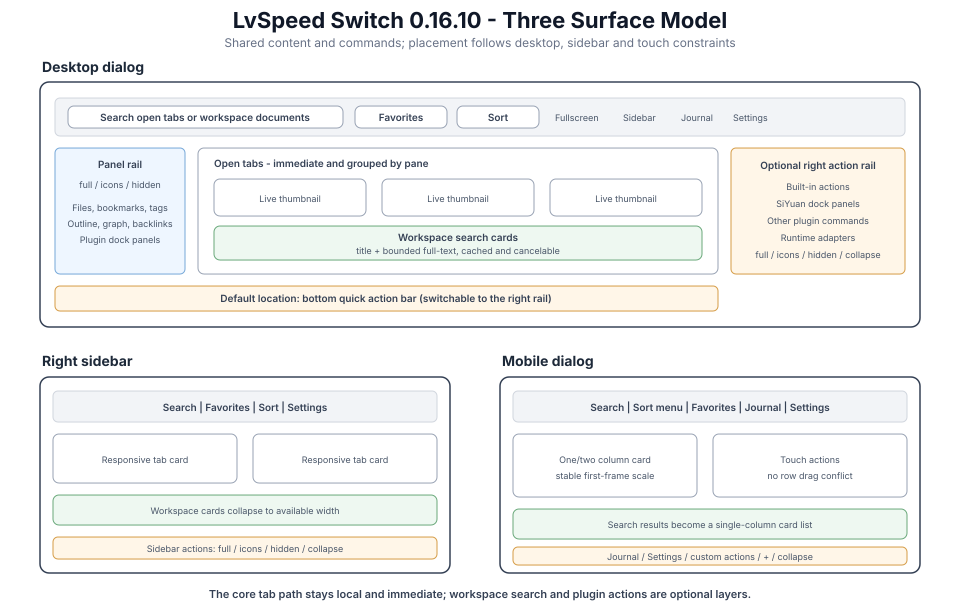

# LvSpeed Switch

[](./plugin.json) [](./LICENSE) [](https://b3log.org/siyuan)

LvSpeed Switch is a lightweight navigation workspace for [SiYuan Note](https://b3log.org/siyuan). It keeps **open tabs** first and uses live thumbnails for rapid preview and switching, then progressively exposes **favorites, workspace document search, panels, journals, and customizable quick actions**. Desktop dialog, right sidebar, and mobile share one data and command model while adapting their layouts to screen space and input method.

<p align="center"></p>

<p align="center"></p>

> `v0.16.10` further tightens the three-surface layout and quick-action settings. Desktop, sidebar, and mobile share capabilities while adapting to their own space and input methods. The core tab path remains local-first and never waits for workspace search or third-party plugins.

[中文说明](./README.md)

## Core Capabilities

### Tab Switching And Live Refresh

- **Live thumbnails**: each tab card shows current document content; background documents are filled through the kernel API when needed, while off-screen content is rendered lazily.
- **Native split panes**: tabs remain grouped by SiYuan window/pane and switching activates the correct pane. Opening, closing, or batch-changing tabs refreshes every active plugin view immediately.
- **Keyboard and pointer control**: arrows and `Tab` move across the real grid, `Enter` opens, and `Esc` closes. Cards provide pin, favorite, close, and context-menu actions.
- **Six sort modes**: recent use, open order, reversed open order, recently edited, title ascending, and title descending; the choice persists.
- **Desktop fullscreen**: fullscreen belongs only to the desktop dialog. Sidebar and mobile do not render an action that cannot apply there.

### Favorite Folders And Ordering

- Favorites use stable document root IDs, so they can reopen after a tab closes or SiYuan restarts.
- Favorite folders show order and item count, and support collapse, rename, delete, move up, and move down. Desktop also supports dragging folders into order.
- Favorite items live inside their folder, show an in-folder order number, and can move between folders or up/down within one. Desktop supports in-folder drag sorting.
- Mobile settings disable whole-row drag to avoid stealing vertical scrolling; explicit move controls provide the same result.
- A folder can open or close all its tabs, with separate handling for duplicate documents, failed items, and no-op states.

### Two-Section Card Search

Search always uses this priority:

1. **Open tabs**: filtered locally and immediately while preserving pane grouping, pinning, sorting, and keyboard navigation.
2. **Workspace documents**: queried by document title, excluding already-open documents, and presented as title/path cards that open directly.

Workspace requests use a 180 ms debounce, bounded in-memory cache, request-version validation, and cancellation. Desktop dialog, right sidebar, and mobile each own an isolated search session, so one surface cannot cancel or overwrite another. This release provides workspace **document-title search**; it does not claim block-level full-text snippets or the native filter set yet. See [ROADMAP.md](./ROADMAP.md) for that work.

### Panels, Journal, And Quick Actions

- **Left panel rail**: open the file tree, outline, bookmarks, tags, graph, backlinks, and plugin docks. Choose a full list, icon-only rail, or complete hiding.
- **Right sidebar mode**: keep tab cards in a SiYuan right Dock. Thumbnails resize with available width and can either enlarge to fill or add columns automatically.
- **Today's journal**: desktop and mobile toolbars retain a dedicated journal action. Select a default notebook or choose one on first use.
- **Quick action workspace**: desktop uses a bottom bar by default and can move it into a narrower right rail; sidebar and mobile render their own selected actions.
- **Four action sources**: built-in actions, SiYuan Dock panels, commands exposed by other plugins, and runtime adapters registered through `registerQuickAction()`.
- **Configuration**: labels up to four graphemes, icon, desktop/sidebar/mobile targets, enabled state, ordering, and JSON import/export. The `+` action opens Quick Actions settings directly.
- If an external plugin is absent, its configuration is retained and skipped safely. No polling or DOM injection is used, so optional integrations do not slow the core tab path.

### Three Surface Strategy

| Surface | Primary controls and behavior |
| --- | --- |
| Desktop dialog | Search, favorites, sort, fullscreen, sidebar, journal, and settings; left panel rail; bottom or right quick actions |
| Right sidebar | Compact search and toolbar; responsive tab/search cards; sidebar actions; no fullscreen |
| Mobile | Compact sort menu, favorites, journal, and settings; one/two/auto columns; bottom custom actions and `+`; no fullscreen |

On mobile, the first frame waits for the WebView to reach a stable size before cards become visible, then scales thumbnails from the container's measured width. Mobile settings use a horizontally scrollable top tab row and single-column controls. Favorite and quick-action ordering use buttons instead of row dragging, avoiding gesture conflicts with page scrolling.

### Performance, Data, And Themes

- Local tab filtering and switching never wait for workspace APIs or third-party plugins; a search failure leaves open-tab results intact.
- Thumbnails render by viewport and cache per document with a per-entry size limit; orphaned cache entries are pruned after tabs close.
- MRU, favorites, pins, settings, and quick actions are validated and deduplicated on read. Writes are debounced and pending saves are flushed before unload.
- UI uses SiYuan theme variables and native icons, with stable button, card, switch, and text dimensions for default themes and third-party themes such as Neo.

## Quick Start

1. **Open**: the layout icon on the top toolbar, or the hotkey `Alt+Shift+S` (changeable in **Settings → Keymap**); on mobile, tap the top-bar entry or the floating button.
2. **Switch**: click a card, or move with arrows / `Tab` and hit `Enter`; click a panel on the left rail to jump to it.
3. **Manage**: pin with the pin button, favorite with the star (group menu pops up); close tabs with × on the card, or right-click for the full menu (long-press on mobile).
4. **Search**: use one field to see matching open tabs first and workspace document-title cards second.
5. **Dock it**: hit the "Sidebar mode" toolbar button to pin the switcher to the right dock.
6. **Customize**: use `+` in the bottom/right action area to add Docks, plugin commands, or change per-surface visibility.
7. **Fullscreen**: on desktop only, fill the window and restore with the button or `Esc`.

## Shortcuts

| Key | Action |
| --- | --- |
| `Alt+Shift+S` | Toggle the switcher (global, configurable) |
| `↑` `↓` `←` `→` | Move selection across the grid |
| `Tab` / `Shift+Tab` | Next / previous |
| `Enter` | Switch to the selected tab |
| `Esc` | Close the switcher |

## Settings

Open **Settings → Plugins → LvSpeed Switch → Settings**, or use the gear inside the switcher. Desktop uses a left tab rail; mobile uses a horizontally scrollable top tab row. Changes save immediately:

| Tab | Options |
| --- | --- |
| Appearance | Switcher width/height (480–1920 × 360–1280), thumbnail columns (auto / 2–8), thumbnail height (72–360) |
| Behavior | Default sort order, fullscreen mode (off by default; opens filling the window) |
| Panels | Show / hide left-rail panels, display mode (full list / collapsed icon rail / hidden), sidebar thumbnail layout (enlarge / auto columns) |
| Favorites | Collapse and order folders, create / rename / delete, order items, and reassign favorites |
| Quick Actions | Label, icon, surface targets, enable state, drag/button ordering, right action rail, and import/export |
| Journal | Default journal notebook (dropdown; first click of the journal button also prompts a picker) |
| Mobile | Floating button toggle (off by default), card layout (single / double / auto), and thumbnail height |

## Install And Upgrade

- **Marketplace**: search "小驴速切 / LvSpeed Switch" in **Settings → Marketplace → Plugins** (community bazaar listing pending).
- **Manual**: download `package.zip` from [Releases](https://github.com/ai68298100/siyuan-speed-switch/releases), extract into `<workspace>/data/plugins/siyuan-speed-switch/` and restart SiYuan (the folder must be named `siyuan-speed-switch`).

Upgrading preserves favorites, groups, pins, MRU, and settings. On first `v0.16.9` load, quick-action fields are validated; invalid entries are ignored, while valid configurations remain even if their third-party provider is temporarily unavailable.

## Requirements

- SiYuan v3.1.20+ (uses the `getAllTabs` API).
- Desktop client / browser-desktop frontend (tabs and split panes).
- Mobile features (FAB, tab switching, favorites) require SiYuan **v3.8.0+** (relies on the mobile MobileTabs system).

## Changelog

### v0.16.10 (2026-09-06)

- Prevented the desktop toolbar from wrapping when the optional right action rail is enabled; search and selectors now shrink within one row.
- Replaced the mobile sort text button with a fixed icon button so search, sort, favorites, journal, and settings remain on one row.
- Added independent Full / Icons only / Hidden modes for desktop, sidebar, and mobile quick actions; desktop defaults to the bottom position.
- Bottom, right, sidebar, and mobile action bars can now collapse and remember their state; the desktop right rail is narrower.
- Fresh installs default to Journal and Settings only, without duplicate Switch and Search actions; existing user configurations remain valid.
- Switch and Search can still be restored from Add action > Built-in; plugin commands use an icon available in SiYuan instead of rendering a missing fallback.
- Aligned quick-action headers with their data columns and replaced the persistent add selector with categorized Built-in, Dock, and Plugin Command menus.
- Rebuilt mobile settings around the viewport: horizontally scrollable tabs, independently scrolling content, and card-like quick-action editors prevent clipping and drag/scroll conflicts.
- Quick-action edits and imports now refresh every open surface immediately; plugin dialogs on mobile hide the floating button until they close.

### v0.16.9 (2026-09-06)

- **Reworked all three surfaces**: the desktop dialog keeps a larger high-frequency toolbar and fullscreen, the right sidebar uses compact controls, and mobile uses a touch sort menu. They share command semantics without forcing controls that do not apply to every surface.
- **Upgraded two-section search**: open tabs remain immediate and first; workspace document titles appear as responsive title/path cards with loading, empty, and error states, excluding documents already open.
- **Isolated search sessions**: desktop, sidebar, and mobile independently own debounce, request version, cancellation, and bounded cache state. Closing a surface or unloading the plugin releases pending work, and stale responses cannot replace newer input.
- **Live tab-change refresh**: every active plugin surface receives the same refresh notification, including after desktop batch open/close operations.
- **Rebuilt favorite management**: folders collapse and show order/count, with reorder, rename, and delete actions. Items have in-folder order, reassignment, and movement. Desktop supports drag sorting; mobile uses explicit controls to avoid scroll conflicts.
- **Added the quick action workspace**: place actions at the desktop bottom or right rail and target desktop, sidebar, and mobile independently. Sources include built-ins, SiYuan Docks, other plugin commands, and `registerQuickAction()` runtime adapters, with icons, short labels, ordering, and import/export.
- **Overhauled settings**: seven sections now cover Appearance, Behavior, Panels, Favorites, Quick Actions, Journal, and Mobile. Panel toggles use responsive columns; favorite and quick-action editors have narrow-screen layouts, column labels, and explanatory copy.
- **Stabilized mobile first paint**: unnecessary dialog animation is disabled, cards wait for stable WebView layout, and thumbnails scale from measured width with a no-width fallback to reduce first-open flashing, blank cards, and misalignment.
- **Quality and documentation**: search-session and quick-action pure-function tests bring the unit suite to 82 cases; Chromium style smoke coverage now includes search cards, and both the three-surface map and six-layer runtime architecture diagrams were redrawn.

### v0.16.8 (2026-09-05)

- Fixed stale document IDs after navigating an existing tab to another document; card titles, icons, thumbnails, and favorite actions now follow the current document.
- Reworked one-click favorite group open/close with document deduplication, duplicate-trigger protection, shared state verification, and accurate success/failure/no-change feedback.
- Fixed stale settings writes overwriting newer values during rapid changes; unload now waits for all writes queued for each data key.
- Favorites dropdown global listeners now exist only while the panel is open and are released immediately on close.
- Replaced card actions with semantic buttons isolated from host tooltip styles, and unified switch styling for mobile themes including Neo.
- Added root ID, batch-operation, source-constant, and Chromium theme regression tests; CI smoke tests no longer depend on developer-specific paths.

### v0.16.7 (2026-09-05)

- Fixed favoriting unloaded tabs by resolving document IDs from SiYuan's lazy-loaded tab data and retrying after loading.
- Fixed incomplete one-click favorite group open/close actions by confirming tab state after each operation.
- Fixed Neo and similar themes enlarging the mobile favorite, pin, and close buttons by enforcing stable button and icon dimensions.
- Fixed mobile close failures being counted as successful closes; failed single closes now keep their cards and show an error.
- Fixed the mobile "Recently edited" sorting race caused by asynchronous timestamp loading.
- Debounced thumbnail cache writes, awaited pending saves during unload, and added HTTP error handling for kernel requests.
- Added version consistency, type-check, unit-test, and smoke-test gates to the release workflow.

### v0.16.6 (2026-09-05)

- **Sort switches reflect up-to-date edit times**: desktop popup, sidebar and mobile share & backfill the updated-time map when switching to "Recently edited", so ordering is correct on first paint and stable after switches.
- **Accurate batch close counts**: only tabs that were actually closed successfully count toward the summary message.
- **Mobile sort switching keeps state**: reuses the assembled list closure, re-sorts with the latest data immediately and clears the search box.
- **Better emoji icon detection**: composed emoji (e.g. 👨‍👩‍👧) and skin-tone emoji (e.g. 👍🏽) now render as emoji correctly.
- Fixed listener leaks when the favorites dropdown is destroyed mid-collapse; the mobile favorites sheet shows a hint when empty instead of staying silent.

### v0.16.5 (2026-09-05)

- **Auto-sanitize persisted data on startup**: favorites are deduped by key, corrupted entries are dropped and fields normalized; pinned/group lists filter invalid entries — legacy dirty data no longer amplifies over time.
- Sanitization writes back to storage only when data actually changed, so normal startups perform zero extra disk writes.

### v0.16.4 (2026-09-05)

- **Fixed favorites disappearing after clicking**: favoriting a lazy-loaded (never-activated) tab failed to resolve the doc ID, so the favorite key degraded to a one-off tab ID — jumps silently failed, star states desynced and caused duplicates, and repeated cleanup eventually emptied the list.
- Favoriting a not-yet-loaded tab now shows a "switch to the tab first" hint instead of creating a broken entry.
- Legacy broken favorite entries are auto-migrated (one-off tab ID → stable doc ID) once the tab is opened; no manual cleanup needed.
- Clicking a favorite / opening a group now reports entries that cannot be located instead of failing silently; favorites persist until explicitly removed.

### v0.16.3 (2026-09-05)

- Fixed the pin / favorite / close action buttons at the bottom-right of mobile tab cards.
- Fixed "open all / close all favorites" not applying to the whole group.
- MRU (most recently used) list now caps at 200 entries to prevent unbounded plugin data growth.

### v0.16.0 (2026-09-05)

- **Architecture & docs**:
  - README now includes `docs/architecture.svg` — a five-layer diagram (entry points → switcher main → subsystems → persistence → infrastructure).
  - README "Development" section expanded: "How to add a setting / dock panel / sort order" with copy-pasteable code patterns.
  - Three new ADRs in `docs/adr/`: `0001-method-splitting.md` / `0002-constants-module.md` / `0003-testing-strategy.md` — for future refactors to look back on.
- **New `src/constants.ts`**: centralised every magic number / threshold, grouped by domain with `_MS` / `_PX` / `_MIN/MAX` naming conventions:
  - Timing: `SEARCH_DEBOUNCE_MS` / `SAVE_DEBOUNCE_MS` / `FAB_HIDE_DELAY_MS` / `MESSAGE_DEFAULT_MS` / `UPDATED_CACHE_MS`
  - Pixels: `DIALOG_WIDTH_MIN_PX/MAX_PX` / `DIALOG_HEIGHT_MIN_PX/MAX_PX` / `THUMB_HEIGHT_MIN_PX/MAX_PX` / `MOBILE_THUMB_HEIGHT_MIN_PX/MAX_PX` / `BACK_TOP_THRESHOLD_PX` / `SIDEBAR_DEFAULT_WIDTH_PX`
  - Ranges: `COLUMNS_MIN/MAX` / `MOBILE_COLUMNS_MIN/MAX`
  - `src/index.ts` updated in sync: debounce timings, UI bounds, column limits, favorites / FAB / back-top thresholds — future tweaks need only one place.
- **5 more giant methods split** (continuing the v0.15.6 refactor streak):
  - `onload` 83 → 25 lines — extracted `initPersistentData()` / `registerDesktopDock()` / `registerMobileEntries()` / `bindGlobalEvents()`; lifecycle phases cleanly separated.
  - `applySearch` 56 → 22 lines — extracted `runDocSearchFetch()`; cache hit path and remote fetch path separated, easier to test timeout/cancel branches individually.
  - `renderDocResults` 70 → 17 lines — extracted `ensureDocResultsBox()` / `collectOpenRootIds()` / `appendDocResultsEmpty()` / `buildDocResultItem()`; each helper single-responsibility.
  - `buildSettingsFavGroupList` 79 → 16 lines — extracted `buildFavGroupRow()` / `replaceFavGroupRowWithRenameControls()`; row construction vs inline rename UI separated.
  - `promptJournalNotebook` 60 → 16 lines — extracted `buildJournalPromptHtml()` / `createJournalSelect()` / `populateJournalNotebookSelect()` / `bindJournalPromptEvents()`; HTML / option population / event binding in three layers.
  - Not split: `openSetting`(88) — closure-captured locals make extraction harmful; queued for next round.
- **Tests extended**:
  - New `tests/constants.test.cjs`: validates MIN/MAX/range self-consistency + debounce timing sanity, **3 cases / 5.7ms**.
  - `tests/mobile-card-smoke.cjs` grew from 3 button sizes to 7 CSS invariants: 3 28×28 buttons + `.sw__icon` collapse defence + `.sw__mobile-card` present + `.sw__mobile-grid` single-column + `.sw__thumb` placeholder.
  - `npm test` runs all in one shot — **26 cases / ~1s all green**.
- **Quality gates**: tsc 0 errors, build OK (152 KiB package.zip), zero `console` / `debugger` / `alert` / `@ts-ignore` residuals, the only `as any` occurrence is in a comment (not code).

### v0.15.6 (2026-09-04)

- **Giant-method split (pure refactor, zero behavior change)**: every method over 70 lines in `src/index.ts` was split into a 10–50-line orchestrator plus single-purpose helpers. All tests pass; build artifact is identical:
  - `renderList()` **100→44 lines** — extracted `sortGroupItems` / `renderTabGroup` / `buildTabGroupGrid`; introduced `ITabGroupRenderCtx` interface to constrain helper parameters and avoid parameter sprawl.
  - `renderMobileList()` **74→42 lines** — extracted `buildMobileGroupGrid` / `renderMobileCardsInGroup`; mobile grid rendering is now decoupled.
  - `renderSidebarPanel()` **85→27 lines** — extracted `buildSidebarHtml` / `observeSidebarResize` / `bindSidebarToolbarEvents`; sidebar shell / responsive `ResizeObserver` / toolbar interactions are layered.
  - `assembleSwitcherParts()` **82→47 lines** — extracted `prepareSwitcherChrome` / `bindSwitcherListArea` / `bindSwitcherBackTop`; switcher chrome / list-area events / back-to-top button live in three clean layers.
  - `renderFavPanel()` **82→31 lines** — extracted `appendFavGroup` / `appendFavFlatList`; reusing the pure `groupFavoritesByGroup` from the last round.
  - `openFavMenu()` **73→16 lines** — extracted `buildFavMenuUnfavorited` / `buildFavMenuFavorited`; the unfavorited vs favorited menu-construction branches are now fully separated.
  - `openSetting()` **385→90 lines** — extracted `buildSettingsAppearance` / `buildSettingsBehavior` / `buildSettingsPanels` + `buildSettingsDockToggles` / `buildSettingsMobile` / `buildSettingsJournal` / `buildSettingsFavorites` + `buildSettingsFavCreateRow` / `buildSettingsFavGroupList` / `appendSettingsFavItems`. The five settings tabs (Appearance / Behavior / Panels / Favorites / Mobile) now build independently, so adding a new option no longer bloats the central method.
- **Two new pure helpers in `src/util.js`**:
  - `resolveIconFallback` — locks in the 5-case fallback strategy from the previous mobile icon fix.
  - `buildTabGroupsByParent(tabs, fallbackKey)` — shared by `renderList` / `renderMobileList`; desktop and mobile's parent-window grouping logic collapses into a testable function.
- **Unit tests**: 4 new cases for `buildTabGroupsByParent` (jsdom verifies Map order + fallback window key), 5 for `resolveIconFallback`, 4 for `groupFavoritesByGroup` — total **23/23 passing**.
- **Next candidates**: `onload` (86) / `buildSettingsFavGroupList` (81) / `renderDocResults` (75) / `promptJournalNotebook` (63) / `openMobileGroupActions` (59) / `applySearch` (58) / `setupFavDropdown` (57) / `openCardMenu` (56) / `bindKeydown` (55) are still long — queued for future rounds.

### v0.15.5 (2026-09-04)

- **Fixed mobile tab card icon display**:
  - `getMobileTabs()` now reads SiYuan's tab-icon field from both possible locations: `t.icon` first, then falls back to `t.current.icon` (different SiYuan builds store it differently).
  - Extracted `resolveIconFallback(raw)` as a pure function in `src/util.js`, covering five cases — empty value, `icon*` SVG name, emoji character, 4-6 digit hex codepoint, invalid string — all with unit tests.
  - SCSS adds `min-width/height: 14px`, `svg{display:block}` and an empty placeholder to `.sw__icon`, so an SVG load failure no longer collapses the icon and shifts the title.
- **Fixed favorite-group batch open/close dropping items on desktop and mobile**:
  - `openGroupTabs()` and `closeGroupTabs()` are now `async`: each `openTab` / `mobileOpenDoc` / `MobileTabs.close` is awaited in sequence, so the next call never races against the previous state.
  - `closeTabQuietly()` is now `async` — awaits the `MobileTabs.close` Promise when present, otherwise sleeps 80ms; desktop `removeTab` gets a 30ms settle delay before the next tab closes.
  - New `sleep(ms)` helper.
  - `openFavGroupMenu` and `openMobileGroupActions` `click` handlers are now `async`/`await`, so the menu/sheet stays open until the batch finishes — no more "list refreshed before the action took effect".
- **Unit tests**: 5 new cases for `resolveIconFallback`; total now **19/19 passing** (10.5ms).

### v0.15.4 (2026-09-04)

- **Mobile switcher `showMobileSwitcher()` split**: 138 lines → 12-line orchestrator + 5 helpers (`createMobileSwitcherDialog`, `buildMobileSwitcherHtml`, `bindMobileSwitcherToolbarActions`, `renderMobileSwitcherList`, `openMobileSwitcherDialog`), cleanly separating top-bar buttons, search, sort, and FAB restore logic.
- **Mobile favorites sheet `showMobileFavSheet()` split**: 151 lines → 30-line orchestrator + 6 helpers; HTML generation, grouping, flat/grouped list rendering, and backdrop-close are now isolated for easier mobile debugging.
- **Card builder `createCard()` split**: 152 lines → 38-line orchestrator + 5 helpers (`buildCardThumb`, `buildCardMeta`, `buildCardIcon`, `buildCardActions`, `bindCardLongPress`); icon rendering is now isolated in `buildCardIcon` so the mobile icon issue can be debugged independently.
- **New pure `groupFavoritesByGroup` function**: moved to `src/util.js`; preserves empty groups from the registry, drops ungrouped items into `""`, and returns a Map that keeps insertion order. Added 4 unit tests covering registry order, empty groups, defensive unregistered groups, and fully ungrouped favorites; total now 14/14 passing.
- **Dev dependency**: added `jsdom@30.0.1` for mobile UI smoke tests.

### v0.15.3 (2026-09-04)

- **Desktop switcher main split**: the 181-line `showSwitcher()` was broken into five clearly-scoped helpers — `createSwitcherDialog`, `buildSwitcherHtml`, `assembleSwitcherParts`, `bindSwitcherFullscreenToggle`, `bindSwitcherToolbarActions` — with the top-level method compressed to a 22-line "menu" of calls. Each helper can now be read, tested and reasoned about in isolation.
- **New `src/util.js` pure-function utility module**: exports `clampNum`, `stableSortBy` and `normalizeSortBy` with zero dependencies. The three `*_LIST.includes(x as T) ? x as T : DEFAULT` patterns inside `getSettings()` collapse to single `normalizeSortBy(...)` calls; the thumbnail LRU eviction now goes through `stableSortBy`, making the intent explicit and self-documenting.
- **Unit-test / UI smoke-test foundation**: added `tests/util.test.cjs` (Node 22's built-in `node:test`, 10 assertions, all passing under 6ms) and `tests/mobile-card-smoke.cjs` (jsdom loads SiYuan's mobile base CSS plus the `litheness` icon sprite, then verifies the three card buttons are still 28×28px). Added two commands to `package.json` — `npm test` and `npm run test:smoke`. No new production dependencies.

### v0.15.2 (2026-09-04)

- **Type-safety refactor**: added `src/types.ts` with a single home for all inferred types of SiYuan global objects (`window.siyuan`), lazily-mounted Protyle models, the MobileTabs API, layout docks, etc.; added the `getSiyuan()` helper so every `(window as any).siyuan` in business code is gone. The 23 `(saved as any).xxx` accesses inside `getSettings()` collapsed into one `as Partial<ISwSettings>` overall cast. Real `as any` usage dropped from 44 occurrences to 0 (remaining 6 are TS-recommended `as unknown as X` double-step narrowing).
- **Structured logger**: added `src/logger.ts`; all 21 `console.warn("[speed-switch] xxx fail", e)` calls now go through `logger.warn(...)` with a unified `[speed-switch]` prefix and one `ENABLED` switch; `error/info/debug` are exposed too for future use.
- **`mobileOpenDoc` three-path fallback**: the previous `// TODO: Mobile` placeholder is now a complete chain — call `MobileTabs.open(rootId)` first, poll `activeTabID` after 300ms to confirm the switch took effect; on no change fall back to `plugin.openTab({app, doc})`; if both fail show a user-friendly message via the new i18n key `openDocFailed` (added in both `zh-CN` and `en`).
- **Refactor details**: `(this as any).element` inside dock callbacks now goes through the strongly-typed `IDockHandlerSelf`; the custom `__swThumbObserver` property hung on `HTMLElement` is now held via a module-level `WeakMap`, eliminating invasive element property assignment. No user-visible UI change.

### v0.15.1 (2026-09-04)

- **Top-bar "Open today's diary" icon fixed**: the desktop and mobile top-bar buttons previously referenced the non-existent `#iconDate` symbol (no such symbol in SiYuan's litheness icon sprite), so the icon rendered blank. Switched to `#iconCalendar` (the calendar symbol shipped with SiYuan); both desktop and mobile now show the icon correctly.
- **Favorites panel — right-click batch open/close (desktop)**: right-click any favorites group header to open every favorited tab in that group at once, or close all opened tabs belonging to it — matching the mobile ⋯ button behavior.
- **Favorites panel — ⋯ button (mobile)**: every group header in the mobile favorites bottom sheet now has a ⋯ button that opens an action sheet with the same batch open/close actions. After the action completes the underlying switcher list auto-refreshes.
- **Defensive hardening for mobile card bottom buttons**: further tightened `.sw__pin / .sw__fav-btn / .sw__close` box-model and text styles (`box-sizing:border-box`, `line-height:0`, `font-size:0`, `appearance:none`, `svg{display:block}`, etc.) to defend against any path that could abnormally enlarge the buttons — e.g. SVG sprite not yet injected, inline-SVG intrinsic 300×150, or WebView default button appearance.

### v0.15.0 (2026-09-04)

- **Persist favorite-group collapse state**: each group's expanded/collapsed state in the favorites panel is remembered across sessions — it survives a SiYuan restart. Deleting or renaming a group automatically clears its remembered state.
- **Remember last settings tab**: opening the settings dialog lands on the tab you used last time (e.g. "Mobile"), so you no longer have to click your way back each time.
- **Build & tooling polish**: `tsconfig` compile target raised to ES2017 (fixes `Array.includes` type-check compatibility); README version badge kept in sync with the three version-number files.

### v0.14.0 (2026-09-04)

- **Batch open/close by favorite group (desktop)**: right-click a favorites group header to open every favorited tab in that group at once, or close all opened tabs belonging to it.
- **Batch open/close by favorite group (mobile)**: in the favorites bottom sheet, each group header gains a ⋯ button that opens an action sheet with the same batch open/close actions.
- After the operation a toast reports "Opened / Closed N tab(s)"; silent when nothing changed.

### v0.13.2 (2026-09-04)

- **Mobile UX improvements**: the favorites bottom sheet gains a subtle scrim and respects bottom safe-area insets (home indicator / nav bar); the top-bar favorites, journal and settings buttons are now uniform in size, and card action buttons plus the floating button got larger touch targets.
- **Cross-platform polish**: search inputs disable spellcheck; numeric settings inputs expose a numeric keyboard and screen-reader labels; settings tabs now carry proper ARIA state, and the plugin respects the system "reduce motion" setting.

### v0.13.1 (2026-09-04)

- **Journal button moves into the switcher**: the top bar no longer takes an extra slot — desktop and mobile each keep a single switcher entry; the journal button now lives in the **switcher's top bar**, opening/creating today's journal right after you open the switcher.

### v0.13.0 (2026-09-04)

- **Today's journal, one click away**: a journal button on both the desktop and mobile top bars opens or creates **today's journal** (idempotent — no duplicates per day).
- **Default journal notebook**: a new **Settings → Journal** tab lets you pick the default notebook; if unset, the first journal click pops up a notebook picker before opening.
- Opening an existing journal or creating a new one always happens in the configured notebook; the setting saves instantly and syncs across devices.

### v0.12.1 (2026-09-04)

- **Mobile floating button is off by default** — keeps the bottom free from a redundant FAB; enable it anytime under **Settings → Mobile → Floating button**. The top-bar entry always stays available, so the switcher experience is unchanged.

### v0.12.0 (2026-09-04)

- **Tabbed settings redesign**: the long single-page settings are now a left tab rail + grouped panels — Appearance / Behavior / Panels / Favorites / Mobile switch in one click; number inputs carry unit labels, switches and selects share a unified format, and every change still saves instantly.
- **Favorites dropdown right-click (desktop)**: every favorited tab supports right-click — **move to group** (submenu with the current group checked), **new group & move**, and **unfavorite**; the panel stays open and refreshes in place so you can organize several favorites in a row.
- **Card context menu enhanced**: favorited tabs gain a "Move to group" submenu (current group checked) plus a "New group" entry; unfavorited tabs offer "New group…" to favorite straight into a new group.
- **Sidebar thumbnail layout setting (Settings → Panels)**: when the sidebar is stretched wider, thumbnails enlarge to fill the width by default, or auto-add columns to show more tabs; switching applies instantly.
- **Mobile settings fit**: the settings dialog now scales with the viewport (no overflow in landscape anymore); on narrow screens the tab rail narrows and setting rows stack vertically.

### v0.11.1 (2026-09-04)

- **Fixed the mobile flash of oversized icons and scrambled layout on first open**: SiYuan mounts the dialog DOM first and adds `b3-dialog--open` only after a 50ms timeout, leaving the container mid-transform during that window, where the mobile WebView mis-renders card buttons. The animation window is now disabled — the dialog enters its final state synchronously and opens crisply.
- **Mobile card action buttons relocated**: pin / favorite / close no longer float over the thumbnail; they now sit at the right end of the bottom meta row as plain icons (primary color only when active), leaving the thumbnail fully unobstructed.
- **Floating button moved further up** (96→120px incl. safe area) to fully clear SiYuan's bottom toolbar; the swipe gesture now requires vertical-dominant movement, so horizontal panning no longer hides it by accident.
- Also removed `backdrop-filter` from mobile buttons (a trigger of the WebView animation glitch, and a perf win).

### v0.11.0 (2026-09-04)

- **Fixed mobile styles silently broken (major)**: a stylesheet nesting error made all 39 mobile-specific rules (compact toolbar, card layout, always-visible action buttons, touch feedback) compile into selectors that could never match, so the mobile dialog had been falling back to desktop styles. Mobile now renders as designed — toolbar sizing, single/double/auto card layouts, thumbnail height, always-visible pin/favorite/close buttons and press feedback all take effect.
- **README overhauled**: features now cover fullscreen mode and a Mobile section; settings table updated to five sections; quick start covers mobile and fullscreen entries; old changelog entries collapsed; the outdated README.zh-CN.md removed (Chinese readme is the main README).
- Plugin description (marketplace) mentions fullscreen mode.

### v0.10.1 (2026-09-04)

- **Mobile floating button improved**:
  - Moved up to the natural one-handed thumb zone for easier reach.
  - Smaller (48→40px) with slight transparency to obstruct less content.
  - Swipe up to hide, swipe down to show — consistent with SiYuan's built-in toolbar.

### v0.10.0 (2026-09-04)

- **Fullscreen mode improved (desktop)**: a fullscreen toggle button is added to the switcher toolbar — click to enter fullscreen in normal mode, click again to exit; the switch happens in place without rebuilding the dialog, keeping thumbnails and search state. The setting still decides the initial mode; Esc still closes.
- **Settings switches enhanced**: fixed switches looking identical on/off under some themes — off shows an outlined track with a gray knob, on shows a solid primary track with a white knob; also fixed a broken switch markup in the "Panel visibility" list.

### v0.9.0 (2026-09-04)

- **Fullscreen mode (desktop, Settings → Behavior)**: the switcher can fill the whole window; press Esc to exit. Off by default, with a hint when enabled.
- **Mobile top bar entry**: SiYuan 3.8.x mobile does not open the top bar to plugins, so an entry button is now inserted directly into the top bar — always visible, one tap to open.
- **Mobile UX improvements**:
  - The switcher no longer auto-focuses the search box, so the on-screen keyboard no longer pops up on open; tap the box to search.
  - Rebuilt the top toolbar: the search icon is back to normal size, laid out in a single row (search + sort + favorites + settings), compact and pinned to the top.
  - The floating button moved up to avoid the bottom capsule toolbar; it hides while the switcher is open and restores on close.
- **Fixed**: the "floating button" toggle in settings not taking effect; the default mobile card layout is now "Auto" (single column in portrait, two in landscape).

### v0.8.0 (2026-09-04)

- **Performance (desktop & mobile)**:
  - Thumbnail **viewport lazy rendering**: only cards scrolled into view (240px preload margin) get thumbnails, so opening the switcher renders just the first screen instead of everything.
  - Clone size is decoupled from document length: only the first 30 blocks are cloned (thumbnails show the first screen anyway).
  - Sorting and list refreshes now **reuse existing cards** (DOM moves instead of rebuilds); rendered thumbnails are kept, making re-sorting instant.
  - A **concurrency gate** for `getDoc` fetches (desktop 4 / mobile 2) prevents hammering the kernel; smaller fetch payload.
  - Session-level cache for rootID parsing (no repeated `JSON.parse`) and a 3-second cache for the "recently edited" SQL query.
  - Mobile thumbnail cache limit raised from 20 to 30.
- **Dock panel display modes (desktop, Settings → Panels)**:
  - **Hidden**: no dock list; the content area takes the full dialog width.
  - **Collapsed**: a 44px icon rail; hover shows the panel name, click activates; a top button expands/collapses anytime.
  - **Full**: the current list (icon + name).
- **Mobile long-press menu**: press and hold a tab card (~0.5s) to open the pin/favorite/group/close menu, same as desktop right-click.
- **Empty-state guidance**: when no tabs are open, a hint suggests searching the whole workspace from the search box.
- Fixed: the default focused card under "Recently used" sorting used a stale matching key (MRU is keyed by document rootID), breaking focus placement.

### v0.7.1 (2026-09-04)

- **Fixed mobile switcher not working**: the SiYuan `getAllTabs` plugin API always returns an empty array on mobile (mobile is a separate build), so tapping the floating button did nothing. Mobile now reads tabs from `window.siyuan.mobile.tabs` (MobileTabs, SiYuan 3.8+); switching and closing tabs also go through MobileTabs.
- **Fixed opening documents on mobile**: the `openTab` plugin API is a no-op on mobile; workspace search results and favorite jumps now use `MobileTabs.open`.
- **Fixed invisible prompts on mobile**: the mobile WebView blocks native `alert`; all prompts now use SiYuan `showMessage`. On SiYuan < 3.8 (no MobileTabs), a clear upgrade hint is shown instead of failing silently.
- "Recently used" sorting is now keyed by document rootID, so mobile and desktop share one MRU list and stay consistent after sync.
- Mobile card icons support per-document custom emoji icons.

### v0.7.0 (2026-09-04)

- **Mobile support**: floating action button (FAB, toggleable in settings), full-screen tab switcher with bottom-sheet favorites, responsive card layout (single column / two columns / auto).
- Mobile settings: FAB toggle, card layout selector (single/double/auto); all settings, favorite groups, and content sync via plugin-level storage — works with SiYuan's built-in sync to keep mobile and desktop in sync.
- **Bottom-sheet favorites**: on mobile, tapping the star button opens a bottom sheet that lists favorites by group, touch-friendly.
- Optimized mobile card styling: more compact thumbnails, always-visible action buttons, ≥44px touch targets.
- Compatible with SiYuan on Android/iOS/HarmonyOS; uses CSS variables for automatic theme adaptation.

<details>
<summary>History</summary>

### v0.6.1 (2026-09-04)

- Fixed the `backends` manifest field (`all` no longer mixed with concrete platforms) to pass the SiYuan bazaar listing check.

### v0.6.0 (2026-09-04)

- Favorites management in settings: **create groups** (empty groups are kept and selectable when favoriting), **inline rename**, and **delete** (members move to ungrouped); each group row shows a count badge.
- Fixed the favorites dropdown overflowing the narrow sidebar: the panel is now fixed-positioned and clamped to the host and viewport — auto-narrowed in narrow panels, flipped upward when space below is tight, and repositioned on scroll/resize.
- English name unified as **LvSpeed Switch**; README fully rewritten.
- New preview image.

### v0.5.0 (2026-09-04)

- Performance: favorites, pins and tab switches now use an in-memory cache with debounced writes — no more lag on rapid favoriting.
- Favorites dropdown rebuilt as a custom component: prominent group headers with separators, and groups can be collapsed/expanded by clicking the header.
- Settings section headers enhanced: primary-color small caps with separators; the first section sits flush with the dialog top.
- Plugin display name unified as "小驴速切" in Chinese (Settings → Plugins → 小驴速切).

### v0.4.0 (2026-09-04)

- Favorite groups polished: clicking the star opens a group menu — pick an existing group, create a new one, switch/remove groups, or unfavorite.
- Settings page reorganized into sections (Appearance / Behavior / Panels / Favorites) with a favorites manager: rename groups and reassign favorites per item (saved instantly).
- Toolbar dropdowns now labeled "Favorites" / "Sort" and widened; the search box is narrower; the toolbar wraps gracefully in narrow dialogs.
- Search performance: debounce lowered to 180ms, result caching (instant on repeated keywords), stale requests aborted.
- Fixed workspace document results occasionally disappearing while typing (root cause fixed).
- Fixed stale group counts, leftover empty groups, and missing empty state after closing tabs inside the dialog.
- Arrow-key navigation now uses the real grid column count (previously a fixed estimate that broke with custom columns).
- Sidebar highlight-only refresh on document switch (no more flicker or scroll position loss).

### v0.3.1 (2026-09-04)

- Favorite groups: right-click a favorited card to "Set group" (pick from existing groups or type a new one; leave empty to ungroup). The favorites dropdown shows a two-level structure — pick the group first, then the tab.
- Clearer pin/favorite states: hollow star when unfavorited, filled primary-color star when favorited (same approach as SiYuan's star icon); pinned tabs keep a filled pin always visible.
- Pin/favorite/close buttons get a frosted-glass backdrop, staying readable even over thumbnail content.
- Fixed the toolbar favorites dropdown not showing (class-name collision between the card favorite button and the select).
- Buttons now use SiYuan's standard tooltips, fixing empty white boxes with no text on hover.
- Sidebar thumbnails scale with the panel size (live rescale while dragging the splitter, no full list rebuild); the sidebar also gains the sort dropdown, matching the dialog.

### v0.3.0 (2026-09-03)

- Two-section search results: matched open tabs show in the upper section, workspace-wide documents in the lower one (already-open docs excluded; click to open).
- New sidebar mode: pin the tab list to a right dock panel from the switcher toolbar — single-column cards that adapt to the panel size, staying in sync for quick tab switching.
- New favorites: star a tab from its card; jump from the favorites dropdown in the toolbar. Favorited documents reopen from favorites even after their tabs close (remembered per document, survives restarts).
- Card context menu: right-click a card to pin/unpin, favorite/unfavorite, or close the tab.

### v0.2.2 (2026-09-03)

- Modernized UI: search box with magnifier icon, unified control heights and radii, card hover elevation, primary-color highlight for the current tab, separator under group headers, subtle left-rail highlight, slim scrollbars — all via SiYuan theme variables for automatic light/dark adaptation.
- Fixed broken card/pin/close button backgrounds (a non-existent `--b3-card-background` variable was used).
- Fixed document search results lacking a text color (potentially invisible in dark themes).
- Thumbnail loading state now a spinning refresh icon; dedicated empty-state style; back-to-top button fades in with a lift animation.
- Settings panel switches restyled into a light rounded container.

### v0.2.1 (2026-09-03)

- Fixed the thumbnail cache not surviving restarts/layout resets: models of inactive tabs are lazy-loaded when SiYuan restores the layout; rootIDs are now also parsed from the tab header's `data-initdata` so the cache or kernel API kicks in on first open.
- Sticky toolbar: name / search / sort / settings in one row, always visible while scrolling thumbnails.
- New back-to-top button: appears after scrolling deep, smooth-scrolls to the top.

### v0.2.0 (2026-09-03)

- Persistent thumbnail cache: content snapshots keyed by document rootID survive layout resets and restarts while tabs stay open; pruned automatically on tab close.
- Quick settings entry inside the switcher (toolbar gear button).
- Six sort orders: recently used / open order / **reversed** / **recently edited** (by document update time) / title asc/desc.
- Search upgraded: open tabs match first; with no tab matches, **workspace-wide document titles** are searched — click a result to open it.

### v0.1.0 (2026-09-03)

- Plugin settings page: switcher width/height, thumbnail columns and height, default sort, panel visibility (Settings → Plugins → 小驴速切 → Settings).
- Tab pinning: pin button on cards; pinned tabs stay at the front of their group, remembered per document.
- Sorting & search: four sort orders (recently used / open order / title asc/desc) switchable in the switcher and persisted; live filtering in the search box.
- Theme-aware styles: thumbnails and cards use theme variables for seamless light/dark switching.
- All thumbnails visible on first open: background tabs fetched via the kernel API.
- Fixed recent-use records lost after restart (persistent data preloaded on startup).

- v0.0.4 (2026-09-03): repo renamed to siyuan-speed-switch; GitHub Actions auto packaging & release; README localized.
- v0.0.3 (2026-09-03): fixed the default hotkey not responding; added the left panel list; thumbnails re-render on every open.
- v0.0.2 (2026-09-03): fixed tab titles and thumbnails not showing.
- v0.0.1 (2026-09-03): first release, basic thumbnail tab switching.

</details>

## 🏗️ Architecture

<p align="center"></p>

The plugin uses six layers. Its three surfaces share navigation services and persistence, while each surface owns its DOM, search session, and lifecycle:

| Layer | Entry file / class | Responsibility |
| --- | --- | --- |
| Surface | `showSwitcher` / `renderSidebarPanel` / `showMobileSwitcher` | Surface-specific layout and interaction for desktop/fullscreen, right sidebar, and mobile |
| Orchestration | `registerSwitcherRefresh` / SearchSession / action executor | View refresh broadcasting, isolated async state, shared command routing |
| Navigation services | Tabs / favorites / search / quick actions / journal / panels | Sorting, deduplication, batch behavior, and progressive feature composition |
| SiYuan integration | `getAllTabs` / MobileTabs / kernel API / Dock / plugin commands | Encapsulates host capabilities and third-party plugin boundaries |
| Persistence | `loadData` / `saveDataDebounced` | Eight validated storage keys, debounced writes, unload flush, and configuration transfer |
| Infrastructure | `util.js` / `search-session.js` / `quick-actions.js` / types and constants | Host-independent pure functions, types, boundaries, logging, and tests |

**Performance isolation**: open-tab switching uses local state only. Workspace requests, thumbnail backfill, and third-party actions are optional layers that may fail independently. Every search surface owns its request version, abort controller, timer, and cache, all released on destruction.

**Data boundaries**: `sw_mru`, `sw_pinned`, `sw_favorites`, `sw_fav_groups`, `sw_fav_collapsed`, `sw_quick_actions`, `sw_settings`, and `sw_thumb_cache` persist independently. Re-queryable search results and temporary UI state are never written to plugin data.

**Test matrix**: `pnpm test` currently runs 87 unit cases; UI smoke tests run separately:

| File | Scope | Cases |
| --- | --- | --- |
| `tests/util.test.cjs` | 13 `util.js` pure functions | 52 |
| `tests/constants.test.cjs` | Source constant range and format checks | 6 |
| `tests/search-session.test.cjs` | Session isolation, cancellation, versions, and cache limits | 6 |
| `tests/quick-actions.test.cjs` | Defaults, optional built-ins, sanitization, command/adapter, and grapheme boundaries | 13 |
| `tests/i18n.test.cjs` | Locale parity, static references, and value validation | 10 |

| UI test | Scope |
| --- | --- |
| `tests/mobile-card-smoke.cjs` | Mobile card, action buttons, single-column grid, thumbnail, and settings-switch CSS invariants |
| `tests/chromium-style-smoke.cjs` | Computed styles for mobile cards, switches, and workspace search cards in real Chromium, optionally layered with host/theme CSS |
| `tests/live-siyuan-smoke.cjs` | Connects to a test browser running the real SiYuan desktop frontend and checks the toolbar, quick actions, and responsive settings |
| `tests/live-siyuan-mobile-smoke.cjs` | Connects to SiYuan's mobile frontend and checks the mobile branch, single-line toolbar, dialog bounds, and settings overflow |

## Development

### Quick commands

```bash
pnpm install            # install dependencies
pnpm dev                # dev watch (outputs dev dist/)
pnpm build              # production build → dist/* + package.zip
pnpm test               # 87 unit, constant, search, quick-action, and i18n cases
pnpm test:smoke         # mobile UI smoke test (requires `pnpm build` first)
pnpm test:smoke:browser # Chromium/theme test (supports SIYUAN_BASE_CSS and SIYUAN_THEME_CSS)
```

Pushing a `v*` tag triggers GitHub Actions to build and publish a Release.

### How to add a new setting

1. **`src/types.ts`** — add the field + default to `ISwSettings`:
   ```ts
   export interface ISwSettings {
       myNewOption: boolean;     // new field
       // ...
   }
   ```

2. **`src/constants.ts`** — add bounds (`MY_NEW_MIN` / `MY_NEW_MAX`) if applicable.

3. **`src/index.ts → DEFAULT_SETTINGS`** — provide a default:
   ```ts
   const DEFAULT_SETTINGS: ISwSettings = {
       myNewOption: false,
       // ...
   };
   ```

4. **`src/index.ts → buildSettingsXxx`** — render the input control (switch / select / number) in the matching tab; saved on every change.

5. **i18n** — add the key to both `src/i18n/zh-CN.json` and `src/i18n/en.json`, keeping both key sets identical.

### How to add a new dock panel

1. Append `{key, icon, label}` to the `DOCK_ITEMS` array inside `renderDockList`.
2. If the panel needs special activation (not a plain `openTab`), add a branch in `openDockByKey`.

### Third-party quick action adapters

Commands already registered through SiYuan's `addCommand()` appear automatically in the Quick Actions add list and need no additional adapter. For parameters or a custom workflow, locate the LvSpeed Switch plugin instance and register a visible entry directly:

```ts
const speedSwitch = this.app.plugins.find(
    (plugin) => plugin.name === "siyuan-speed-switch",
);

this.unregisterSpeedSwitchAction = speedSwitch?.registerQuickAction({
    id: "xiaolv-checkin",
    label: "Time",
    icon: "iconCalendar",
    value: "open",
    targets: ["desktop", "sidebar", "mobile"],
    handler: (value) => openClock(value),
});

// Call from the provider plugin's onunload():
this.unregisterSpeedSwitchAction?.();
```

The entry is persisted in Quick Actions settings and can target surfaces independently. Its callback stays in memory; no function is serialized. When the provider unloads, configuration remains but execution is skipped safely. The lower-level `registerQuickActionAdapter(id, handler)` API can take over a pre-existing `adapter` configuration. DOM-click simulation and synthetic global shortcuts are intentionally unnecessary.

### How to add a new sort order

1. Add the sort key to the `SORT_BY_LIST` constant array.
2. Add a member to the `SortBy` union type.
3. Add the sort branch inside `sortGroupItems` (extract to `util.js` for unit testing).

## Development Roadmap

See [ROADMAP.md](./ROADMAP.md) for planned phases, design constraints, and release gates.

## 📜 Architecture Decision Records

- [ADR-0001 Method splitting](docs/adr/0001-method-splitting.md) — why we split `onload` / `applySearch` etc. into orchestrator + helpers
- [ADR-0002 Constants in `src/constants.ts`](docs/adr/0002-constants-module.md) — why we centralised magic numbers into a single module in v0.16.0
- [ADR-0003 Pure functions + jsdom test matrix](docs/adr/0003-testing-strategy.md) — why `util.js` must stay zero-dep + Node built-in `node:test`
- [ADR-0004 Persistent data sanitization](docs/adr/0004-data-sanitization.md) — why historical configuration is validated, deduplicated, and capped before entering UI code

## License

[MIT](./LICENSE)
