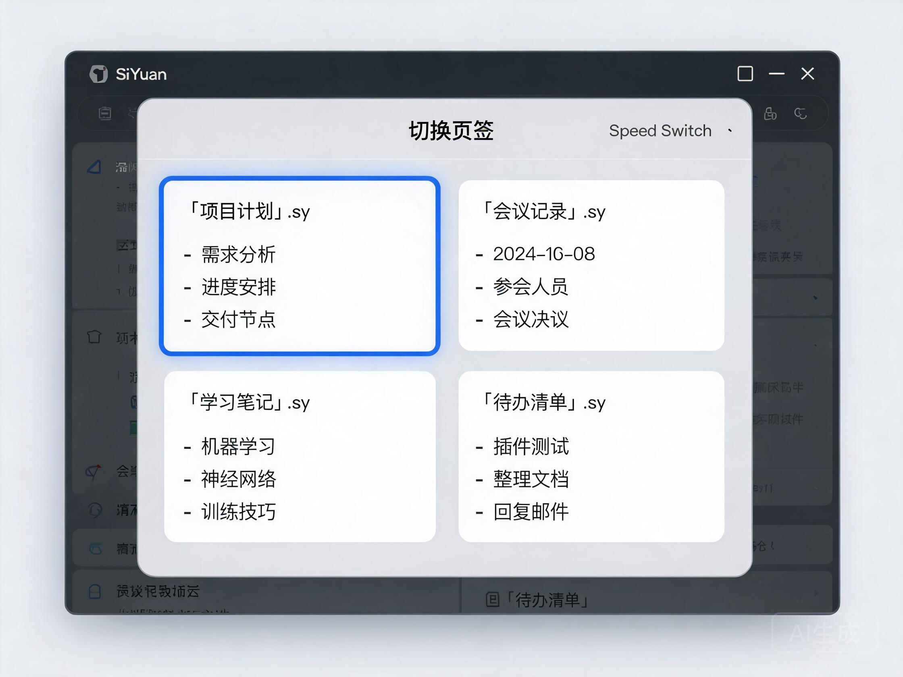
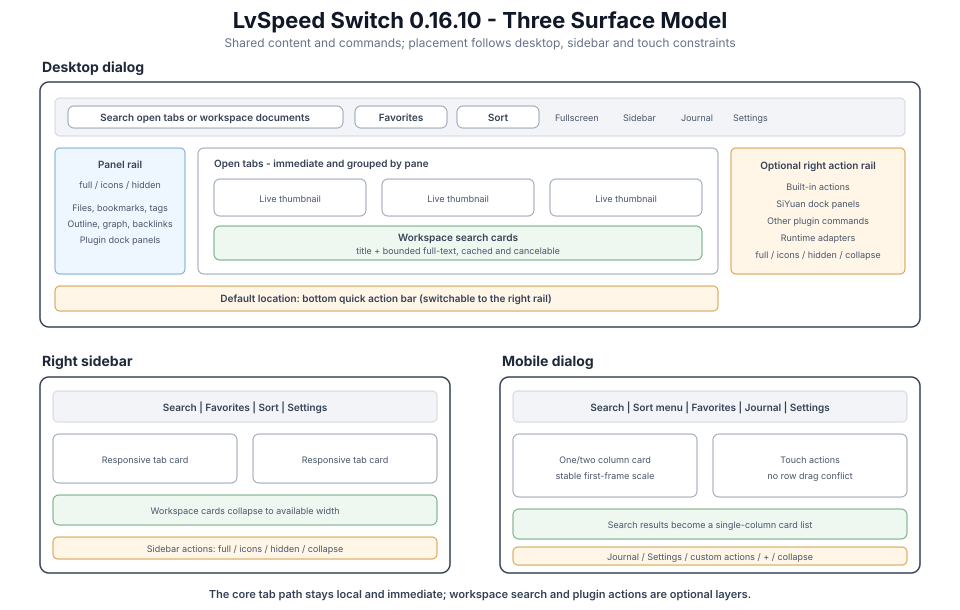
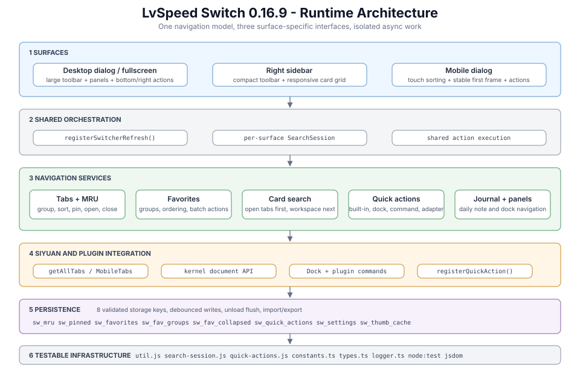

# LvSpeed Switch

[](./plugin.json) [](https://github.com/ai68298100/siyuan-speed-switch/actions/workflows/ci.yml) [](https://github.com/ai68298100/siyuan-speed-switch/releases/latest) [](./LICENSE) [](https://b3log.org/siyuan)

LvSpeed Switch is SiYuan Note's **unified switching and work-context platform**. One platform shell connects the switcher, workbench, snippet lab, and floating ball: find and preview content, inspect and arrange widgets, manage code snippets inside a safe boundary, and return to the last work surface from anywhere. Desktop, sidebar, and mobile share object, action, and status semantics while adapting their layouts to available space and input method.

> **Current stable release: v0.46.6 (2026-10-09)**<br>
> [Download the GitHub Release](https://github.com/ai68298100/siyuan-speed-switch/releases/tag/v0.46.6) · [Release readiness](./docs/release-readiness.md) · [Roadmap](./ROADMAP.md)

## What's New In v0.46.6 (2026-10-09)

Added: Quick snippet enable/disable

- The persistent snippet list and picker catalog now expose sibling Enable/Disable actions for native snippets with visible state and failure receipts.

Improved: Second-panel and widget-store hierarchy

- Restored card radius, shadow, and glass depth in the workbench; the store detail pane now presents one title, factual metadata, live preview, and action area instead of a duplicate card.
- Cleared stale accessibility references during redraw and kept the same hierarchy in desktop and mobile detail sheets.

Fixed: Snippet toggling and older-host compatibility

- Quick toggles reuse whole-list write/readback confirmation and the dirty-draft guard; hosts without master flags no longer turn confirmed writes into false errors.
## What's New In v0.46.5 (2026-10-09)

Added: Segmented surface navigation in the top bar

- Added icons, purpose hints, and current-state feedback for the switcher, workbench, and snippet lab in one continuous segmented control.

Improved: Top-bar hit areas and instant feedback

- Kept visible borders and fills by default; hover, focus, and pressed states respond immediately. The close button is 36px on desktop and keeps a 44px touch target on coarse pointers.
- Icons and labels no longer compete with button events; mouse, touch, keyboard, and screen-reader semantics are explicit.

Fixed: Unresponsive hover and repeated mouse movement

- Fixed unstable hit testing caused by host button skins, hint nodes, and transparent boundaries so the top-bar controls can be hovered and clicked continuously.

## What's New In v0.46.4 (2026-10-09)

Added: Full-path boundary regression guards

- Added contracts and deletion-injection checks for empty dialogs, preserved search scenes, floating-menu positioning, saved-search notebook scopes, and settings diff dialogs.

Improved: Continuous first- and second-panel workflows

- Group redraws now replay the active search/filter; sort menus reposition on viewport changes; malformed host roots consistently destroy empty shells while preserving existing focus recovery.
- Saved searches retain their notebook scope while the host notebook list is unavailable and reuse the option when the list returns.

Fixed: Display copy and factual alignment

- Fixed HTML entities appearing in favorite-group titles and added failure exits for settings, diff, template, and host-list dialogs.
- Corrected the Chinese and English descriptions of path filtering and widget readiness, including level-by-level browsing, capability fallback, and external dependencies.

## What's New In v0.46.3 (2026-10-09)

Added: Full-path interaction regression guards

- Added style and lifecycle contracts for platform chrome, mobile sheets, search metadata, stale states, and snippet previews, with deletion-injection checks for critical declarations.

Improved: Three-panel controls and state feedback

- Restored settings, close, and Esc hint feedback across desktop and touch layouts, with a unified 44px mobile close hit area.
- Restored first-panel source/scope metadata, second-panel stale-cache status, and bounded scrolling for third-panel store/Gist previews.

Fixed: Store copy and malformed dialog cleanup

- Removed hardcoded Chinese labels from the English store flow and fixed malformed separators and dependency copy.
- Destroyed empty store dialogs after host/theme mutation and restored focus to the trigger control.

## Previous release (v0.46.1 · 2026-10-09)

Fixed: Miniflux category credential handling

- Fixed category discovery when a pasted token contains leading or trailing whitespace by sending the validated normalized token.

Fixed: Mobile group action failure feedback

- Fixed silent host rejections and unhandled Promise rejections during group actions; failures now show feedback and restore the action state.

Improved: Settings switch accessibility and click behavior

- Module visibility and dock switches now support full-row clicks and expose accessible names to screen readers.

<p align="center"></p>

<p align="center"></p>

## Xiaolv Plugins And Community

The four plugins currently developed under the Xiaolv series are:

- **小驴雷切** (LvSpeed Switch): the unified switching and work-context platform
- **小驴打卡**
- **小驴人脉**
- **小驴拾遗**

The four plugins remain independently installable and cooperate through the documented [widget protocol](./docs/widget-protocol.md) and quick-action protocol; installing LvSpeed Switch does not install or enable the other plugins.

QQ community group: **871707735**

## Table of Contents

- [Xiaolv Plugins And Community](#xiaolv-plugins-and-community)
- [Core Capabilities](#core-capabilities)
- [Widget Panel: 58 Configurable Widgets](#widget-panel-58-configurable-widgets)
- [SiYuan Agent Capabilities](#siyuan-agent-capabilities)
- [Quick Start](#quick-start)
- [Shortcuts](#shortcuts)
- [Settings](#settings)
- [Install And Upgrade](#install-and-upgrade)
- [Requirements And Compatibility](#requirements-and-compatibility)
- [Architecture And Tests](#architecture-and-tests)
- [Development](#development)
- [Development Roadmap And Decision Records](#development-roadmap-and-decision-records)
- [Release Checklist](#release-checklist)
- [Changelog](#changelog)
- [License](#license)

## Four Entrances, One Work Path

| Entrance | What it helps you do | Availability |
| --- | --- | --- |
| **Switcher** (surface 1) | Search tabs, favorites, recents, full-library documents, and snippets; preview, open, locate, or execute | Desktop, sidebar, mobile; the right preview stays on wide desktop and degrades on narrow screens |
| **Workbench** (surface 2) | View, refresh, and arrange widgets, read health receipts, and restore the layout context | Desktop, sidebar, mobile |
| **Snippet Lab** (surface 3) | Manage native snippets, edit drafts, preview in isolation, and manually review AI output before saving | Desktop only; enter from the switcher surface navigation or a snippet object action; mobile shows the capability boundary |
| **Floating ball** (global trigger) | Open the platform, restore the last surface, run actions, and use 1–9 fixed slots from anywhere | Desktop main window and mobile; not mounted in the sidebar |

All four entrances share the platform header, context bar, status badges, action panel, and return semantics. The surfaces keep their distinct work modes: search and preview in the switcher, grid and layout in the workbench, editing and safety boundaries in the snippet lab, and fast touch-safe triggering in the floating ball.

The snippet lab needs desktop width for its editor, preview, and properties areas, so mobile does not present a pretend editing screen. The switcher's right preview covers the wide-desktop results area, the empty-query work context, and opened tabs; search results support `Alt` peek-open and `Ctrl+click / Ctrl+Enter` right-split open.

## Core Capabilities

### Tab Switching And Live Refresh

- **Live thumbnails**: every tab renders as a card showing the current document; unrendered background documents are backfilled on demand through the kernel API, and off-screen content renders lazily.
- **Native split-pane support**: cards group by SiYuan window/split pane and switching activates the correct pane; opening, closing, or batch-changing tabs notifies every open plugin view for an immediate refresh.
- **Keyboard and mouse**: arrow keys and `Tab` move across the real grid, `Enter` opens, `Esc` closes; cards support pinning, favoriting, closing, and a context menu.
- **Six sort modes**: recently used, open order, reverse open order, recently edited, title ascending, title descending — persisted on change.
- **Unified history entry**: the desktop dialog, sidebar, and mobile toolbar share a clock entry; recently opened and recently closed render in separate sections, closed documents reopen with a click, and stale records can be removed individually.
- **Desktop fullscreen**: only the desktop dialog offers a fullscreen toggle; the sidebar and mobile never render the inapplicable action.

### Favorites And Ordering

- Favorites use stable document root IDs, so they survive tab closes and SiYuan restarts.
- Folders show an index and a count and can collapse, rename, delete, move up, and move down; the desktop also supports drag-to-reorder folders.
- Favorites live inside their folder with an in-group index; they can move between folders or reorder within one, and the desktop supports in-group drag.
- The mobile settings page disables whole-row dragging to avoid fighting page scroll; explicit move buttons perform the same operations.
- A folder can open or close its tabs in one tap, with separate feedback for duplicates, failures, and no-op states.

### Layered Card Search

Search results keep a fixed priority:

1. **Open tabs**: instant local filtering that keeps window grouping, pins, ordering, and keyboard navigation.
2. **Opened document content**: SiYuan search bounded to at most 6 opened root documents; hits restore existing tab cards only — no duplicate cards.
3. **Workspace documents**: title search first; when titles have no results or advanced filters are active, fall back to bounded native full-text search aggregated into cards with a few snippets.

**Tab filter query syntax** (local layer): space-separated terms all match (AND); `-term` excludes tabs containing it; `"quoted phrase"` matches as a whole. Example: `project -weekly "meeting notes"`.

Search requests use a 180 ms debounce, bounded in-memory cache, request-version validation, and cancellation. Desktop dialog, right sidebar, and mobile each own an isolated search session, so one surface cannot cancel or overwrite another. The current worktree supports notebook, path, content-type, subtype, search-method, and result-order filters; notebook/path filters keep the title fast path, while other filters use bounded native block-level full-text requests. Workspace results fetch up to 33 entries at once and render the first 12; a "Load more" button expands the rest purely client-side (no new requests, no cache-key changes) before falling back to SiYuan's native search. The path menu browses notebook paths level by level and clearly degrades when the host lacks the capability; this remains an addition rather than a replacement for SiYuan's native search page. See [ROADMAP.md](./ROADMAP.md) for that work.

### Work Context, Commands & Actions (new)

- **Related content**: opening the switcher lists backlinks and mentions of the current document (official kernel endpoint, bounded projection with totals and truncation), click to jump.
- **Saved searches**: save the current query and filters from the filter menu; replay from the zero-term workbench or filter menu, right-click to remove.
- **Command mode**: typing `>` lists executable actions only (built-ins + SiYuan host commands); filter by text and click to run.
- **Marks**: command palette entries "Mark current position" and "Jump to latest mark" restore the exact scroll position (session scope).
- **Multi-target quick capture**: switch between today journal and current document, preview the destination, controlled write with per-step failure reasons.
- **Peek open**: `Alt+click` a search result to peek at it in a read-only preview tab before committing.
- **Digit direct access**: the first nine visible cards carry digit badges; press the matching key to open.
- **Document set version history**: overwrites keep the last 3 versions, roll back to any of them (reversible); Essentials receipts are part of the restore summary.
- **Migratable config pack**: export/import a versioned pack of whitelisted settings + document sets; import validates the whole pack, applies groups with per-item receipts, and does not claim an atomic multi-key transaction.
- **Mobile floating-ball anti-misfire**: layered with the host `data-prevent-swipe` contract, touch-stream interception, and drag-time scroll-chain blocking; dragging the ball no longer triggers SiYuan edge swipes, while swipes elsewhere keep working.

### Panels, Journal, And Quick Actions

- **Left panel rail**: open the file tree, outline, bookmarks, tags, graph, backlinks, and plugin docks. Choose a full list, icon-only rail, or complete hiding.
- **Right sidebar mode**: keep tab cards in a SiYuan right Dock. Thumbnails resize with available width and can either enlarge to fill or add columns automatically.
- **Today's journal**: desktop and mobile toolbars retain a dedicated journal action. Select a default notebook or choose one on first use.
- **Quick action workspace**: desktop uses a bottom bar by default and can move it into a narrower right rail; sidebar and mobile render their own selected actions.
- **Document sets**: Settings supports saving current documents, overwriting by name, inline rename, deleting sets, previewing restores, controlled restore, and JSON import/export; imports are capped at 512 KiB and require confirmation before merging, restores follow the saved order, bounded preflight reports missing and unverified entries, cancellation is supported, and the result reports restored, failed, already-open, and missing counts. Cross-surface host behavior still needs final validation.
- **Four action sources**: built-in actions, SiYuan Dock panels, commands exposed by other plugins, and runtime adapters registered through `registerQuickAction()`.
- **Configuration**: labels up to four graphemes, icon, desktop/sidebar/mobile targets, enabled state, ordering, and JSON import/export. The `+` action opens Quick Actions settings directly.
- If an external plugin is absent, its configuration is retained and skipped safely. No polling or DOM injection is used, so optional integrations do not slow the core tab path.

### Performance, Data, And Themes

- Local tab filtering and switching never wait for workspace APIs or third-party plugins; open-tab results remain intact when search fails, and an unavailable title-search API still falls through to opened-document content and bounded full-text layers before showing an error state.
- Thumbnails render by viewport and cache per document with a per-entry size limit; orphaned cache entries are pruned after tabs close.
- Persisted data is validated and deduplicated on read; favorites are capped at 512 entries, pins at 64, and favorite groups at 64. Runtime reads defensively sanitize corrupted values and can produce a read-only capacity status snapshot; writes are debounced, and pending saves are flushed before unload.
- UI uses SiYuan theme variables and native icons, with stable button, card, switch, and text dimensions plus shared empty/loading/error state semantics and screen-reader semantics for default themes and third-party themes such as Neo.
- Older WebViews missing `AbortController`, `IntersectionObserver`, `ResizeObserver`, or `MutationObserver` use bounded fallbacks for search cancellation, thumbnail loading, and resize/favorite observation without blocking tab switching.

### Three Surface Strategy

| Surface | Primary controls and behavior |
| --- | --- |
| Desktop dialog | Search, favorites, recent history, sort, fullscreen, sidebar, journal, and settings; left panel rail; bottom or right quick actions |
| Right sidebar | Compact search and toolbar; responsive tab/search cards; sidebar actions; no fullscreen |
| Mobile | Compact sort menu, favorites, journal, and settings; one/two/auto columns; bottom custom actions and `+`; no fullscreen |

On mobile, the first frame waits for the WebView to reach a stable size before cards become visible, then scales thumbnails from the container's measured width. Mobile settings use a horizontally scrollable top tab row and single-column controls. Favorite and quick-action ordering use buttons instead of row dragging, avoiding gesture conflicts with page scrolling.

## Widget Panel: 58 Configurable Widgets

The Workbench (surface entry or `Alt+Shift+P`) is the widget panel: 58 read-only widgets can be composed through settings on a 12-column grid, with independent layouts for desktop / right sidebar / mobile. Cards expose source, capabilities, update time, and health; failures keep the card mounted and provide visible and screen-reader receipts. Some widgets depend on host data, a local service, or an external account, and cards expose that readiness state. Every widget has completed a full depth pass against the eight-dimension scorecard: settings discoverability, data correctness, information hierarchy, size fitness, interaction feedback, state recovery, performance lifecycle, and three-surface/a11y/privacy.

| Group | Widgets |
| --- | --- |
| Navigation & history | Recently opened · Pinned docs · Tags · Bookmarks · Favorites · Document sets · Pinned document |
| Notes & writing | Today journal · Journal this month · Journal calendar · Recent daily notes · On this day · Today's tasks · Flashcard review · Quick capture · Upcoming reservations · Current document outline · Document relations · Today's writing · Recent writing activity · Writing streak · Note stats |
| Data & retrieval | Databases · Database table · Saved searches · Recent updates · Recently edited · Random review · Data health · Plugin commands · Inbox |
| Time & info | Time & date · World clock · Countdown · Year progress · Daily quote |
| Subscriptions & external | Weather · Air quality · Anime schedule · Trending now · Live news · Hacker News top stories · RSS feed · Unread articles (Miniflux) · iCal schedule · GitHub contributions · App usage (ActivityWatch) · Service status (Uptime Kuma) · FX reference · Device battery |
| Check-in bridge | Today's check-ins · Check-in streaks · Check-in heatmap · This week's check-ins · Upcoming occasions · Monthly checkins · Checkin summary (requires the 小驴打卡 plugin) |

Widget sources and store grouping, failure fallback, and the third-party integration protocol live in [`docs/widget-protocol.md`](docs/widget-protocol.md).

## SiYuan Agent Capabilities

On SiYuan versions that expose `addAgentCapability` (adapted against the 3.8.4 source contract), the plugin registers eleven capabilities gated by host capability detection:

| Capability | Type | Description |
| --- | --- | --- |
| `navigation-state` | Read-only | Current tabs, recently opened, recently closed, and favorite summaries (all bounded snapshots) |
| `search-documents` | Read-only | Bounded document search (notebook, path, content-type, subtype, search-method, and result-order filters; bounded `limit/offset` paging returning `total/truncated`) |
| `get-document-outline` | Read-only | Heading outline of a given document (heading text + level + heading block id; pairs with open-document to jump to a section) |
| `home-widget-snapshot` | Read-only | Widget-panel data snapshot: query any registered widget (including third-party ones) by `moduleId` for bounded items |
| `workspace-context` | Read-only | One workspace snapshot: device side, active document, open tabs, recently closed, document sets, quick actions, today's journal status (probe only, never creates), and storage-drill health (bounded projection) |
| `home-adapter-diagnostics` | Read-only | Widget adapter diagnostics: a bounded projection of recent successes, cache, timeouts, and failures (no exception objects or sensitive text) |
| `workspace-plan` | Read-only | Execution-chain entry: normalizes requested steps into a bounded ≤8-step action plan (with expiry); drafts only, never executes |
| `execute-workspace-plan` | Controlled execution | Executes the whole plan in order after one host confirmation and returns a bounded receipt |
| `open-document` | Controlled navigation | Opens a given document and locates it (tab switch only; never modifies note data) |
| `open-documents` | Controlled navigation | Opens up to 5 documents as a workspace (a dialog lists every title for confirmation; on refusal or timeout none opens) |
| `update-task-status` / `create-document` / `append-to-journal` | Controlled write | Toggle a task checkbox / create a document / append to today's journal; forced confirmation before execution, a 30-second timeout counts as refusal |

Read-only capabilities declare `localRead` and never declare write, egress, or external cost; controlled navigation declares no writes. Inputs, outputs, and text lengths of every capability are bounded; older SiYuan versions skip the registration automatically without affecting tab switching or mobile loading. The "Agent controlled actions" master switch in Settings disables all write and batch actions at once (read-only capabilities stay). Capabilities are governed by the SiYuan Agent's policy and lifecycle and cleaned up by the host on uninstall; see the AI capability section in [ROADMAP.md](./ROADMAP.md).

[中文 README](./README.md)

## Quick Start

1. **Open**: the layout icon on the top toolbar, or the hotkey `Alt+Shift+S` (changeable in **Settings → Keymap**); on mobile, tap the top-bar entry or the floating button.
2. **Switch**: click a card, or move with arrows / `Tab` and hit `Enter`; click a panel on the left rail to jump to it.
3. **Manage**: pin with the pin button, favorite with the star (group menu pops up); close tabs with × on the card, or right-click for the full menu (long-press on mobile).
4. **Search**: use one field to see matching open tabs first and workspace document-title cards second.
5. **Dock it**: hit the "Sidebar mode" toolbar button to pin the switcher to the right dock.
6. **Workbench**: use the Workbench surface entry or `Alt+Shift+P` to open the widget workbench; cards expose source, capabilities, and health.
7. **Snippet Lab**: choose “Snippet Lab” in the switcher's platform header, or use a snippet object's “Open in lab” action. It is desktop-only; mobile shows the capability boundary.
8. **Floating ball**: tap to restore the last surface; bind up/down/left/right flicks and More actions in Settings, with per-device 1–9 slots for actions or saved searches.
9. **Customize**: use `+` in the bottom/right action area to add Docks, plugin commands, or change per-surface visibility.
10. **Sizing**: desktop surfaces open fullscreen by default; adaptive and fixed sizes remain selectable in Settings.

## Shortcuts

| Key | Action |
| --- | --- |
| `Alt+Shift+S` | Toggle the switcher (global, configurable) |
| `Alt+Shift+P` | Open the Workbench (default, configurable; bind "global" in Settings → Keymap to trigger while SiYuan is unfocused) |
| `↑` `↓` `←` `→` | Move selection across the grid |
| `Tab` / `Shift+Tab` | Next / previous |
| `Enter` | Switch to the selected tab |
| `Shift+F10` or `ContextMenu` | Open the focused card's action menu (mouse-free) |
| `Esc` | Close the switcher |

## Settings

Open **Settings → Plugins → LvSpeed Switch → Settings**, or use the gear inside the switcher. Desktop uses a left tab rail; mobile uses a horizontally scrollable top tab row. Changes save immediately:

| Tab | Options |
| --- | --- |
| Appearance | Panel size mode (adaptive screen ratio / fixed size / fullscreen), adaptive scale (50–100), fixed width/height (480–1920 × 360–1280), thumbnail columns (auto / 2–8), thumbnail height (72–360) |
| Grouping & sorting | The toolbar "Group · Sort" button configures both at once: grouping mode (by notebook / by favorites / by creation month / none — notebook by default) + in-group ordering (six modes); group blocks flow side by side by content width and group headers collapse |
| Behavior | Default sort order, recently opened history, agent controlled-actions master switch |
| Panels | Show / hide left-rail panels, display mode (full list / collapsed icon rail / hidden), sidebar thumbnail layout (enlarge / auto columns) |
| Favorites | Collapse and order folders, create / rename / delete, order items, and reassign favorites |
| Quick Actions | Label, icon, surface targets, enable state, drag/button ordering, right action rail, and import/export |
| Floating Ball | Independent surface switches, docked/free positioning, size/margins/idle styling, visibility preferences, action ordering, first layer/overflow, simulated preview, and import/export |
| Journal | Default journal notebook (dropdown; first click of the journal button also prompts a picker) |
| Mobile | Card layout (single / double / auto) and thumbnail height; the legacy floating button toggle migrates to Floating Ball settings |

Tap the floating ball to open the switcher; drag onto journal, search, widget panel, or another configured action. Dropping on empty space saves its position. Right-click or `Shift+F10` opens searchable actions; an edge handle restores the ball after scroll hiding. Position, actions, and enable state are independent per surface; appearance and behavior are shared, with the sidebar fixed at 44 px. Missing providers retain their configuration and recover when reloaded. Real SiYuan and Android acceptance remains tracked in [BLOCKERS.md](BLOCKERS.md).

## Install And Upgrade

- **Marketplace**: search "小驴雷切 / LvSpeed Switch" in **Settings → Marketplace → Plugins** (community bazaar listing pending).
- **Manual**: download `package.zip` from [Releases](https://github.com/ai68298100/siyuan-speed-switch/releases), extract into `<workspace>/data/plugins/siyuan-speed-switch/` and restart SiYuan (the folder must be named `siyuan-speed-switch`).

Upgrading preserves favorites, groups, pins, MRU, and settings. On first `v0.16.9` load, quick-action fields are validated; invalid entries are ignored, while valid configurations remain even if their third-party provider is temporarily unavailable.

## Requirements And Compatibility

- SiYuan **v3.8.0+** (`minAppVersion` raised as of v0.24.0, see ADR 0064; older hosts silently disable this plugin — upgrade SiYuan first).
- Desktop client / browser-desktop frontend (tabs and split panes).
- Kernel-data widgets (pinned docs, inbox, recent updates, data health, recent docs, database navigator, saved searches, database table) are adapted to the SiYuan **v3.8.0+** kernel contracts. The inbox requires a signed-in SiYuan account with inbox data synced.
- Agent capabilities are registered only when the host exposes `addAgentCapability`; missing host capabilities are skipped safely without affecting basic switching.
- Browser emulation is for structural/style checks only and is not a substitute for acceptance on a real Android SiYuan device.
- Real install, upgrade, uninstall, and theme checks remain manual release steps.

## Architecture And Tests

<p align="center"></p>

The plugin uses six layers. Its three surfaces share navigation services and persistence, while each surface owns its DOM, search session, and lifecycle:

| Layer | Entry file / class | Responsibility |
| --- | --- | --- |
| Surface | `showSwitcher` / `renderSidebarPanel` / `showMobileSwitcher` | Surface-specific layout and interaction for desktop/fullscreen, right sidebar, and mobile |
| Orchestration | `registerSwitcherRefresh` / SearchSession / action executor | View refresh broadcasting, isolated async state, shared command routing |
| Navigation services | Tabs / favorites / search / quick actions / journal / panels | Sorting, deduplication, batch behavior, and progressive feature composition |
| SiYuan integration | `getAllTabs` / MobileTabs / kernel API / Dock / plugin commands | Encapsulates host capabilities and third-party plugin boundaries |
| Persistence | `loadData` / `saveDataDebounced` / `storage-migration.js` | 15 validated storage keys (12 managed migrations + 2 inspected + 1 version stamp), debounced writes, unload flush, a read-only migration drill, and configuration transfer |
| Infrastructure | `util.js` / `search-session.js` / `quick-actions.js` / types and constants | Host-independent pure functions, types, boundaries, logging, and tests |

**Performance isolation**: open-tab switching uses local state only. Workspace requests, thumbnail backfill, and third-party actions are optional layers that may fail independently. Every search surface owns its request version, abort controller, timer, and cache, all released on destruction.

**Data boundaries**: the 15 storage keys persist independently (list in `src/constants.ts` as `PERSISTENT_KEYS`; per-key migrations and capacity bounds in [`docs/storage-compatibility-matrix.md`](docs/storage-compatibility-matrix.md)). Favorites are capped at 512 entries, pins at 64, and favorite groups at 64; loading and runtime writes both deduplicate, clamp, and safely write back. Re-queryable search results and temporary UI state are never written to plugin data.

**Widget panel open protocol**: third-party plugins may call `registerHomeModule` to register read-only, per-surface-isolated widgets that appear in the widget store (size model declaration, description, and a failure-jump callback are supported). The full integration guide lives in [`docs/widget-protocol.md`](docs/widget-protocol.md). The plugin never changes the default switcher home automatically and never persists external function references; callers should run the returned unregister function and `dispose()` the controller during unload.

```ts
const unregister = speedSwitch.registerHomeModule({
    moduleId: "my-readonly-module",
    title: "My summary",
    supportedDevices: ["desktop", "sidebar"],
    read: async (config, device) => ({items: await readSummary(config, device)}),
});
// The caller explicitly creates the controller in its own container and owns its lifecycle.
```

**Test matrix**: `pnpm test` discovers all `*.test.cjs` files under `tests/` and `tests/host/`; the current test count is taken from command output. UI smoke tests run separately:

| File | Scope |
| --- | --- |
| `tests/util.test.cjs` | `util.js` pure functions and data sanitization boundaries |
| `tests/constants.test.cjs` | Source constant range and format checks |
| `tests/search-session.test.cjs` | Session isolation, cancellation, versions, and cache limits |
| `tests/quick-actions.test.cjs` | Defaults, optional built-ins, sanitization, command/adapter, and grapheme boundaries |
| `tests/search-model.test.cjs` | Search aggregation, request normalization, scopes, advanced filters, query lexing, cache keys, and result pagination planning |
| `tests/agent-capabilities.test.cjs` | Agent schemas, input normalization, output bounds, registration fallback, and JSON Schema validation |
| `tests/i18n.test.cjs` | Locale parity, static references, and value validation |
| `tests/checkin-bridge-model.test.cjs` | Check-in bridge model: API handshake, capability probing, streaks, and heatmap caliber |
| `tests/component-availability-audit.test.cjs` | Exactly one adapter per widget; full timeout/cache envelope coverage for network adapters |
| `tests/accessibility-gate.test.cjs` | Reduced-motion fallbacks, visible focus, and aria-live/aria-busy accessibility baseline |
| Remaining top-level and `tests/host/*.test.cjs` | Recent records, home runtime, view contracts, third-party providers, compatibility, and release contracts |

| UI test | Scope |
| --- | --- |
| `tests/mobile-card-smoke.cjs` | Mobile card, action buttons, single-column grid, thumbnail, and settings-switch CSS invariants |
| `tests/mobile-toolbar-layout.cjs` | Real-Chromium gate for mobile toolbar chip legibility, widget-panel card height band, and icon bounding before the plugin stylesheet applies (with a bare-svg control) |
| `tests/chromium-style-smoke.cjs` | Computed styles for mobile cards, switches, and workspace search cards in real Chromium, including WCAG contrast sampling, optionally layered with host/theme CSS |
| `tests/live-siyuan-smoke.cjs` | Connects to a test browser running the real SiYuan desktop frontend and checks the toolbar, quick actions, and responsive settings |
| `tests/live-siyuan-mobile-smoke.cjs` | Connects to SiYuan's mobile frontend and checks the mobile branch, single-line toolbar, dialog bounds, and settings overflow |

## Development

### Quick commands

```bash
pnpm install            # install dependencies
pnpm dev                # dev watch (outputs dev dist/)
pnpm build              # production build → dist/* + package.zip
pnpm test               # run every unit, contract, and host release test (count comes from command output)
pnpm test:smoke         # mobile UI smoke test (requires `pnpm build` first)
pnpm test:smoke:layout  # mobile toolbar/widget-panel layout gate with a bare-svg control (requires `pnpm build` first)
pnpm test:smoke:browser # Chromium/theme test (supports SIYUAN_BASE_CSS and SIYUAN_THEME_CSS)
pnpm test:smoke:floating-ball # three-surface Chromium interaction/geometry checks (BROWSER_PATH supported)
pnpm verify:release     # local release-candidate gate (typecheck, reproducible two-build audit, all tests, release/quality/integration audits, and all four UI smokes)
```

Pushing a `v*` tag triggers GitHub Actions to build and publish a Release.

### Contribution guide (summary)

- **New setting**: add the field to `ISwSettings`/`DEFAULT_SETTINGS` in `src/index.ts` → normalize it in `src/settings-model.js` → add the control in the matching settings-page builder → sync i18n in both languages.
- **New dock panel**: append a `{key, icon, label}` triple to `DOCK_ITEMS` inside `renderDockList`; special activation goes into an `openDockByKey` branch.
- **New sort order**: append a key to `SORT_BY_LIST` → extend the `SortBy` type → add a branch in `sortGroupItems` (extract to `util.js` for unit tests).
- **New widget**: follow the eight-dimension scorecard in `docs/component-deep-optimization-plan.md` and the existing adapter patterns.

### Third-party quick action adapters

Commands already registered through SiYuan's `addCommand()` appear automatically in the Quick Actions add list and need no additional adapter. For parameters or a custom workflow, locate the LvSpeed Switch plugin instance and register a visible entry directly:

```ts
const speedSwitch = this.app.plugins.find(
    (plugin) => plugin.name === "siyuan-speed-switch",
);

this.unregisterSpeedSwitchAction = speedSwitch?.registerQuickAction({
    id: "xiaolv-checkin",
    label: "Time",
    icon: "iconCalendar",
    value: "open",
    targets: ["desktop", "sidebar", "mobile"],
    handler: (value) => openClock(value),
});

// Call from the provider plugin's onunload():
this.unregisterSpeedSwitchAction?.();
```

The entry is persisted in Quick Actions settings and can target surfaces independently. Its callback stays in memory; no function is serialized. When the provider unloads, configuration remains but execution is skipped safely. The lower-level `registerQuickActionAdapter(id, handler)` API can take over a pre-existing `adapter` configuration. DOM-click simulation and synthetic global shortcuts are intentionally unnecessary.

## Development Roadmap And Decision Records

See [ROADMAP.md](./ROADMAP.md) for the planned feature order, design constraints, and release gates; all architecture decisions live in [`docs/adr/`](docs/adr/). Recent key decisions:

- [ADR-0057 widget sources as first-class citizens](docs/adr/0057-widget-source-and-store-grouping.md) — widget protocol v2.4 and store source grouping
- [ADR-0058 database table projection](docs/adr/0058-av-widget-bounded-list-projection.md) — why the database widget is a read-only bounded list projection
- [ADR-0059/0062/0065/0067 resource self-discipline lines](docs/adr/0067-raw-bundle-line-recalibration.md) — size gates guard against runaway growth only: raw 896 KiB, 256 KiB per-entry zip, 512 KiB archive ceiling
- [ADR-0063/0064 execution chain and version floor](docs/adr/0063-execution-chain-host-action-effects.md) — the execution chain runs on host confirmation cards; minAppVersion raised to 3.8.0

## Release Checklist

One command runs the automated checks:

```bash
pnpm verify:release
```

It runs type checking, a production build, the reproducible two-build audit, the complete automated suite, the release/quality/integration audits, and the four UI smoke suites. The release workflow additionally enforces the `package.zip` allowlist, version metadata, remote-dependency checks, and the 512 KiB archive ceiling (a project self-discipline line) after building. Once the automated gates pass, confirm each item in a real SiYuan environment (desktop dialog, right sidebar, a real Android device, themes, lifecycle); the checklist lives in [`docs/acceptance-runbook.md`](docs/acceptance-runbook.md), and the candidate status and artifact matrix in [docs/release-readiness.md](docs/release-readiness.md).

The current version is `v0.46.6` (released 2026-10-09; this patch adds quick snippet toggles and repairs second-panel/store hierarchy and material; release assets are available in the GitHub Release).

## Changelog

Full history: [`docs/CHANGELOG.md`](docs/CHANGELOG.md) (中文完整历史)；English full history: [`docs/CHANGELOG.en-US.md`](docs/CHANGELOG.en-US.md); per-version notes also on [GitHub Releases](https://github.com/ai68298100/siyuan-speed-switch/releases). Recent releases:

### v0.46.1 (2026-10-09)

- **Native snippet management**: adds snippet groups, backup/restore, metadata, editor foundations, and safety boundaries for a recoverable studio workflow.
- **Platform and search improvements**: adds surface adapter routing, native title-search normalization, composed search, and workbench cache/lifecycle hardening while preserving local-first failure semantics.
- **Host acceptance and resource evidence**: adds SiYuan 3.8 compatibility probes, desktop/native-sidebar acceptance matrices, isolated background E2E, and long-session resource checkpoints.
- **Verification**: full suite **8585/8585**; `tsc` clean; quality audit **50/50**; integration audit **50/50**; visual matrix, production build, and release-package checks passed.

- **R13–R16 visual and scale campaign**: completed token scales for type, radii, spacing, shadows, motion, status language, and density, with a four-state consistency matrix aligning all surfaces and device modes.
- **Reliability pool (about twenty batches)**: closed cancellation families, session isolation, lifecycle cleanup, focus and keyboard accessibility, honest failure receipts, overlay disposers, and sanitization boundaries across async and unload paths.
- **T-7204 icon-system tokenization**: consolidated icon width/height consumption across style slices onto shared icon tokens while preserving existing geometry and behavior.
- **Verification**: full suite **6738/6738**; `tsc` clean; quality audit **50/50**; integration audit **50/50**; `git diff --check` clean.
### v0.44.1 (2026-09-30)

- **Workbench visual overhaul (all 58 widgets)**: iPad-quality material base (glass/depth/hover) plus dedicated styles for nine widget families (clock/calendar/weather/task/writing/reading/stats/nav/utilities); the clock widget gains a day-progress bar, day-night indicator and milestone badge.
- **Snippet studio**: built-in CSS snippets grow 5 to 26 across 14 categories (inline-code pill, link hover, task checkboxes, table zebra, mark highlight, kbd key-caps, image zoom, eye-care mode and more — all themeable and dark-adaptive); the category filter now covers every category; one-click draft copy in the editor toolbar.
- **Mobile long-press drag**: press and hold anywhere on a widget cell to start rearranging (same pipeline as the drag handle: drop hints, Escape to cancel, edge auto-scroll).
- **Third-party widget ecosystem (first external integration, Calendar)**: fixes both host defects reported in the field (widgets purged on add; previews stuck at medium); disabling/reloading a plugin no longer drops user layouts (ADR 0103); unavailable widgets are visible and removable in both panel and store; the Calendar widget gains pre-install catalog exposure; the integration guide now documents the bounded-retry registration pattern.
- **Security**: transitive fast-uri vulnerabilities fixed (0 vulnerabilities).
- **Verification**: full suite **6625/6625**; `tsc` clean; every new gate carries negative-injection evidence.
### v0.44.0 (2026-09-30)

- **Module visibility switches**: Settings → Panels → Modules can disable the workbench / snippet studio / floating ball; the top bar consolidates into a single unified platform entry (its context menu dynamically lists enabled surfaces + settings).
- **Snippet recycle bin**: pre-save / pre-delete / conflict-discarded versions are captured automatically; the catalog sheet offers browsing by origin, restore as a disabled draft, and delete-forever/empty with double confirmation; bounded auto-cleanup.
- **Dual-pane preview**: the snippet studio preview becomes a Saved vs Draft comparison with a synced environment, collapsing to a single pane on narrow containers; JS preview execution is hard-sealed at the module level.
- **Audit fixes**: rerender scene preservation (sidebar/mobile), sort menu lifecycle, import generation guard, conflict-copy receipts, same-frame hero demotion, an independent sidebar journal entry, and more.
### v0.43.2 (2026-09-29)

- **Entries & visuals**: SurfaceNav non-current items render as bordered pills (clickability visible) and gray fake entries are structurally impossible; card digit badges sit fully inside cards; the close button on all panels is prominent. Real-click cross-panel switching joined the release gates.

### v0.43.1 (2026-09-29)

- **Hotfix**: v0.43.0's snippet lab could not open (missing import in the preview-receipt wiring threw on chunk first render); fixed, with new mount-level regression tests. If 0.43.0's third panel would not open for you, update to this version.

### v0.43.0 (2026-09-29)

- **Widget store S2 (T-6967)**: sort menu into the filter row; detail meta as four plain rows; empty-catalog failure banner with retry; neutral capability chips; mobile chip snapping.
- **Panel size unification (T-6986/T-6999)**: the snippet lab gains fullscreen/adaptive/fixed modes (default fullscreen); window settings unified under the Panels tab with preview buttons.
- **Settings deepening (T-7002/T-7003/T-7004)**: full combobox search with in-page `/` & Ctrl+K jump, group filter chips and path badges; storage tab with all-keys bilingual groups, usage bars, schema health and cache management; three-state save receipts with retry, a 20-step undo stack, per-group restore-to-defaults, and scene-preserving external rebuilds.
- **Switcher & workbench (T-7009/T-7011)**: async rerenders no longer jump or steal focus; health-detail retries show in-flight state and settle into real groups.
- **Snippet preview chain (T-6987~T-6990)**: capability receipt, CSS coverage diagnostics (three verdicts + error positions), probe content extended to 17 features (callout/columns/formula/attributes/database/blocked media/document title), read-only theme token snapshots.
- **Floating ball (T-7014)**: dialog close restores focus to the originating control.
- **Acceptance (T-7015)**: current scene preset shows a "Current" badge; quick-bar switcher wording unified; full-page acceptance matrix and R3 integration matrix published.
- **Verification**: full suite **6535/6535**; real-device/kernel acceptance still tracked in [BLOCKERS.md](BLOCKERS.md).

### v0.42.0 (2026-09-29)

- **Unified platform shell contract (T-7012)**: the surface entry vocabulary now covers the topbar context menu, plugin commands, quick actions, and the floating ball (previously silently dropped); platform navigation carries the current query across the switcher, workbench, snippet lab, and mobile; focus origin is captured when leaving a surface and restored to the source object row or search box on return; closing Settings returns to the originating surface.
- **Switcher card focus model (T-7007)**: tab cards are real keyboard focus targets (Tab-reachable, screen-reader named); arrow keys, hover, and attached actions share one focusin-driven visual focus and preview pipeline; filter chips become an honest `aria-pressed` button group.
- **Workbench rerender transaction (T-7010)**: scroll position and focus are captured before full-panel rerenders and restored in place afterwards; the edit toggle, refresh-all, config save, and 14+ other triggers no longer jump to top.
- **Settings IA (T-6998)**: component-panel tint and workbench size settings fold into a dedicated Panels-tab group (previously unreachable legacy builder content).
- **History dropdown contract (T-7016)**: per-section counts, the first-8 cap, and "expand all" behavior are pinned by contract.
- **Verification**: full suite **6485/6485**; real-device/kernel acceptance still tracked in [BLOCKERS.md](BLOCKERS.md).

### v0.41.0 (2026-09-28)

- **13 deepening features**: preview pinning and find-in-preview, layout undo/redo, widget health details, document-set diffs, three-way draft leave guard with draft undo/redo, conflict-copy keep, draft find/replace, CSS preview scenes, config-pack diff with per-group apply.
- **Workbench modernization**: material × tier system (plain/accent/dark/vibrant + S/M/L/X hero), edit wiggle mode, view-state micro headers, 45 module default tiers.
- **58 spec cards built to spec**: nine batches fully covered; six list-stream gaps fixed (HN comment counts off-screen, visible source-date row metas, same-title dedupe, continuous ranks, RSS heartbeat + read marks + unread chip, tier hard caps).
- **Store rebuild S1**: left catalog + right detail master-detail, zero-button rows, six source chips, Ctrl+B batch mode, mobile bottom-sheet detail.
- **Mobile fixes**: segmented controls wrap on narrow screens; thumbnail blank-frame guard.
- **Verification**: full suite **6452/6452**; real-device/kernel acceptance still tracked in [BLOCKERS.md](BLOCKERS.md).

### v0.40.0 (2026-09-27)

- **Floating-ball gesture depth**: single click, double click, and long press can each be bound to their own action; once a double-click action is bound, a single click waits briefly for disambiguation, and unbound gestures keep the zero-latency single click. A gesture binding card is available in settings.
- **Workspace restore 2.0**: document sets remember the active document at save time and refocus it after restore; the restore preview became an inline three-section list with outside-set documents dimmed as "kept open".
- **Snippet studio interop**: importing a usercss with variables resolves the placeholders against their defaults and keeps the metadata header (the receipt reports how many); exports carry a header that Stylus installs directly.
- **Split-open keyboard parity**: `Ctrl+click / Ctrl+Enter` on a search result opens the document in the right split, matching the existing right-click gesture.
- **Real-device feedback fixes**: closing a tab from the switcher on mobile stays in the plugin instead of jumping to SiYuan's native tab overview; workbench module headers no longer render duplicated titles; the workbench quick-action bar got a solid bottom-bar treatment; duplicate close buttons were consolidated.
- **Validation boundary**: this batch passed the complete automated suite and 9 real-kernel E2E specs; real Android and desktop host acceptance remains tracked in [BLOCKERS.md](BLOCKERS.md).

### v0.39.0 (2026-09-27)

- **Snippet studio productization**: the studio can be reached from the switcher navigation, workbench object actions, the floating-ball More panel, and a public command; mobile surfaces show "available on desktop" instead of disappearing silently, and a failed chunk load falls back to the switcher with a clear receipt. First focus, the top-right close button, dirty-draft guarding, footer receipts, and AI receipt states are all in place; five safety boundaries (sandboxed CSS preview, disabled JS execution, draft-only AI, AI sees only this snippet, native snippets as the only saved source) are permanently visible.
- **AI draft review pipeline**: when an AI candidate completes, the panel shows a locally computed change summary and a line diff; each hunk can be toggled ✔/✗ before applying the selection (rejecting a deletion keeps the original line). A deterministic versioned rule reviewer marks findings inline; iterate rounds diff against the previous candidate and say so. CSS snippet exports carry a usercss metadata header that Stylus can install directly.
- **Command mode and catalog**: the `>` command mode groups built-in actions and SiYuan host commands under collapsible, keyboard-operable heads; the snippet catalog ranks your own snippets before the built-in samples.
- **Preview and receipts**: opened tabs and the empty-query view share the switcher preview pane; a dead document ID (non-zero code response) yields a failed receipt instead of a blank pane.
- **Validation boundary**: this batch passed the complete automated suite and real-kernel E2E; real Android and desktop host acceptance remains tracked in [BLOCKERS.md](BLOCKERS.md).

### v0.38.0 (2026-09-26)

- **Cross-surface objects**: native snippets appear in the switcher's empty-query work area and search results; opening one locates it by object ID in Snippet Studio while protecting unsaved drafts. Workbench widget cards now describe their source, purpose, capabilities, and health; returning from another surface restores focus and scroll position by widget instance ID.
- **Workbench health receipts**: widget refreshes report the number of healthy and failed widgets; failed cards provide both visible feedback and screen-reader descriptions. The stray prefix before the Favorites widget's empty message is gone.
- **Floating-ball flicks and digit slots**: up, down, left, and right flicks can be bound to actions in Settings. The More panel's fixed 1–9 slots can be bound per surface to an action or a saved search. Saved searches replay their existing query and filters; an unavailable target keeps its slot number and shows feedback.
- **Tab-change hints**: optionally show the last-updated time and a “Changed” badge for changes in the past seven days. Tab cards in the switcher, sidebar, and mobile view refresh when updated metadata arrives. This option is off by default.
- **Validation boundary**: this batch passed automated tests and real-kernel E2E against a backup workspace; real Android and desktop host acceptance remains tracked in [BLOCKERS.md](BLOCKERS.md).

### v0.37.0 (2026-09-26)

- **Platform · fullscreen by default**: the switcher, workbench and snippet studio open fullscreen by default (adaptive/custom sizes remain selectable; users who changed settings are unaffected). Opened tabs render as a 4-column large-card grid; workbench widgets render with full content.
- **Platform · unified route context & ball restore**: singleton guards for the switcher/workbench dialogs (rapid clicks no longer stack windows); the floating ball restores the last used surface with a safe switcher fallback; workbench layout-editing state survives surface navigation.
- **UI · unified platform language (six RZ batches)**: settings group cards with eight enums as segmented controls; keyboard hints as kbd chips; six-state status badges; kbd-skinned digit badges; workbench edit banner; store pill actions; quick-capture segmented targets with a primary pill save; stacked mobile bottom bar (44px targets). Contrast sampling fixed host warning/error colors failing 3:1 as badge small text.
- **Snippet studio · original layout absorbed**: preview hero + properties:editor row + AI rail + catalog as an overlay picker; opens fullscreen.
- **Engineering**: ADR 0079/0080; 26-screen full-plugin UI prototype; baseline 6201 tests.

### v0.36.0 (2026-09-25)

- **Keyboard · arrow-key row navigation**: after Tab focuses a search result row, ↑/↓ moves through rows with scroll follow; rows outside the doc grid keep native scrolling. The keyboard-first loop is complete: Tab into results → arrows to scan → 1-9 direct open or Enter to activate.
- **Search · resident preview pane**: on desktop, a right-hand pane live-previews the focused document's outline (≤12 entries) and first-paragraph excerpt (≤600 chars); synced to row focus with 300ms debounce and stale-packet discard; zero new kernel endpoints.

### v0.35.0 (2026-09-25)

- **Search · keyword highlighting**: query terms are highlighted in doc result titles and snippets (solid mark on titles, primary tint on snippets; segment assembly with zero innerHTML; exclusions stay plain, casing preserved).
- **Search · snippet sanitization**: the kernel's presentational `<mark>` wrappers in full-text snippets are stripped at the projection layer instead of showing as literal text (known wrappers only; literal prose like "a < b" is untouched).
- **Keyboard · digit direct access for result rows**: in search state, 1-9 opens the first nine visible doc results (with digit badges), sharing one activation entry with clicks (same block-level hit anchoring); digit keys no longer go dead when cards hide.

### v0.34.0 (2026-09-24)

- **Related content**: the zero-term workbench lists backlinks/mentions of the current document (official endpoint, bounded projection, explainable truncation); click to jump.
- **Saved searches + `>` command mode**: save and replay queries and filters; `>` enters command mode listing executable actions only.
- **Marks + digit badges**: jump back by exact scroll ratio; the first nine visible cards carry digit badges.
- **Multi-target quick capture**: journal/current-doc targets, destination preview, controlled write with per-step failure reasons.
- **Preview open**: Alt+click opens search results as read-only preview tabs.
- **Document set version history & rollback**: overwrites keep the last 3 versions, any of them can be restored reversibly; restore summary includes Essentials receipts; scene presets persist into document sets.
- **Dynamic favorite groups**: tag + notebook scope + updated-window parameterized queries.
- **Density tier & config pack**: compact density switch; one-click export/import of a versioned config pack (grouped apply with per-item receipts; no atomic multi-key transaction claim).
- **Mobile floating-ball anti-misfire**: `data-prevent-swipe` contract + touch-stream interception + drag-time scroll-chain blocking; dragging the ball no longer triggers SiYuan edge swipes, while swipes elsewhere keep working.
- **Real-instance E2E channel**: 6 real-kernel acceptance specs (desktop/mobile/readonly), plus ADR 0077 (1024 KiB raw line) and provider protocol metadata.
### v0.30.1 (2026-09-22)

- **Task Horizon mobile integration**: the floating ball can discover and invoke the task manager and quick-add plugin commands, rechecking provider capabilities before execution and safely handling failures, timeouts, and unloads.
- **Companion version required**: the two mobile commands require the matching Task Horizon patch to be merged and released; upgrading LvSpeed Switch alone cannot create those provider-side mobile entries.
- **Verification**: 6,020 tests across 223 files, four UI smoke suites, 22 floating-ball Chromium scenarios, and 6/6 provider integration checks passed; Android keyboard, back navigation, rotation, and task submission remain pending.

### v0.30.0 (2026-09-22)

- **Complete floating ball**: independent desktop, sidebar, and mobile surfaces with stable drag targets, free placement, action execution, overflow search, and keyboard-equivalent access.
- **Configuration governance**: appearance/behavior settings, per-surface enablement and action ordering, default presets, import/export, capability states, and safe fallback.
- **Reliability and viewport handling**: scroll/modal/fullscreen yielding, execution watchdog, visualViewport/safe-area handling, and host-aware low layering.
- **Verification**: 6,011 tests, four UI smoke suites, 22 Chromium scenarios, and 100 real pointer drags passed.

### v0.29.1 (2026-09-21)

- **Fixed iCal every-N-days weekday recurrence** (`FREQ=DAILY;INTERVAL=N;BYDAY=…`): previously conservatively degraded to a single occurrence, now expands correctly per RFC (e.g. "every 2 days limited to Mon/Wed").
- **City table grows to 555 entries (wave 12)**: Sanya, Chiang Mai, Phuket, Nha Trang, Penang, Sharjah, Male, Volgograd, Azores, Kiritimati, Kinshasa, Ho Chi Minh City, Alexandria and more - all bilingual; full-table IANA validation clean.
- **Engineering & repo**: version-consistency gate (six version surfaces must match), count-consistency gate, fixture end-to-end integration tests with a CORS fixture server, bilingual issue templates, repo metadata refresh, remote branch consolidation (4 merged branches cleaned), dependency updates.

### v0.29.0 (2026-09-21)

- **World-clock city table grows to 535 entries (wave 11)**: European second-tier cities (Naples/Venice/Turin/Bordeaux/Nice/Leipzig/Dresden/Birmingham/Glasgow/Porto/Seville/Salzburg/Bern), Russia/Central Asia (Yekaterinburg/Novosibirsk/Vladivostok), the Americas (New Orleans/Austin/Nashville/Winnipeg), Oceania (Christchurch), and Asia (Hyderabad/Kabul/Guam/Kinshasa/Ho Chi Minh City) - all bilingual; full-table IANA validation clean.
- **Subscription fixes**: iCal accepts webcal:// share links and suffix-less addresses (iCloud/Nextcloud/Fastmail work as-is); RSS/Atom date parsing tries later candidates when the first tag is malformed.
- **Quality infrastructure**: version-consistency and count-consistency gates, end-to-end loopback integration tests for the acceptance fixtures, bilingual issue templates, repo metadata refresh, dead-subgraph pruning and dead-export cleanup.

### v0.28.3 (2026-09-21)

- **Fixed the iCal feed gateway lagging behind the config policy**: the v0.28.2 URL relaxation only touched config normalization while the loader gate `allowedIcalFeedUrl` still required the .ics suffix - suffix-less addresses (iCloud/Nextcloud/Fastmail) saved fine but failed at fetch. The gate now mirrors the config policy: suffix-less https addresses and http+localhost fixture paths all fetch correctly.

### v0.28.2 (2026-09-21)

- **World-clock city table grows to 460 entries (wave 9)**: English aliases completed for every major Chinese city (Dongguan/Foshan/Wuxi/Ningbo/... plus Suzhou in both languages); 25 new zone groups added in both languages — Kyoto/Hiroshima, Incheon/Daegu, Kaohsiung/Taichung, Frankfurt/Cologne/Stuttgart, Lyon/Marseille, Rotterdam, Antwerp, Gothenburg, Bergen, Krakow, Philadelphia/Orlando/Las Vegas/Portland/Minneapolis/Detroit, Guadalajara, Jeddah, Manama, Bishkek/Dushanbe/Ashgabat, San Jose, Kingston, Dakar/Abidjan/Algiers/Tunis/Tripoli/Khartoum/Luanda/Accra/Kigali/Harare/Lusaka/Maputo/Kampala/Dar es Salaam, Adelaide/Hobart/Papeete/Noumea; full-table IANA validation clean.
- **iCal subscription URL policy relaxed**: `webcal://` share links are accepted (fetched as https); the .ics path-suffix requirement is dropped (iCloud/Nextcloud/Fastmail work as-is); security rejection rules unchanged.
- **RSS/Atom date tolerance**: when the first date tag is malformed, later candidates (dc:date/published) are tried before giving up.

### v0.28.1 (2026-09-21)

- **iCal subscription URL policy relaxed**: `webcal://` share links are accepted (fetched as https); the .ics path-suffix requirement is dropped, so iCloud, Nextcloud, and Fastmail subscription addresses work as-is; plain-http and embedded-credential rejection rules unchanged.
- **RSS/Atom date tolerance**: when the first date tag (pubDate/updated) is malformed, later candidates (dc:date/published) are tried before giving up, so entries keep their timestamps.
- **Engineering**: a zero-reference dead shim removed; the manual acceptance checklist grew verification points for the v0.26~v0.28 features (acceptance-runbook section 5d).

### v0.28.0 (2026-09-21)

- **iCal recurrence semantics completed**: BYSETPOS candidate-set selection ("last weekday of the month" style) and DAILY+BYDAY weekday filtering (weekends no longer expand); fixed MONTHLY ordinal-less BYDAY and YEARLY+BYMONTH+BYMONTHDAY being silently mis-expanded; 8 invalid combinations such as BYWEEKNO/BYYEARDAY now degrade explicitly to a single occurrence instead of guessing.
- **Bundle structure optimization**: the world-clock city table now declares per IANA zone (338 cities / 104 zones), recovering ~2.9KB of raw margin with zero semantic change (build-time deep-equality verified).

### v0.27.1 (2026-09-21)

- **iCal recurrence supports BYSETPOS** (MONTHLY/WEEKLY candidate-set selection): recurring events like "last weekday of the month" (`BYDAY=MO..FR;BYSETPOS=-1`) now expand correctly; fixed a semantic defect where `MONTHLY;BYDAY=TU` without an ordinal was silently degraded to a single occurrence (RFC: every matching Tuesday of the month); standalone BYSETPOS and other invalid combinations still degrade safely.
- **Engineering cleanup**: a repository-wide dead-export sweep removed 5 zero-reference items; no behavior changes.

### v0.27.0 (2026-09-21)

- **World-clock city table grows to 338 entries (wave 8)**: closed the bilingual asymmetry — about 70 cities gained their missing language (searching 开罗 in Chinese or "Beijing" in English previously fell through); 24 new cities added in both languages, including Canberra, Darwin, Tehran, Baghdad, Ankara, Tel Aviv, Doha, Kyiv, Geneva, Brussels, Ottawa, Calgary, San Diego, Dallas, and Port Moresby; the full table passes IANA validation with zero invalid entries.
- **Performance benchmarks promoted to hard gates**: after three stable releases the four benchmark classes now enforce unconditionally — the filter benchmarks measure CPU time with hard average asserts (15/48/20 ms budgets) and the 40 ms large-library pathology line also blocks on CI; pathological regressions fail precisely in every environment.
- **Full storage-migration drill**: 12 managed keys x 5 corruption classes degrade deterministically through a sanitize fixpoint; a v0.23.5-era payload set (no schema stamp) survives the upgrade key-by-key.

### v0.26.0 (2026-09-21)

- **Publish compliance (F7 closed)**: `plugin.json` now declares `publish.resources`, listing the four packaged `docs/` assets per file (matching the upstream publish-mode resource rule); a new package-resource contract gate fails whenever a non-standard packaged file is undeclared.
- **Documentation alignment**: the English README now mirrors the Chinese one 1:1 across all 15 sections (widget catalog table, Agent capability table, Settings rows), with the full English history moved to `docs/CHANGELOG.en-US.md`.
- **Quality gates**: the large-library aggregation benchmark now measures CPU time recalibrated to a 40 ms pathology line (no more false reds under a loaded full-suite run); an `aggregateSearchResults` doubling-complexity gate was added; store group-collapse aria contracts and zero-match empty-state behavioral tests landed (special line B4 closed).
- **Size**: package.zip 376583 bytes (English README slimmed by ~6.5 KiB), well within the 512 KiB archive ceiling.

### v0.25.0 (2026-09-20)

- **Tab filter query syntax**: space-separated terms all match (AND); `-term` excludes tabs containing it; "quoted phrase" matches as a whole. Exclusions also filter aggregated workspace cards across the opened and global layers.
- **World-clock offline city table grows to 217 entries**: the cities field accepts Chinese names directly (上海,东京) with native datalist autocomplete in the config form.
- **Accessibility**: reduced-motion fallbacks now cover the settings dialog and mobile switcher roots; a gate validates every city-table entry as a valid IANA identifier.

### v0.24.0 (2026-09-20)

- **Agent execution chain goes live**: two new capabilities — `workspace-plan` (read-only, drafts a bounded ≤8-step plan) and `execute-workspace-plan` (executes the whole plan after one host confirmation card and returns a bounded receipt). Confirmation, timeout and cancellation are handled by the SiYuan host via `actionEffects` declarations; the self-built approval pipeline (6 modules) was removed.
- **Gray-scale switch**: a settings toggle turns off all controlled write/batch capabilities and the execution chain at once; read-only capabilities stay.
- **Storage governance**: persistent keys grow to 15 — a schema-version stamp (detects downgrade/unknown data) and RSS read-state (bounded to 200 entries); the RSS widget gains a hide-read filter.
- **Widget second wave**: writing streak supports weekly n/m goals and rest-day exemptions; note stats gains an optional writing-strength score; recent writing activity gains a year-grid heatmap view (53-week paging + color legend).
- **Ecosystem & configuration**: DailyHot supports a base-URL + route selector (validated by the same URL whitelist); the world clock accepts Chinese city names via a built-in 110-city offline table.
- **Compatibility & engineering**: minimum SiYuan version raised to 3.8.0 (ADR 0064); four performance benchmarks, an accessibility baseline gate and dual-theme WCAG contrast sampling added to the release gates; ActivityWatch supports bucket selection.

## Acknowledgements

This plugin’s interaction research and implementation draw on [TCOTC/snippets](https://github.com/TCOTC/snippets), [Obsidian Canvas](https://obsidian.md/help/plugins/canvas), [JSON Canvas](https://github.com/obsidianmd/jsoncanvas), Visual Notes, Advanced Canvas, Miro, and Milanote for ideas around snippet management, free-form layout, preview, and information hierarchy. Thanks to their maintainers and communities for the public design and implementation references.

## License

[MIT](./LICENSE)
