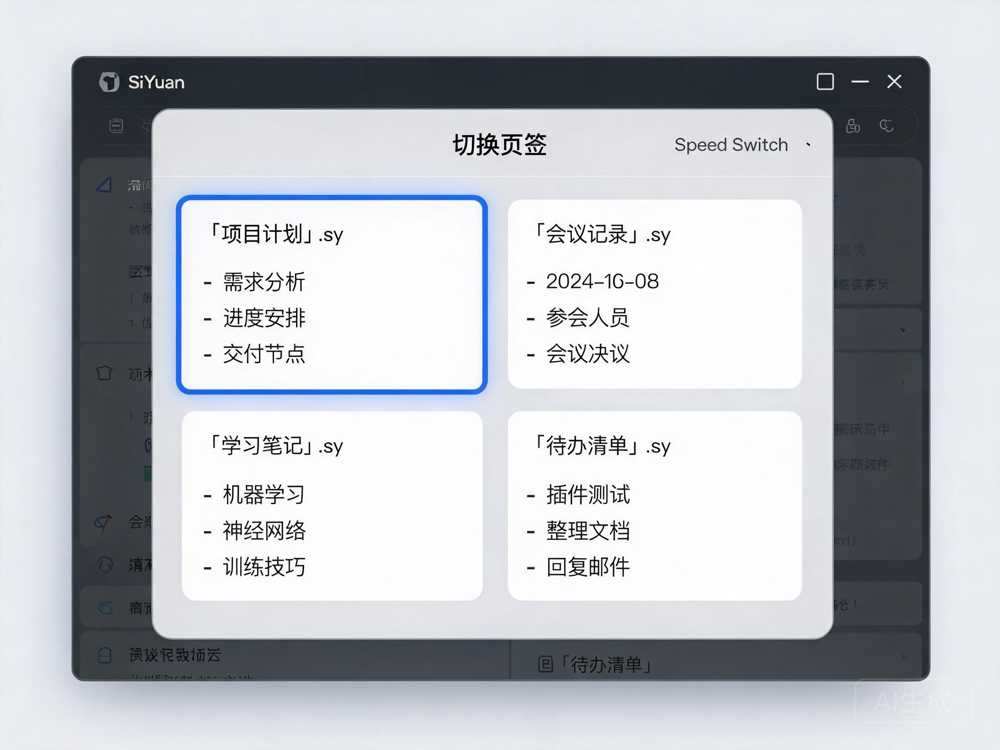
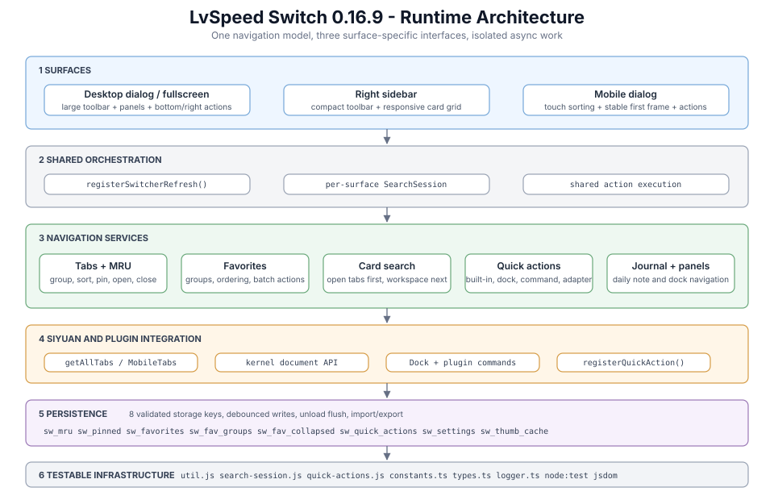

# 小驴速切（LvSpeed Switch）

[](./plugin.json) [](./LICENSE) [](https://b3log.org/siyuan)

思源笔记页签切换器：像 Windows **Win+Tab / Alt+Tab** 一样，以**实时缩略图**快速切换已打开的页签；内置**收藏分组**、**全库搜索**、**面板速达**、**侧边栏常驻**、**全屏模式**五种效率武器，**分栏（分屏）布局完全支持**，**手机端完整适配**。

<p align="center"></p>

[English README](./README.en-US.md)

## ✨ 功能特性

### 切换
- 🌟 **缩略图预览** — 每个页签一张卡片，实时展示文档内容；后台未渲染的页签自动经内核 API 拉取内容，首次打开也能看到全部缩略图。
- 🔀 **分栏原生支持** — 页签按窗口（分栏）分组展示，切换时自动激活对应分栏。
- ⌨️ **全键盘操作** — 方向键 / `Tab` 移动选择（按真实网格列数移动），`Enter` 切换，`Esc` 关闭，与 Alt+Tab 肌肉记忆完全一致。
- 📌 **页签置顶** — 卡片图钉一键置顶，置顶页签始终排在最前；按文档记忆，重开后仍保留。
- 🖥️ **全屏模式** — 工具栏一键在「全屏 ⇄ 普通」间切换，全屏下缩略图墙铺满整个窗口；也可在设置中固定默认全屏，`Esc` 退出。

### 收藏与分组
- ⭐ **一键收藏** — 卡片星标收藏；文档页签按 rootID 记忆，**页签关闭后仍可从收藏一键重开**，重启不丢。
- 🗂️ **分组管理** — 收藏时可归入已有分组或现场新建；设置页支持**新建 / 行内重命名 / 删除分组**、逐项调整收藏所属分组，全部即时保存。
- 🖱️ **右键速达** — 卡片与收藏下拉项均支持右键：**移动至分组**（子菜单直选）、**新建分组并移动**、取消收藏，批量整理不用进设置页。
- 📂 **分组下拉** — 顶栏收藏下拉为自定义组件：分组标题带数量徽标，**点击折叠 / 展开**，窄侧边栏下自动收窄并夹紧在面板内，不会溢出遮挡。

### 搜索与排序
- 🔍 **两段式搜索** — 上半区实时匹配已打开页签，下半区自动搜索**全库文档标题**（排除已打开，点击直开）；180ms 防抖 + 结果缓存 + 过期请求取消，重复关键词秒出。
- 🔃 **六种排序** — 最近使用 / 打开顺序 / 打开倒序 / 最近编辑 / 标题升降序，切换器内即选即存。

### 面板与侧边栏
- 🖇️ **面板速达** — 切换器左侧列出全部 dock 面板（文件树、大纲、书签、关系图、反链、标签、收集箱、AI 聊天等），点击即展开聚焦；设置中可隐藏不需要的面板。
- 📎 **侧边栏模式** — 一键把页签列表固定为右侧 Dock 面板：卡片常驻、随面板尺寸自动伸缩，不打断当前工作流；侧边栏拉宽时可选择**放大缩略图**或**自动增加列数**。
- 📅 **当日日记** — 切换器弹窗顶栏新增日记按钮：打开切换器后即可一键打开/新建当日日记；默认日记本可在 **设置 → 日记** 下拉选择，未设置时首次点击会弹出选择。

### 手机端
- 📱 **完整适配** — 顶栏常驻入口按钮 + 可选悬浮按钮（默认关闭，可在设置中开启），轻触即开切换器；缩略图、收藏、搜索与桌面端同款体验。
- 👆 **触控交互** — 长按卡片弹出置顶 / 收藏 / 分组 / 关闭菜单（对应桌面右键）；悬浮按钮上滑隐藏、下滑出现，与思源工具条一致。
- 🗂️ **布局自适应** — 卡片布局支持单列 / 双列 / 自动（竖屏单列、横屏双列），设置一次两端同步。

### 性能与外观
- 💾 **缩略图缓存** — 按文档缓存内容快照，重置布局、重启思源都秒开；页签关闭自动清理，单条上限 200KB 防膨胀。
- ⚡ **视口懒渲染** — 只生成滚动到可视区的缩略图，大量页签秒开；排序切换复用卡片，已渲染缩略图原样保留。
- 🎨 **跟随主题** — 全部样式基于思源主题变量，明暗主题与**非官方主题**无缝跟随；设置开关强制两态高对比，任何主题下状态一目了然。

## 🚀 快速上手

1. **打开**：顶部工具栏右侧布局图标，或快捷键 `Alt+Shift+S`（可在 **设置 → 快捷键** 修改）；手机端点顶栏入口或悬浮按钮。
2. **切换**：点击卡片，或方向键 / `Tab` 移动后 `Enter`；左侧点击面板直达。
3. **管理**：卡片图钉置顶、星标收藏（点击星标弹出分组菜单）；右上角 × 关闭页签，右键卡片还有完整菜单（手机端长按卡片）。
4. **搜索**：顶栏输入关键字，页签与全库文档结果同时呈现。
5. **常驻**：顶栏「侧边栏模式」按钮把切换器固定到右侧 Dock。
6. **全屏**：顶栏全屏按钮一键铺满窗口，再点或 `Esc` 恢复。

## ⌨️ 快捷键

| 按键 | 动作 |
| --- | --- |
| `Alt+Shift+S` | 打开 / 关闭切换器（全局，可在设置中改） |
| `↑` `↓` `←` `→` | 按网格移动选择 |
| `Tab` / `Shift+Tab` | 下一项 / 上一项 |
| `Enter` | 切换到选中页签 |
| `Esc` | 关闭切换器 |

## ⚙️ 设置

**设置 → 插件 → 小驴速切 → 设置**（切换器内齿轮按钮直达），左侧标签栏一键切换五个分组，改动即时保存：

| 标签页 | 可配置项 |
| --- | --- |
| 外观 | 切换器宽高（480–1920 × 360–1280）、缩略图列数（自动 / 2–8）、缩略图高度（72–360） |
| 行为 | 默认排序方式、全屏模式（默认关，开启后打开即铺满窗口） |
| 面板 | 左侧面板列表显示 / 隐藏、显示方式（完整 / 折叠图标 / 隐藏）、侧边栏缩略图布局（放大 / 自动增列） |
| 收藏 | 分组新建 / 重命名 / 删除，收藏项分组调整 |
| 日记 | 默认日记笔记本（下拉选择，首次点击日记按钮也会弹出选择） |
| 手机端 | 悬浮按钮开关（默认关）、卡片布局（单列 / 双列 / 自动） |

## 📦 安装

- **集市安装**：思源 **设置 → 集市 → 插件** 搜索「小驴速切 / LvSpeed Switch」（待上架社区集市）。
- **手动安装**：从 [Releases](https://github.com/ai68298100/siyuan-speed-switch/releases) 下载 `package.zip`，解压到 `<工作空间>/data/plugins/siyuan-speed-switch/` 后重启思源（文件夹名必须为 `siyuan-speed-switch`）。

## 环境要求

- 思源笔记 v3.1.20+（使用 `getAllTabs` API）。
- 桌面客户端 / 浏览器桌面端前端（支持页签与分栏）。
- 手机端功能（悬浮按钮、页签切换、收藏）需思源 **v3.8.0+**（依赖移动端 MobileTabs 多页签系统）。

## 更新日志

### v0.16.7（2026-09-05）

- 修复未激活页签无法收藏的问题，兼容思源懒加载页签的文档 ID，并允许加载完成后重新解析。
- 修复收藏分组一键打开/关闭执行不完整的问题，增加页签状态确认后再继续批量操作。
- 修复 Neo 等主题把手机端收藏、置顶、关闭按钮撑大的问题，强制固定按钮与图标尺寸。
- 修复移动端关闭失败仍被计入成功数量的问题，单个关闭失败时保留卡片并提示。
- 修复移动端“最近编辑”排序的异步更新时间竞态。
- 缩略图缓存改为防抖写盘，卸载时等待待保存数据完成，并补充内核请求错误处理。
- 发布工作流增加版本一致性、类型检查、单元测试和冒烟测试门禁。

### v0.16.6（2026-09-05）

- **排序切换立即看到最新更新时间**：桌面弹窗、侧边栏、手机端切到「最近编辑」排序时共享并回填文档更新时间，首屏顺序更准、切换后不再跳变。
- **批量关闭组内页签计数准确**：只有真正关闭成功的页签才计入提示，失败不再虚报数量。
- **手机端排序切换不丢状态**：复用当前列表装配结果，切换后立即按最新数据重排并清空搜索词。
- **emoji 图标识别更准**：组合 emoji（如 👨‍👩‍👧）与肤色修饰 emoji（如 👍🏽）能正确按 emoji 渲染。
- 修复收藏下拉在弹窗销毁瞬间的监听残留；收藏底部弹窗无收藏时给出提示而非静默。

### v0.16.5（2026-09-05）

- **启动时自动净化持久化数据**：收藏列表自动按 key 去重、剔除损坏条目并归一化字段类型，置顶与分组列表过滤非法条目——历史遗留的脏数据不再随使用被放大。
- 净化遵循"仅在数据确实被清理时才写回"原则，正常情况下启动零额外磁盘写入。

### v0.16.4（2026-09-05）

- **修复收藏页签点击后消失的问题**：懒加载未激活页签收藏时，文档 ID 解析失败导致收藏键退化为一次性页签 ID——跳转必然失败、星标状态错乱引发重复收藏，最终收藏被反复清理清空。
- 未加载完成的页签点击收藏时，现在会提示"请先切换到该页签再收藏"，不再产生无法跳转的坏数据。
- 历史遗留的失效收藏条目会在打开对应页签后自动迁移修复，无需手动清理。
- 收藏下拉点击 / 一键打开分组时，对无法定位文档的条目给出明确提示，不再静默失败；收藏条目永久保留，仅主动删除时移除。

### v0.16.3（2026-09-05）

- 修复手机端页签卡片右下角置顶 / 收藏 / 关闭三个操作按钮的显示问题。
- 修复收藏夹"一键打开 / 一键关闭收藏页签"无法对整组页签生效的问题。
- 最近使用（MRU）列表新增 200 条上限，防止插件数据随使用无限膨胀。

### v0.16.0（2026-09-05）

- **架构与文档**：
  - README 加 `docs/architecture.svg` 五层架构图（入口 → 切换器主层 → 子系统 → 持久化 → 基础设施）。
  - README "开发"小节扩展："如何新增设置项 / dock 面板 / 排序方式" 三段实战指南。
  - 新增 `docs/adr/0001-method-splitting.md` / `0002-constants-module.md` / `0003-testing-strategy.md` 三份决策记录，给未来重构时回溯。
- **新建 `src/constants.ts`**：集中所有 magic number / 阈值（按域分组 + `_MS` / `_PX` / `_MIN/MAX` 命名约定）：
  - 时间：`SEARCH_DEBOUNCE_MS` / `SAVE_DEBOUNCE_MS` / `FAB_HIDE_DELAY_MS` / `MESSAGE_DEFAULT_MS` / `UPDATED_CACHE_MS`
  - 像素：`DIALOG_WIDTH_MIN_PX/MAX_PX` / `DIALOG_HEIGHT_MIN_PX/MAX_PX` / `THUMB_HEIGHT_MIN_PX/MAX_PX` / `MOBILE_THUMB_HEIGHT_MIN_PX/MAX_PX` / `BACK_TOP_THRESHOLD_PX` / `SIDEBAR_DEFAULT_WIDTH_PX`
  - 范围：`COLUMNS_MIN/MAX` / `MOBILE_COLUMNS_MIN/MAX`
  - `src/index.ts` 同步替换：防抖时长、UI 边界、列数上下限、收藏 / FAB / 回顶阈值；后续调整只改一处。
- **5 个大方法继续拆分**（延续 v0.15.6 攒批）：
  - `onload` 83 → 25 行 — 抽出 `initPersistentData()` / `registerDesktopDock()` / `registerMobileEntries()` / `bindGlobalEvents()`，按 4 个生命周期阶段清晰分层。
  - `applySearch` 56 → 22 行 — 抽出 `runDocSearchFetch()`，本地缓存路径与远程 fetch 路径分离，便于单独测试超时 / 取消分支。
  - `renderDocResults` 70 → 17 行 — 抽出 `ensureDocResultsBox()` / `collectOpenRootIds()` / `appendDocResultsEmpty()` / `buildDocResultItem()`，每个 helper 单一职责；以后单条搜索结果 DOM 改动只需改 `buildDocResultItem`。
  - `buildSettingsFavGroupList` 79 → 16 行 — 抽出 `buildFavGroupRow()` / `replaceFavGroupRowWithRenameControls()`，单行构造与行内重命名 UI 分离。
  - `promptJournalNotebook` 60 → 16 行 — 抽出 `buildJournalPromptHtml()` / `createJournalSelect()` / `populateJournalNotebookSelect()` / `bindJournalPromptEvents()`，弹窗 HTML / 选项填充 / 事件绑定三层清晰。
  - 未拆分：`openSetting`(88) — 闭包持有局部变量，硬拆会破坏可读性，留作下一轮。
- **测试扩展**：
  - 新增 `tests/constants.test.cjs`：校验常量 MIN/MAX/范围自洽 + 防抖时长合理性，**3 用例 / 5.7ms**。
  - `tests/mobile-card-smoke.cjs` 从 3 个按钮尺寸扩展到 7 个 CSS 不变量：3 个 28×28 按钮 + `.sw__icon` 防御塌陷 + `.sw__mobile-card` 存在 + `.sw__mobile-grid` 单列 + `.sw__thumb` 占位。
  - `npm test` 一键跑全部，**总 26 用例 / ~1s 全过**。
- **质量门**：tsc 0 错、build 成功（152 KiB package.zip）、零 console / debugger / alert / `@ts-ignore` 残留、`as any` 仅 1 处（在注释里，非代码）。

### v0.15.6（2026-09-04）

- **巨型方法专项拆分（纯重构，零行为变化）**：把 `src/index.ts` 中所有超过 70 行的单方法拆成 10-50 行的 orchestrator + 单一职责的 helper，全部测试通过，构建产物不变：
  - `renderList()` **100→44 行** — 抽出 `sortGroupItems` / `renderTabGroup` / `buildTabGroupGrid`，引入 `ITabGroupRenderCtx` 接口约束 helper 形参，避免参数爆炸。
  - `renderMobileList()` **74→42 行** — 抽出 `buildMobileGroupGrid` / `renderMobileCardsInGroup`，手机端页签网格渲染解耦。
  - `renderSidebarPanel()` **85→27 行** — 抽出 `buildSidebarHtml` / `observeSidebarResize` / `bindSidebarToolbarEvents`，侧边栏壳层/自适应 ResizeObserver/工具栏交互分层。
  - `assembleSwitcherParts()` **82→47 行** — 抽出 `prepareSwitcherChrome` / `bindSwitcherListArea` / `bindSwitcherBackTop`，切换器骨架/列表区事件/回顶按钮三者分离。
  - `renderFavPanel()` **82→31 行** — 抽出 `appendFavGroup` / `appendFavFlatList`，开始复用上一轮提取的 `groupFavoritesByGroup` 纯函数。
  - `openFavMenu()` **73→16 行** — 抽出 `buildFavMenuUnfavorited` / `buildFavMenuFavorited`，未收藏/已收藏两种菜单构造分支彻底分离。
  - `openSetting()` **385→90 行** — 抽出 `buildSettingsAppearance` / `buildSettingsBehavior` / `buildSettingsPanels` + `buildSettingsDockToggles` / `buildSettingsMobile` / `buildSettingsJournal` / `buildSettingsFavorites` + `buildSettingsFavCreateRow` / `buildSettingsFavGroupList` / `appendSettingsFavItems`，设置页五个标签页（外观/行为/面板/收藏/手机端）的构建代码各自独立，新增配置项不会再让主方法涨回去。
- **`src/util.js` 新增两个纯函数**：
  - `resolveIconFallback` —— 配合上一轮手机端图标 bug 修复，固化 5 种 case 的回退策略；
  - `buildTabGroupsByParent(tabs, fallbackKey)` —— 给 `renderList` / `renderMobileList` 共用，桌面/手机端页签按父窗口分组的逻辑收敛成可测函数。
- **单测增量**：`buildTabGroupsByParent` 4 个用例（jsdom 中验证 Map 顺序与 fallback window key），`resolveIconFallback` 5 个，`groupFavoritesByGroup` 4 个，总计 **23/23 通过**。
- **后续候选**：`onload`(86) / `buildSettingsFavGroupList`(81) / `renderDocResults`(75) / `promptJournalNotebook`(63) / `openMobileGroupActions`(59) / `applySearch`(58) / `setupFavDropdown`(57) / `openCardMenu`(56) / `bindKeydown`(55) 仍偏长，留待下几轮继续拆。

### v0.15.5（2026-09-04）

- **修复手机端页签卡片图标显示问题**：
  - `getMobileTabs()` 现在同时读取思源不同版本里页签图标字段的可能存放位置——优先 `t.icon`，再回退 `t.current.icon`；
  - 抽出 `resolveIconFallback(raw)` 纯函数到 `src/util.js`，覆盖空值 / `icon*` 图标名 / emoji 字符 / 4-6 位 hex codepoint / 非法字符串 5 种情况，全部测试用例就位；
  - SCSS 给 `.sw__icon` 加上 `min-width/height: 14px`、svg `display:block`、空值占位符，杜绝 SVG 加载失败导致空白塌陷与后续标题错位。
- **修复桌面/手机收藏分组一键开/关不全**：
  - `openGroupTabs()` / `closeGroupTabs()` 改为 `async`，串行等待每次 `openTab` / `mobileOpenDoc` / `MobileTabs.close` 完成后再进行下一步，杜绝并发丢调用；
  - `closeTabQuietly()` 改为 `async`，会 await `MobileTabs.close` 返回的 Promise，桌面端 `removeTab` 后额外 sleep 30ms 让思源 DOM/状态沉降；
  - 新增 `sleep(ms)` 工具方法；
  - `openFavGroupMenu` / `openMobileGroupActions` 的 click 回调改为 async/await，操作完成后再关菜单/弹窗并刷新背后切换器列表，避免"列表提前刷新而操作尚未生效"。
- **单测增量**：`resolveIconFallback` 5 个用例，总计 19/19 通过（10.5ms）。

### v0.15.4（2026-09-04）

- **手机端切换器 `showMobileSwitcher()` 拆分**：138 行 → 12 行的 orchestrator + 5 个 helper（`createMobileSwitcherDialog` / `buildMobileSwitcherHtml` / `bindMobileSwitcherToolbarActions` / `renderMobileSwitcherList` / `openMobileSwitcherDialog`），顶栏按钮、搜索、排序、FAB 恢复等职责清晰分离。
- **手机端收藏弹窗 `showMobileFavSheet()` 拆分**：151 行 → 30 行的 orchestrator + 6 个 helper；HTML 生成、分组聚合、单列表/分组列表渲染、背景关闭等拆开后更易于定位移动端问题。
- **卡片构建 `createCard()` 拆分**：152 行 → 38 行的 orchestrator + 5 个 helper（`buildCardThumb` / `buildCardMeta` / `buildCardIcon` / `buildCardActions` / `bindCardLongPress`），图标渲染路径独立为 `buildCardIcon`，便于单独调试手机端图标问题。
- **新增 `groupFavoritesByGroup` 纯函数**：上提到 `src/util.js`，保留注册表空分组、未命名兜底到 `""` 组、返回 Map 保持插入顺序；新增 4 个单元测试覆盖边界场景，当前共 14/14 通过。
- **开发依赖**：加入 `jsdom@30.0.1` 用于移动端 UI 抽测。

### v0.15.3（2026-09-04）

- **桌面切换器主体拆分**：`showSwitcher()` 从 181 行的巨型方法拆成 5 个语义清晰的 helper：`createSwitcherDialog` / `buildSwitcherHtml` / `assembleSwitcherParts` / `bindSwitcherFullscreenToggle` / `bindSwitcherToolbarActions`，主体压缩到 22 行的"菜单式"调用。每个 helper 可单独读、单独测，单一职责清晰。
- **新增 `src/util.js` 纯函数工具模块**：导出 `clampNum` / `stableSortBy` / `normalizeSortBy` 三个零依赖工具。`getSettings()` 中三处"`*_LIST.includes(x as T) ? x as T : DEFAULT`"模式替换为单行 `normalizeSortBy(...)`，缩略图 LRU 缓存淘汰改用 `stableSortBy`，业务逻辑更声明式。
- **单元测试 / UI 抽测基建**：新增 `tests/util.test.cjs`（Node 22 内置 `node:test`，10 个 assertion，6ms 内全过）和 `tests/mobile-card-smoke.cjs`（jsdom 加载思源移动端 base CSS + litheness sprite 后抽测三按钮仍是 28×28px）。`package.json` 增加 `npm test` 与 `npm run test:smoke` 两条命令；零新依赖。

### v0.15.2（2026-09-04）

- **类型安全大重构**：新增 `src/types.ts`，集中定义思源全局对象（`window.siyuan`）、Protyle 懒挂 model、MobileTabs API、layout dock 等反推类型；引入 `getSiyuan()` helper，业务代码中 `(window as any).siyuan` 全部消失。`getSettings()` 内 23 处 `(saved as any).xxx` 收窄为 1 处 `as Partial<ISwSettings>` 整体断言。`as any` 实际使用从 44 处降至 0 处（其余 6 处为 TS 官方推荐的 `as unknown as X` 双步窄化）。
- **结构化 logger**：新增 `src/logger.ts`，21 处 `console.warn("[speed-switch] xxx fail", e)` 全部替换为 `logger.warn(...)`，统一 `[speed-switch]` 前缀与单一 `ENABLED` 开关；保留 `error/info/debug` 接口方便后续扩展。
- **`mobileOpenDoc` 三路径兜底**：原 `// TODO: Mobile` 占位实现完整化——优先 `MobileTabs.open(rootId)`，调用 300ms 后轮询 `activeTabID` 是否变化确认生效；未生效自动降级到 `plugin.openTab({app, doc})`；双失败时通过新增 i18n key `openDocFailed` 提示用户。
- **重构细节**：`dock` 回调的 `(this as any).element` 改用强类型 `IDockHandlerSelf`；HTMLElement 自挂私有属性 `__swThumbObserver` 改用模块级 `WeakMap` 持有，杜绝 element 上的侵入式赋值。无用户可见 UI 变化。

### v0.15.1（2026-09-04）

- **顶栏"打开今日日记"图标修复**：电脑端与手机端顶栏的"打开今日日记"按钮之前引用了不存在的 `#iconDate`（思源 litheness 图标精灵中无此符号），图标实际为空白。现已改为 `#iconCalendar`（思源自带日历符号），电脑端、手机端均正常显示。
- **收藏面板右键打开 / 关闭组内页签（电脑端）**：右键任意收藏分组标题，即可一键开启该分组内全部收藏页签，或一键关闭组内已打开的页签，与手机端 ⋯ 按钮对齐。
- **收藏面板 ⋯ 按钮（手机端）**：收藏底部弹窗每个分组标题旁新增 ⋯ 按钮，点击弹出"一键开启 / 一键关闭"操作单；操作完成后自动刷新底层切换器列表。
- **手机端卡片底部按钮防御性硬化**：进一步收紧 `.sw__pin / .sw__fav-btn / .sw__close` 的盒模型与文本样式（`box-sizing:border-box`、`line-height:0`、`font-size:0`、`appearance:none`、`svg{display:block}` 等），对抗潜在的 SVG 精灵未及时注入、内联 SVG 默认 300×150、WebView 按钮默认外观等导致按钮被异常放大的路径。

### v0.15.0（2026-09-04）

- **收藏分组折叠状态持久化**：收藏面板中每个分组的展开 / 折叠状态会记忆下来并跨会话保留，重启思源后仍保持上次的折叠状态；删除 / 重命名分组时自动清理对应记忆。
- **设置面板记住上次标签页**：打开设置弹窗默认定位到上次使用的标签页（如上次停留在「手机端」，下次直接跳到该分组），无需每次重新点击。
- 构建与工程化小改进：`tsconfig` 编译目标提升至 `es2017`（消除数组 `includes` 类型报错），README 版本徽章与插件版本三处同步。

### v0.14.0（2026-09-04）

- **收藏分组批量开/关（电脑端）**：右键收藏分组头，可一键开启该分组内全部收藏页签，或一键关闭组内已打开的页签。
- **收藏分组批量开/关（手机端）**：收藏底部弹窗中，分组标题旁新增 ⋯ 按钮，弹出操作单提供同样的一键开启/关闭。
- 操作完成后会提示"已开启/已关闭 N 个页签"，无变更时不打扰。

### v0.13.2（2026-09-04）

- **手机端体验优化**：收藏底部弹窗新增半透明遮罩并适配底部手势条/导航栏安全区；顶栏收藏、日记、设置按钮尺寸统一，卡片操作按钮与悬浮按钮扩大触控热区，更易点中。
- **跨端细节修复**：搜索框关闭拼写检查，设置页数字输入支持数字键盘与读屏标签；设置页标签页补全读屏状态，并支持系统"减弱动态效果"设置。

### v0.13.1（2026-09-04）

- **日记按钮移入切换器**：外部顶栏不再额外占用日记按钮位，电脑端与手机端均只保留一个切换器入口；日记按钮改到**切换器弹窗顶栏**，打开切换器即可一键打开/新建当日日记。

### v0.13.0（2026-09-04）

- **当日日记快捷入口**：电脑端与手机端顶栏各新增一个日记按钮，点击一键打开/新建**当日日记**（已在别的日期创建过也不重复，当天只有一份）。
- **默认日记本设置**：新增 **设置 → 日记** 分组，下拉选择默认笔记本；若从未设置，首次点击日记按钮会先弹出笔记本选择框，选完才打开日记。
- 打开已有日记或新建当日日记均在该设置的笔记本中完成，改动即存、双端同步。

### v0.12.1（2026-09-04）

- **手机端悬浮按钮默认关闭**：避免底部被冗余悬浮球打扰；需要时到 **设置 → 手机端** 打开「启用悬浮按钮」即可。顶栏入口按钮始终可用，不影响切换器体验。

### v0.12.0（2026-09-04）

- **设置页标签化重构**：原来的超长单页设置改为「左侧标签栏 + 右侧分组面板」——外观 / 行为 / 面板 / 收藏 / 手机端五个标签一键直达；数字输入带单位标签、开关与下拉统一格式，改动仍即时保存。
- **收藏下拉右键菜单（电脑端）**：收藏的页签支持右键——**移动至分组**（子菜单直选，当前分组打勾）、**新建分组并移动**、**取消收藏**；操作后面板保持展开并就地刷新，可连续整理多个收藏。
- **卡片右键菜单增强**：已收藏页签新增「移动至分组」子菜单（当前分组打勾）与「新建分组」入口；未收藏页签可直接「新建分组收藏」。
- **侧边栏缩略图布局设置（设置 → 面板）**：侧边栏拉宽时默认**放大缩略图**填满栏宽，也可切换为**自动增加列数**显示更多页签，切换即时生效。
- **手机端设置适配**：设置弹窗按视口自适应宽高（横屏不再溢出屏幕），窄屏下标签栏自动收窄、设置条目改为上下排布。

### v0.11.1（2026-09-04）

- **修复手机端打开切换器瞬间图标巨大、布局错乱后自愈的问题**：根因是思源弹窗先挂载 DOM、50ms 后才补 `b3-dialog--open` 类，期间容器处于缩放过渡态，手机 WebView 中该窗口内的卡片按钮会渲染错乱。现禁用该动画窗口，弹窗同步进入最终态，切换器打开更干脆。
- **手机端卡片操作按钮重排**：置顶 / 收藏 / 关闭不再悬浮在缩略图上，改落在卡片底部信息行右侧，弱化为纯图标（激活态才显主色），缩略图完整无遮挡。
- **悬浮按钮位置继续上移**（96→120px，含安全区），彻底避开思源底部工具条；手势增加主轴判定，横向滑动不再误触隐藏。
- 顺带移除手机端按钮的 `backdrop-filter` 毛玻璃（WebView 动画期渲染错乱诱因之一，也更省性能）。

### v0.11.0（2026-09-04）

- **修复手机端样式整块失效的问题（重大）**：样式嵌套层级错误导致手机端弹窗的 39 条专属规则（工具栏紧凑化、卡片布局、操作按钮常显、触控反馈等）编译出的选择器永远无法匹配，实际一直在用桌面样式兜底。修复后手机端界面真正按移动端设计显示——工具栏尺寸、单列 / 双列 / 自动卡片布局、缩略图高度、置顶 / 收藏 / 关闭按钮常显与按压反馈全部生效。
- **README 全面更新**：功能特性补全全屏模式与手机端章节；设置表更新为五区；快速上手补充手机端与全屏入口；旧版本更新日志折叠收纳；移除过时的 README.zh-CN.md（中文说明直接使用主 README）。
- 插件描述（集市展示）补充全屏模式。

### v0.10.1（2026-09-04）

- **手机端悬浮按钮优化**：
  - 位置上移至单手拇指自然活动区，更易触及。
  - 尺寸缩小（48→40px）并增加透明度，降低对内容的遮挡。
  - 上滑隐藏、下滑出现，与思源自带工具条行为保持一致。

### v0.10.0（2026-09-04）

- **全屏模式优化（电脑端）**：切换器工具栏新增全屏切换按钮——普通模式点击进入全屏，全屏模式点击退出，互相切换；原地切换不重建弹窗，缩略图与搜索状态全保留。设置项仍决定打开时的初始模式，Esc 退出不变。
- **设置页开关强化**：修复部分主题下开关开/关两态视觉一致、无法分辨状态的问题——关闭为描边轨道 + 灰点，开启为主色实心轨道 + 白点；并修复「面板显示设置」列表开关结构错误导致的渲染异常。

### v0.9.0（2026-09-04）

- **全屏模式（电脑端，设置 → 行为）**：切换器可铺满整个窗口，按 Esc 退出；默认关闭，开启时给出提示。
- **手机端顶栏入口**：思源 3.8.x 手机端不向插件开放顶栏，现直接在顶栏插入入口按钮，一眼可见、轻触即开。
- **手机端交互优化**：
  - 打开切换器不再自动聚焦搜索框，避免输入法直接弹出；点击输入框才可搜索。
  - 重构顶部工具栏：搜索图标恢复正常尺寸，单行排列（搜索 + 排序 + 收藏 + 设置），精简置顶。
  - 悬浮按钮位置上移，避开底部胶囊工具条；打开切换器时自动隐藏、关闭后恢复。
- **修复**：设置页"启用悬浮按钮"开关不生效；手机端卡片布局默认值改为「自动」（竖屏单列、横屏双列）。

### v0.8.0（2026-09-04）

- **性能优化（电脑端与手机端）**：
  - 缩略图**视口懒渲染**：只生成滚动到可视区（含 240px 预载边距）的卡片缩略图，打开切换器从"全量克隆"降为"首屏克隆"，大量页签秒开。
  - 缩略图克隆量与文档大小解耦：只克隆文档前 30 个块（缩略图本就只显示首屏），大文档不再卡顿。
  - 排序切换/列表刷新时**复用已有卡片**（DOM 移动而非重建），已渲染缩略图原样保留，重排瞬时完成。
  - 内核 `getDoc` 回源加**并发闸门**（桌面 4 / 手机 2），避免打开瞬间打爆内核；回源内容量下调。
  - 懒加载页签的 rootID 解析加会话级缓存（免重复 `JSON.parse`）；「最近编辑」排序的 SQL 查询加 3 秒短缓存。
  - 手机端缩略图缓存上限 20 → 30。
- **左侧面板三种显示方式（电脑端，设置 → 面板）**：
  - **完全隐藏**：不显示左侧面板列，内容区占满弹窗全宽。
  - **折叠显示**：左侧收为一排图标（44px），悬停浮出面板名称，点击即激活；顶部按钮可随时展开/收起。
  - **完整显示**：现状（图标 + 名称列表）。
- **手机端长按菜单**：长按页签卡片（约 0.5 秒）弹出置顶/收藏/分组/关闭菜单，与电脑端右键一致。
- **空态引导**：无页签时提示可通过搜索框检索并打开全库文档。
- 修复：默认聚焦项在「最近使用」排序下匹配键错误（MRU 已按文档 rootID 记录）导致焦点定位失效。

### v0.7.1（2026-09-04）

- **修复手机端切换器无法使用的问题**：思源 `getAllTabs` 插件 API 在手机端恒返回空数组（移动端为独立构建），导致点击悬浮按钮无任何反应。现改用思源 3.8+ 的 `window.siyuan.mobile.tabs`（MobileTabs）作为手机端页签数据源，切换/关闭页签亦走 MobileTabs 对应接口。
- **修复手机端打开文档无效**：`openTab` 插件 API 在手机端为空实现，全库搜索与收藏跳转现改走 `MobileTabs.open`，可在手机端正常打开文档。
- **修复手机端提示不可见**：手机端 WebView 拦截原生 `alert`，所有提示改用思源 `showMessage`；旧版思源（<3.8）无 MobileTabs 时会明确提示需升级而非静默失败。
- 「最近使用」排序改按文档 rootID 记录，手机端与桌面端共用同一份 MRU 数据，同步后两端排序一致。
- 手机端卡片图标支持文档自定义 emoji 图标。

### v0.7.0（2026-09-04）

- **手机端适配**：新增悬浮按钮（FAB，可在设置中关闭）、全屏页签切换器（底部弹窗收藏）、响应式卡片布局（单列/双列/自动），移动端操作更便捷。
- 手机端设置项：悬浮按钮开关、卡片布局选择（单列/双列/自动）；所有设置项与收藏分组/内容通过插件级存储同步，配合思源同步功能保持手机与电脑一致。
- **底部弹窗收藏**：手机端点击收藏按钮弹出底部弹窗（Bottom Sheet），按分组展示收藏页签，触控友好。
- 优化手机端卡片样式：缩略图更紧凑、操作按钮始终可见、触控区域 ≥44px。
- 兼容思源移动端多系统（安卓/iOS/鸿蒙），使用 CSS 变量自动适配主题。

<details>
<summary>历史版本</summary>

### v0.6.1（2026-09-04）

- 修复清单 `backends` 字段写法（`all` 不与具体平台混用），以通过思源集市上架检查。

### v0.6.0（2026-09-04）

- 设置页收藏管理增强：新增**新建分组**（空分组保留、收藏时可选）、分组**行内重命名**与**删除**（组内收藏自动移入未分组），分组行显示数量徽标。
- 修复侧边栏模式下收藏下拉溢出侧边栏、显示不全的问题：面板改为 fixed 定位并按宿主与视口自动夹紧，窄面板下自动收窄宽度，下方空间不足时向上翻转，滚动 / 缩放时保持贴位。
- 插件英文名统一为 **LvSpeed Switch**（小驴 = Lv），README 全新改版。
- 全新的预览效果图。

### v0.5.0（2026-09-04）

- 收藏性能优化：收藏、置顶、页签切换改为内存缓存 + 合并延迟写盘，连续操作不再逐次触发文件写入，彻底消除收藏反应慢的卡顿。
- 收藏下拉重构为自定义组件：分组标题醒目、分组间有分隔线，点击分组标题可折叠/展开，长列表也能快速定位。
- 设置页分区标题增强：主色小字 + 分隔线，首个分区紧贴弹窗顶部，视觉层次更清晰。
- 插件中文名称统一为「小驴速切」（设置 → 插件 → 小驴速切）。

### v0.4.0（2026-09-04）

- 收藏分组完善：点击星标弹出分组菜单，收藏时可直接选择分组或新建分组；已收藏时可切换分组、移出分组或取消收藏。
- 设置页分区重构：分为「外观 / 行为 / 面板 / 收藏」四区；新增收藏管理，支持重命名分组、逐项调整收藏所属分组（即时保存）。
- 顶栏下拉框增加「收藏」「排序」标签，下拉框加宽，搜索框收窄；窄弹窗下工具栏自动换行。
- 搜索性能优化：防抖 300ms 降至 180ms，结果缓存（重复关键词秒出），过期请求自动取消。
- 修复搜索时全库文档区偶发消失的问题（继续输入关键词后文档结果被误隐藏，本次根因修复）。
- 修复弹窗内关闭页签后分组计数不更新、空分组残留、全部关闭无空态提示的问题。
- 键盘上下导航按真实网格列数移动（此前为固定估算，设置列数后不准确）。
- 侧边栏文档切换时仅更新高亮（消除高频重建导致的闪烁与滚动位置丢失）。

### v0.3.1（2026-09-04）

- 收藏分组：右键已收藏的页签卡片可「设置分组」（支持从已有分组快速选择，留空移出分组）；收藏下拉框按分组两级展示，先选分组、再选页签。
- 置顶/收藏标志更清晰：未收藏显示空心星、已收藏实心主色星（思源星标同款方案），已置顶实心图钉常显。
- 置顶/收藏/关闭按钮增加毛玻璃底，与缩略图内容重叠时也可清晰辨认。
- 修复顶栏收藏下拉框不显示的问题（卡片收藏按钮与下拉框类名冲突所致）。
- 按钮提示改为思源标准 tooltip，修复悬浮出现空白小框无文字的问题。
- 侧边栏缩略图随面板尺寸自动伸缩（拖动分隔条实时重算缩放，不再整列表重建）；侧边栏补上排序下拉，与弹窗功能一致。

### v0.3.0（2026-09-03）

- 搜索双区展示：搜索时上半部分显示匹配的已打开页签卡片，下半部分显示全库文档结果（自动排除已打开文档，点击直接打开）。
- 新增侧边栏模式：切换器顶栏「侧边栏模式」按钮可将页签列表固定到右侧 Dock 面板，单列卡片常驻显示、自动匹配面板尺寸，便于快速切换页签。
- 新增收藏功能：卡片星标按钮一键收藏/取消收藏；顶栏收藏下拉框可快速跳转，文档页签关闭后仍可从收藏重新打开（按文档记忆、重启保留）。
- 完善右键菜单：卡片右键支持置顶/取消置顶、收藏/取消收藏、关闭页签。

### v0.2.2（2026-09-03）

- 界面现代化改版：搜索框带放大镜图标、控件统一高度与圆角、卡片悬浮上浮阴影、当前页签主色高亮、分组标题加分隔线、左侧面板浅底高亮、细化滚动条，全部颜色使用思源主题变量，明暗主题自动适配。
- 修复卡片/置顶/关闭按钮背景失效问题（误用了思源中不存在的 `--b3-card-background` 变量）。
- 修复全库文档搜索结果项未设文字颜色的问题（暗色主题下可能不可见）。
- 缩略图加载态改为旋转刷新图标；空结果提示独立样式；回到顶部按钮改为淡入上浮动画。
- 设置页面板开关列表改为浅底圆角容器，交互更清晰。

### v0.2.1（2026-09-03）

- 修复缩略图缓存重启/重置后不生效的问题：思源恢复布局时未激活页签的 model 是懒加载的，现从页签头的 `data-initdata` 兜底解析 rootID，首次打开即可命中缓存或通过内核 API 拉取。
- 顶栏固定：名称 / 搜索框 / 排序 / 设置合并为一行，滚动浏览缩略图时始终可见、不随内容滚走。
- 新增一键回到顶部按钮：下拉较深后浮现于右下角，点击平滑回顶。

### v0.2.0（2026-09-03）

- 缩略图持久化缓存：按文档 rootID 缓存内容快照，只要页签未关闭，无论重置布局还是重启思源，缓存都保留并直接命中；页签关闭后自动清理。
- 切换器内新增快捷设置入口（工具栏齿轮按钮），一键直达插件设置页。
- 排序方式扩展至 6 种：最近使用 / 打开顺序 / **打开倒序** / **最近编辑**（按文档更新时间）/ 标题升降序。
- 搜索升级：优先显示已打开页签的匹配结果；无匹配时自动搜索**全库文档标题**，点击结果即可直接打开文档。

### v0.1.0（2026-09-03）

- 新增插件设置页：切换器窗口宽高、缩略图列数与高度、默认排序、面板显示配置（设置 → 插件 → 小驴速切 → 设置）。
- 新增页签置顶：卡片图钉按钮，置顶页签固定在本组最前，按文档记忆、重启保留。
- 新增排序与搜索：最近使用 / 打开顺序 / 标题升降序四种排序（切换器内可切、持久保存），搜索框实时筛选。
- 样式全面跟随主题：缩略图与卡片改用主题变量，明暗主题无缝切换。
- 首次打开即显示全部缩略图：后台未渲染的页签通过内核 API 读取文档内容。
- 修复重启后最近使用记录丢失的问题（启动时预加载持久化数据）。

- v0.0.4（2026-09-03）：仓库更名为 siyuan-speed-switch；接入 GitHub Actions 自动打包发布；README 中文化。
- v0.0.3（2026-09-03）：修复默认快捷键无反应；新增左侧面板切换列表；缩略图每次打开渲染最新状态。
- v0.0.2（2026-09-03）：修复页签标题与缩略图不显示的问题。
- v0.0.1（2026-09-03）：首个版本，基础页签缩略图切换。

</details>

## 🏗️ 架构

<p align="center"></p>

插件按 5 层组织，每层职责清晰、向下单向依赖：

| 层 | 入口文件 / 类 | 职责 |
| --- | --- | --- |
| 入口层 | `index.ts → onload` | 顶栏按钮、侧边栏 dock、命令面板快捷键、手机端 FAB |
| 切换器主层 | `showSwitcher` / `showMobileSwitcher` / `renderSidebarPanel` | 三种切换入口（弹窗 / 侧边栏 / 全屏）的统一编排 |
| 子系统层 | `renderList` / `applySearch` / `openFavMenu` / `promptJournalNotebook` / `openSetting` | 卡片渲染、搜索、收藏、日记、设置 |
| 持久化层 | `loadData` / `saveDataDebounced` (this.data) | 7 个 storage key 的读 / 写（去抖 500ms） |
| 基础设施 | `util.js` / `types.ts` / `constants.ts` / `logger.ts` | 纯函数、TS 类型、常量、结构化日志 |

**纯函数优先**：所有能脱离 `this` 的逻辑（裁剪、排序、分组、图标解析、tab 树）一律抽到 `src/util.js` 并用 `node:test` 覆盖（23 用例）。`src/constants.ts` 集中所有阈值（防抖时长、缓存上限、UI 边界）。

**测试矩阵**（在 `npm test` 一键跑）：

| 文件 | 覆盖范围 | 用例 |
| --- | --- | --- |
| `tests/util.test.cjs` | 6 个 `util.js` 纯函数 | 23 |
| `tests/constants.test.cjs` | 常量 MIN/MAX/范围自洽 | 3 |
| `tests/mobile-card-smoke.cjs` | 移动端卡片 UI 渲染 + 7 个 CSS 不变量（jsdom） | 7 |

## 开发

### 快速命令

```bash
pnpm install      # 安装依赖
pnpm dev          # 开发监听（产出 dev 版 dist/）
pnpm build        # 生产构建 → dist/* + package.zip
pnpm test         # 单元 + 常量测试
npm run test:smoke # 移动端 UI 烟雾测试（需先 pnpm build）
```

推送 `v*` 标签即会触发 GitHub Actions 自动构建并发布 Release。

### 如何新增一个设置项

1. **`src/types.ts`** — 在 `ISwSettings` 加字段 + 默认值：
   ```ts
   export interface ISwSettings {
       myNewOption: boolean;     // 新字段
       // ...
   }
   ```

2. **`src/constants.ts`** — 若有边界，加常量（`MY_NEW_MIN` / `MY_NEW_MAX`）。

3. **`src/index.ts → DEFAULT_SETTINGS`** — 加默认值：
   ```ts
   const DEFAULT_SETTINGS: ISwSettings = {
       myNewOption: false,
       // ...
   };
   ```

4. **`src/index.ts → buildSettingsXxx`** — 在对应标签页 builder 加输入控件（开关 / 下拉 / 数字），改动即写盘。

5. **i18n** — 在 `src/i18n/zh-CN.json` 与 `src/i18n/en.json` 同步加 key（保持 109/109 对齐）。

### 如何新增一个 dock 面板

1. 在 `renderDockList` 内的 `DOCK_ITEMS` 数组追加 `{key, icon, label}` 三元组。
2. 若面板需要特殊激活逻辑（不是简单 `openTab`），在 `openDockByKey` 中加分支。

### 如何新增一个排序方式

1. `SORT_BY_LIST` 常量数组追加排序键。
2. `SortBy` 联合类型追加成员。
3. `sortGroupItems` 内追加排序分支（建议抽到 `util.js` 以便单测）。

## 📜 决策记录

- [ADR-0001 大方法拆分](docs/adr/0001-method-splitting.md) — 为什么把 `onload` / `applySearch` 等 50+ 行的方法按职责拆成 orchestrator + helpers
- [ADR-0002 集中常量到 `src/constants.ts`](docs/adr/0002-constants-module.md) — 为什么 v0.16.0 把 magic numbers 抽到独立模块
- [ADR-0003 纯函数 + jsdom 测试矩阵](docs/adr/0003-testing-strategy.md) — 为什么 `util.js` 必须是零依赖纯函数 + Node 内置 `node:test`

## 许可证

[MIT](./LICENSE)
