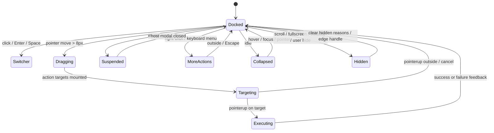

# 悬浮球完整 UI 与功能方案

> T-6756 / T-6764 · 2026-09-22 · 设计状态：本地功能实现与完整验证已完成；真实 SiYuan / Android 验收按 B-004、B-005 后置
>
> 关联：`docs/floating-ball-research.md`、ROADMAP §8.0.7、ADR 0066、ADR 0068；本轮对原方案的修订以 ADR 0068 为准

## 1. 产品定义

悬浮球是小驴雷切的“共享动作注册表的空间入口”。它把切换器、搜索、日记、组件面板、快速记录以及其他已注册快捷动作放到当前思源窗口的一个稳定入口中。

悬浮球必须满足三条心智模型：

1. 轻触球，永远能打开切换器；
2. 拖动球，才进入动作选择，不因为轻微移动误触动作；
3. 动作配置只改变入口和排序，不复制另一套动作执行逻辑。

首层只承担高频动作，低频动作由“更多动作”承接。悬浮球与原生工具栏、切换器底部快捷栏并列存在，三者共享动作定义和执行器。

## 2. 端侧形态

> ADR 0072（2026-09-23）：悬浮球撤出侧栏端，只保留桌面主窗口与手机端；本节侧栏行仅作历史参考，schema 仍容忍旧 sidebar 配置字段。

| 端侧 | 默认状态 | 球体尺寸 | 停靠规则 | 首层面板 | 主要差异 |
| --- | --- | --- | --- | --- | --- |
| 桌面弹窗/主窗口 | 默认关闭，可单独开启 | 默认 48 px，可设 44~64 px | 默认左右吸附；关闭吸附后可自由停放 | 最多 6 项内收半环 | 鼠标悬停显示标签；右键打开更多动作 |
| ~~侧栏~~（已撤出） | ~~未配置时跟随桌面开关，配置后独立~~ | ~~固定 44 px~~ | — | — | 与桌面主窗口同屏重复，ADR 0072 撤出 |
| 手机 | 兼容旧 `fabEnabled`，迁移后默认保持原值 | 默认 48 px，可设 44~64 px | 可视区、安全区及底部 48 px 导航预留之外 | 最多 6 项内收半环 | 触控优先；“更多动作”使用底部抽屉 |

球体初始位置采用右侧、可视区垂直 72% 处；旧版手机 FAB 的右下位置迁移到右侧同一垂直比例。用户拖动后按端侧分别保存。

三端共享动作 ID、能力声明和执行器，也共享外观与行为设置；开关、位置和动作列表分别保存。尺寸设置应用于桌面与手机，侧栏保持 44 px。展开方向根据各端位置和可用空间独立计算。这一实际配置边界修订了 ADR 0066 §6 的全空间配置分端设想，详见 ADR 0068。

## 3. 状态模型



控制器维护显式状态机和统一清理出口。`hidden`、`suspended` 和 `dragging` 互斥；滚动、全屏、后台与手动隐藏分别记录原因，恢复一个原因不能清除其他原因。

### 3.1 停靠态

- 球体显示图标 `iconLayout`，无常驻文字；悬停或聚焦显示“打开切换器”。
- 贴边后可进入半隐藏态，保留可交互的可见部分；关闭吸附并自由停放时不半隐藏。
- 闲置降至 40% 不透明度，交互立即恢复到 100%；不允许降到全透明。
- 默认在弹层、确认框、设置页打开时让位；关闭“弹层让位”后仍保持低于宿主弹层的层级，不抢占宿主按钮。

### 3.2 拖动态

- 使用 Pointer Events，`touch-action: none`，统一处理鼠标、触控笔和触摸。
- 起始位移小于 8 px 视为点击候选；超过 8 px 进入拖动。
- 拖动开始后球体缩放到 0.94、透明度降到 0.72，并显示动作目标。
- 首层目标在拖动开始时按停靠位置计算一次，拖动过程中位置保持稳定；只有球体跟随指针更新 transform，目标不会随球一起逃离指针。
- 指针捕获丢失、窗口失焦、`pointercancel` 或插件销毁都必须回到停靠态并释放监听器。
- 拖动只在当前窗口内移动，位置始终钳制在安全区内。

### 3.2.1 宿主移动手势边界（思源 3.8.5 复核）

- `touch-action: none` 只约束浏览器默认直接操控行为；思源移动端还在 document 冒泡阶段运行自己的 `touchstart/move/end/cancel` 侧滑状态机。
- 移动端 portal 根节点、真实触发按钮和滚动隐藏后的恢复按钮必须声明思源宿主契约 `data-prevent-swipe`，使一整轮触摸由悬浮球拥有，避免同一根手指同时驱动悬浮球拖动和思源侧栏滑动。
- 不通过增大 plugin touch slop、移动停靠位置、修改 `sidebarSwipe` 或固定高 z-index 来掩盖事件归属问题；3.8.5 的页面级侧滑可以从普通内容区域开始。
- 动作面板继承 portal 的手势边界，但仍保留自己的垂直滚动；若最低支持的思源版本或真实 Android WebView 不识别该契约，另行评估局部 touch 冒泡隔离，不在默认路径添加全局 `preventDefault`。

### 3.3 目标选中态

- 动作目标只出现在球体向内的一侧，避免被窗口边缘截断。
- 首层最多 6 个目标；半环放不下时依次退为竖列或紧凑网格。极端小空间只显示容得下的目标，但保留最后的“更多动作”，不缩小热区。
- 目标触控热区至少 44 px，视觉图标 20~24 px。
- 命中半径为目标可视半径加 8 px；容错区相交时选最近目标，同距按稳定顺序确定唯一目标；选中后显示强调反馈。
- “更多动作”是最后一个目标，始终位于首层末位；没有可用自定义动作时仍保留。
- 松手命中动作或“更多动作”：恢复拖动前停靠位置再执行，不写入位置；松手落在空白区才保存新的停放位置，不执行动作。取消、失焦或捕获丢失恢复原位置。

### 3.4 执行态与失败态

- 松手后先关闭目标层，再执行动作，避免动作打开弹层时发生层级竞争。
- 执行态不可重复触发；异步动作显示轻量忙碌环，1500 ms watchdog 解除等待保护。每次执行有独立版本标记，旧 Promise 的迟到完成不能结束较新的执行态；弹层/全屏等隐藏原因仍优先。
- 动作成功不弹成功提示；动作不可用、宿主缺失或执行失败显示现有 `showMessage` 错误提示。
- 失败不改变用户已保存的位置和动作顺序；下一次打开仍可重试。

## 4. 轻触与键盘交互

### 4.1 指针交互

| 操作 | 行为 |
| --- | --- |
| 轻触/点击 | 打开切换器，保持现有 FAB 语义 |
| 拖动超过 8 px | 显示首层动作目标并移动球体 |
| 拖到动作目标松手 | 执行目标动作，球体回到拖动前位置 |
| 拖到“更多动作”松手 | 打开更多动作面板，球体回到拖动前位置 |
| 拖到空白处松手 | 保存新位置；吸附关闭时保留横纵比例 |
| 右键球体 | 直接打开更多动作面板，不移动球体 |
| 点击面板外 | 关闭动作面板，保留球体位置 |
| 内容向下滚动 | 隐藏对应端侧球体；不改变拖动或执行中的球体 |
| 内容向上滚动/点击边缘把手 | 清除滚动隐藏原因，其他隐藏原因仍保留 |

### 4.2 键盘与无障碍

- 球体使用 `<button>`，保留可聚焦、`aria-label="打开切换器"` 和可见 focus ring；不再使用 `role=button` 的裸 `div`。
- Enter/Space 打开切换器。
- Shift+F10 或 ContextMenu 键打开更多动作。
- 动作面板打开后，Tab 在动作目标间循环；Enter/Space 执行；Escape 关闭并把焦点还给球体。
- 每个目标使用动作名称、端侧支持状态和不可用原因组成 `aria-label`。
- 更多动作打开后首层隐藏并移出 Tab 顺序，更多面板包含首层动作的等效入口，键盘路径不依赖拖动。
- 更多面板可切换已配置动作的启用状态；“管理快捷动作”进入悬浮球设置页后，可用上移/下移按钮排序，不依赖拖动。

## 5. 动作面板 UI

### 5.1 首层动作面板

首层采用“球体 + 内收扇形”布局，不显示标题栏和说明文案。目标由动作图标、短标签和选中环组成：

```text
                         [日记]
                 [搜索]   ○   [组件]
                         [更多]
                       (悬浮球)
```

实际方向根据球体所在边缘镜像：靠左边时目标向右展开，靠右边时目标向左展开；靠近顶部或底部时向可用区域平移并避开球体。半环不能完整容纳时回退竖列或网格，侧栏优先竖列。纯几何模块返回 viewport 坐标，渲染与命中共用同一组目标。

新配置和恢复默认预设包含日记、搜索、组件面板、设置；组件面板为共享 builtin `home`。已有用户动作数组保持原样。切换器由球体轻触提供；空配置或没有可用动作时保留切换器和更多动作安全路径。

### 5.2 更多动作面板

桌面使用靠球体内侧的浮层，手机使用底部抽屉，侧栏使用侧内抽屉。统一结构如下：

1. 顶部标题“快捷动作”和关闭按钮；
2. 搜索框，按名称、动作 ID、来源插件搜索；
3. 分组：内置、组件面板、插件动作、其他；
4. 每行显示图标、名称、来源、端侧状态和启用开关；
5. 底部提供“管理快捷动作”，直接跳转悬浮球设置标签；
6. 没有结果显示空态，不关闭球体。

展开时合并首层与其他已配置可展示动作，避免在键盘模式丢失首层入口；同一动作在更多列表中只出现一次。未加载提供方、能力未知或被禁用的动作显示原因并禁止执行；明确不支持当前端的动作在设置中保留原因，不进入当前端动作面板。

## 6. 动作内容与能力边界

悬浮球直接复用 `IQuickAction` 和 `createQuickActionRegistry`。持久化只记录动作 ID、启用状态、顺序和端侧分区，动作名称、图标、能力和执行器仍由快捷动作注册表提供。

### 6.1 动作类别

| 类别 | 首批内容 | 说明 |
| --- | --- | --- |
| 内置导航 | 切换器、搜索、日记、设置 | 由速切直接执行，始终可回退 |
| 速切面板 | 组件面板 `home`，以及注册表提供的面板/历史命令 | `home` 经共享 builtin 执行器打开第二面板；其他入口以现有目录及端侧能力为准 |
| 记录与整理 | 快速记录、今日日记、恢复最近关闭 | 需要注册表声明宿主能力；失败只提示，不破坏当前文档 |
| 外部组件 | RSS、天气、打卡、插件命令 | 由 adapter/command 注册，显示来源和支持端 |
| 受控动作 | Agent 提议/执行入口 | 继续受 `agentActionsEnabled` 与现有执行链门控，不默认放入首层 |

### 6.2 首层与溢出规则

- 首层每个端侧最多 6 个渲染槽位，其中最后一个固定为“更多动作”，因此设置页最多勾选 5 个配置动作；建议使用 4 个配置动作。
- 桌面、侧栏、手机各自保存首层顺序；没有端侧配置时继承共享默认预设。
- “更多动作”不可被删除或禁用。
- 首层与更多面板不同时展示；更多列表合并首层动作并去重，保证所有交互方式有等效入口。
- 动作注册表刷新后，若动作仍存在但暂不可用，保留其配置顺序；重新可用时自动恢复。
- 运行时动作 handler 不持久化；插件卸载后显示 unavailable，不执行旧引用。

## 7. 设置页 UI

现有“手机端”设置中的 `fabEnabled` 扩展为独立的“悬浮球”页签，旧字段只作为迁移入口保留。设置页采用预览驱动的三段布局：

### 7.1 顶部：总开关与实时预览

- 标题：悬浮球；说明“在思源窗口中快速打开切换器和常用动作”。
- 端侧切换：桌面、侧栏、手机。
- 每个端侧独立启用开关。
- 右侧实时预览：球体、停靠边、展开方向、首层动作；修改设置即时更新预览。
- 预览中的动作可点击执行模拟；模拟只显示结果，不写入文档。

### 7.2 中部：行为与外观

| 分组 | 控件 | 默认值/范围 |
| --- | --- | --- |
| 停靠 | 左/右边缘、垂直位置滑杆、自动吸附 | 右侧、72%、开启；关闭吸附后拖动可自由停放 |
| 空间 | 球体尺寸、边距 | 桌面/手机 44~64 px、默认 48 px；侧栏固定 44 px；边距 0~32 px、默认 8 px |
| 可见性 | 闲置透明度、闲置延迟、半隐藏、滚动隐藏 | 40%~100%、3~8 秒（默认 5 秒）、开启、开启 |
| 场景 | 弹层让位、全屏隐藏 | 默认开启；视觉可视区与移动安全区避让始终生效 |
| 反馈 | 命中强调、执行忙碌环、失败提示 | 自动反馈，非额外设置开关 |

高级设置折叠提供 8~12 px 触摸阈值；首层上限固定为 6（含“更多动作”），最多配置 5 个首层动作。外观和行为为三端共享设置，位置按当前选中端侧保存。拖动设置滑杆只更新预览，提交 change 后才保存并刷新运行中的球体；可单独确认恢复外观/行为默认值。

### 7.3 底部：动作集管理

动作集编辑器复用现有快捷动作设置视觉，但增加“首层/更多”分栏：

- 每行显示动作、端侧能力状态、首层开关、启用开关、排序和删除控件；
- 桌面支持拖拽排序；手机支持上移/下移按钮；键盘支持上移/下移；
- “添加动作”使用共享注册表目录，设置中显示当前端能力状态；更多面板提供名称、ID、来源搜索；
- “恢复默认预设”先导出当前配置或要求确认，再恢复；
- “预览首层”在设置页直接展开球体目标；
- 导入/导出沿用快捷动作 JSON，但增加 `floatingBall` 命名空间和版本号；
- 当前动作不可用时显示原因，不自动删除用户配置。

### 7.4 空态、迁移和危险操作

- 新配置显示 4 个默认动作；预览模拟轻触入口、首层动作与更多动作，不执行真实动作。
- 旧用户只有 `fabEnabled` 时，迁移为 `enabled.mobile = fabEnabled`，位置从旧右下 CSS 推导为右侧 72%；不改变旧开关的开/关状态。
- 恢复默认、导入替换和清空动作均需要确认；确认框打开时悬浮球让位。
- 导入文件限制 512 KiB，解析期间按钮 `aria-busy=true`，失败不覆盖现有配置。

## 8. 数据结构与迁移

当前配置为 schema v1；`marginPx` 与可选 `xRatio` 采用兼容性增量字段，缺失时使用原来的默认边距与左右停靠。临时展开、拖动目标和执行状态不持久化：

```ts
type FloatingBallSurface = "desktop" | "sidebar" | "mobile";

interface FloatingBallConfigV1 {
  schemaVersion: 1;
  enabled: Record<FloatingBallSurface, boolean>;
  position: Record<FloatingBallSurface, {
    edge: "left" | "right";
    yRatio: number; // 0..1，按可视区高度归一化
    xRatio?: number; // 0..1，snap=false 时保留自由停放横向比例
  }>;
  appearance: {
    size: number; // 44..64
    marginPx: number; // 0..32，默认 8
    idleOpacity: number; // 0.4..1
    halfHide: boolean;
    idleDelayMs: number; // 3000..8000
  };
  behavior: {
    snap: boolean;
    hideOnScroll: boolean;
    hideOnFullscreen: boolean;
    yieldToModals: boolean;
    touchSlopPx: number; // 8..12
  };
  actions: Record<FloatingBallSurface, Array<{
    actionId: string;
    enabled: boolean;
    firstLayer: boolean;
    order: number;
  }>>;
}
```

归一化校验端侧枚举、钳制比例和尺寸、去重动作 ID、清除未知字段、保留旧 `fabEnabled`，损坏时回退安全默认值。已有动作数组不因新增默认 `home` 而被覆盖。位置（包括 `xRatio`）和运行时状态不写入导出文件，导入也保留当前设备的原位置。

## 9. 实现边界

### B0：动作模型与生命周期

- 新增 `floating-ball-model` 纯函数：状态、配置归一化、位置钳制、首层选择、动作可用性。
- 扩展快捷动作 surface 为 `floating-desktop`/`floating-sidebar`/`floating-mobile` 的映射，而不是复制动作种类。
- 抽出独立 `floating-ball-ui.ts` 控制器；`index.ts` 只负责宿主装配、设置读写和动作执行回调。
- 单例标记、宿主重绘恢复、监听器清理、插件卸载清理一次完成。

### B1：球体与停靠

- Pointer Events 状态机、8 px touch slop、位置比例存储、边缘吸附、半隐藏态。
- 桌面/侧栏/手机开关和旧 FAB 迁移。
- 纯函数测试：位置钳制、边缘选择、点击/拖动判定、窗口尺寸变化后的重定位。

### B2：动作目标与溢出

- 首层扇形/半环布局、命中测试、更多动作入口、外部关闭。
- 悬浮球与 `executeQuickAction` 复用共享动作执行器，动作错误统一走现有提示。
- 纯函数测试：目标布局、命中优先级、空配置安全回退、动作去重。

### B3：配置治理

- 悬浮球设置页、端侧预览、动作首层开关、排序、恢复默认、导入导出和迁移。
- 动作能力未知/不支持/未加载三种状态的文案和 UI。
- 与快捷动作配置变更建立实时刷新关系，避免打开中的球体使用旧列表。

### B4：体验收口

- 闲置降透明度、全屏/演示/弹层让位、焦点恢复、键盘完整路径、reduced-motion。
- 性能目标：空闲时无轮询；拖动开始测量一次目标布局，pointermove 不读 DOM 几何，只更新球体 transform 和选中状态；销毁后无监听器和定时器。
- 桌面、窄侧栏、Android 真机和主题验收。

### B5：宿主边界与验收夹具

- 侧栏 portal 以宿主可视矩形作为边界，球体与拖动落点不再把整个窗口 viewport 当作侧栏空间。
- 侧栏宽度变化和窗口 resize 只触发一次位置重算，不引入轮询；宿主销毁仍由既有 `resolveHost`/MutationObserver 清理。
- 自动化夹具只证明几何和生命周期契约；最窄真实侧栏、主题和触控仍需真实宿主/Android 记录，浏览器模拟不得冒充设备证据。

### B6：滚动状态与端侧生命周期

- 按真实滚动容器记录方向；桌面排除侧栏事件，侧栏只消费其宿主内滚动，手机维持独立生命周期。
- 滚动隐藏保留边缘恢复按钮；全屏、后台、手动隐藏或弹层让位期间不单独露出恢复按钮。
- 开关更新和销毁统一解绑，隐藏原因相互独立。

### B7 / T-6764：完整功能收口

- 完成共享外观/行为控制、自由停放、尺寸/边距、真实预览，以及更多面板搜索、分组、来源、启用和管理入口。
- 稳定首层目标、纯几何命中与球体跟随分离；命中动作保留停靠位置，空白松手才写盘。
- 增加共享 `home` builtin；更多面板合并首层入口、隐藏首层并限制焦点范围。
- 执行 watchdog 与新旧 completion 隔离；嵌套弹窗期间启停球体或修改让位设置都按当前状态恢复。
- `visualViewport` resize/scroll、移动安全区和底部导航预留参与边界；层级读取宿主 `siyuan.zIndex` 并保持在其下方，无轮询。
- 本地实现任务全部纳入本轮；环境验收仅按 B-004 / B-005 后置，不能用浏览器夹具代替真实设备结论。

## 10. 验收清单

### 自动化

- 配置迁移、损坏清理、位置比例、首层上限和动作能力过滤纯函数测试；
- Pointer cancel、窗口失焦、插件销毁后监听器清理测试；
- 外部点击关闭、键盘焦点、`aria-label`、`aria-expanded`、44 px 热区门禁；
- 负向验证：移除 touch slop、首层上限、modal 让位或清理调用时，测试必须失败；
- 几何 100 组边缘/小视口/横屏数据、稳定目标与唯一命中；嵌套弹窗/运行中设置切换/替换 controller 释放；共享组件/设置/搜索执行链；
- 更多动作搜索、分组、空态、关闭/恢复焦点；真实 Chromium 夹具核对几何与可见性，证据归类为浏览器自动化；
- `pnpm exec tsc --noEmit`、`pnpm test`、`pnpm run test:smoke`、`pnpm run test:smoke:browser`、`pnpm build`。

### 人工

以下是环境验收，不再混记为尚未实现的本地功能。B-004 缺少 Android 工具链和连接设备；B-005 仍需真实 SiYuan 最窄侧栏 UI 及宿主主题/交互证据。

- 桌面：左右边缘、窗口缩放、右键、键盘、弹层覆盖、全屏；
- 侧栏：最窄宽度、动作不截断、打开设置后返回、侧栏销毁重建；
- 手机：竖屏/横屏、刘海和底部安全区、键盘弹出、滚动隐藏、触控拖动、旋转后位置；
- 手机宿主侧滑：左右边缘各至少 30 次拖动，悬浮球拖动不得打开/关闭/切换思源侧栏；更多面板可竖向滚动，侧栏原生左右滑仍可从普通内容区域正常使用；
- 主题：默认明暗、Neo、低对比度主题；
- 稳定性：连续拖动 100 次无重复执行、切换思源文档和重载插件后球体只有一个实例。

## 11. 设计结论

悬浮球首版应交付“稳定入口 + 高频动作 + 可恢复配置”，把复杂动作编排、工具箱和自动点击留在动作注册表或其他专门界面。这样它既能成为用户日常使用的主入口，又不会与切换器、原生工具栏和组件面板争夺职责。
