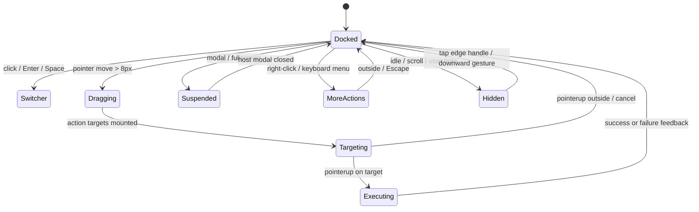

# 悬浮球完整 UI 与功能方案

> T-6756 · 2026-09-21 · 设计状态：已定稿，B0（T-6757）已开始实现
>
> 关联：`docs/floating-ball-research.md`、ROADMAP §8.0.7、快捷动作 ADR 0010~0046

## 1. 产品定义

悬浮球是小驴雷切的“共享动作注册表的空间入口”。它把切换器、搜索、日记、组件面板、快速记录以及其他已注册快捷动作放到当前思源窗口的一个稳定入口中。

悬浮球必须满足三条心智模型：

1. 轻触球，永远能打开切换器；
2. 拖动球，才进入动作选择，不因为轻微移动误触动作；
3. 动作配置只改变入口和排序，不复制另一套动作执行逻辑。

首层只承担高频动作，低频动作由“更多动作”承接。悬浮球与原生工具栏、切换器底部快捷栏并列存在，三者共享动作定义和执行器。

## 2. 端侧形态

| 端侧 | 默认状态 | 球体尺寸 | 停靠规则 | 首层面板 | 主要差异 |
| --- | --- | --- | --- | --- | --- |
| 桌面弹窗/主窗口 | 默认关闭，可单独开启 | 48 px，最小触控/点击区域 44 px | 左右边缘吸附，垂直位置保留 | 4~6 项扇形/半环 | 鼠标悬停显示标签；右键打开更多动作 |
| 侧栏 | 默认跟随桌面开关，可单独关闭 | 44 px | 只在侧栏内容区左右边缘吸附 | 3~5 项竖向扇形 | 面板空间窄，动作默认图标优先 |
| 手机 | 兼容旧 `fabEnabled`，迁移后默认保持原值 | 48 px，安全区外留 8 px | 左右边缘吸附，避开底部导航与键盘 | 3~5 项内收扇形 | 触控优先；动作面板使用底部抽屉承接“更多” |

球体初始位置采用右侧、可视区垂直 72% 处；旧版手机 FAB 的右下位置迁移到右侧同一垂直比例。用户拖动后按端侧分别保存。

桌面端和手机端共享动作 ID、能力声明和执行器，但不共享位置、尺寸、透明度、展开方向等空间配置。侧栏默认复用桌面动作集，位置单独保存。

## 3. 状态模型



状态必须是互斥的。`hidden`、`suspended` 和 `dragging` 不能仅靠多个 CSS 类隐式推断，B0 应建立显式状态机并统一清理出口。

### 3.1 停靠态

- 球体显示图标 `iconLayout`，无常驻文字；悬停或聚焦显示“打开切换器”。
- 贴边后可进入半隐藏态：球体最多隐藏 45%，保留 24 px 以上可点击区域。
- 闲置降至 40% 不透明度，交互立即恢复到 100%；不允许降到全透明。
- 弹层、确认框、设置页打开时，球体降级或隐藏；不遮挡宿主弹层按钮。

### 3.2 拖动态

- 使用 Pointer Events，`touch-action: none`，统一处理鼠标、触控笔和触摸。
- 起始位移小于 8 px 视为点击候选；超过 8 px 进入拖动。
- 拖动开始后球体缩放到 0.94、透明度降到 0.72，并显示动作目标。
- 指针捕获丢失、窗口失焦、`pointercancel` 或插件销毁都必须回到停靠态并释放监听器。
- 拖动只在当前窗口内移动，位置始终钳制在安全区内。

### 3.3 目标选中态

- 动作目标只出现在球体向内的一侧，避免被窗口边缘截断。
- 首层最多 6 个目标；窄屏按垂直扇形或半环排列，不能强行绘制完整圆环。
- 目标触控热区至少 44 px，视觉图标 20~24 px。
- 命中半径为目标可视半径加 8 px；命中后目标放大 1.1 倍并显示强调环。
- “更多动作”是最后一个目标，始终位于首层末位；没有可用自定义动作时仍保留。
- 松手落在球体或空白区：吸附位置并关闭目标，不执行动作。

### 3.4 执行态与失败态

- 松手后先关闭目标层，再执行动作，避免动作打开弹层时发生层级竞争。
- 执行中的球体保持可见但不可重复触发；异步动作显示轻量忙碌环，最长 1.5 秒后解除保护。
- 动作成功不弹成功提示；动作不可用、宿主缺失或执行失败显示现有 `showMessage` 错误提示。
- 失败不改变用户已保存的位置和动作顺序；下一次打开仍可重试。

## 4. 轻触与键盘交互

### 4.1 指针交互

| 操作 | 行为 |
| --- | --- |
| 轻触/点击 | 打开切换器，保持现有 FAB 语义 |
| 拖动超过 8 px | 显示首层动作目标并移动球体 |
| 拖到动作目标松手 | 执行目标动作，球体吸附到最终位置 |
| 拖到“更多动作”松手 | 打开更多动作面板，球体吸附到最终位置 |
| 右键球体 | 直接打开更多动作面板，不移动球体 |
| 点击面板外 | 关闭动作面板，保留球体位置 |
| 上滑内容 | 延续旧行为隐藏球体；不改变拖动中的球体 |
| 下滑内容/点击边缘把手 | 恢复球体 |

### 4.2 键盘与无障碍

- 球体使用 `<button>`，保留可聚焦、`aria-label="打开切换器"` 和可见 focus ring；不再使用 `role=button` 的裸 `div`。
- Enter/Space 打开切换器。
- Shift+F10 或 ContextMenu 键打开更多动作。
- 动作面板打开后，Tab 在动作目标间循环；Enter/Space 执行；Escape 关闭并把焦点还给球体。
- 每个目标使用动作名称、端侧支持状态和不可用原因组成 `aria-label`。
- 键盘用户可在更多动作面板中使用“上移/下移/启用/隐藏”，不依赖拖动排序。

## 5. 动作面板 UI

### 5.1 首层动作面板

首层采用“球体 + 内收扇形”布局，不显示标题栏和说明文案。目标由动作图标、短标签和选中环组成：

```text
                         [日记]
                 [搜索]   ○   [组件]
                         [更多]
                       (悬浮球)
```

实际方向根据球体所在边缘镜像：靠左边时目标向右展开，靠右边时目标向左展开；靠近顶部或底部时自动改为横向半环。目标碰撞或超出安全区时使用垂直堆叠布局。

首层默认预设：日记、搜索、组件面板、设置。切换器由球体轻触提供；用户可将切换器加入首层，但不重复渲染两个相同入口。动作不足时按现有注册表顺序补齐，首层最少保留“切换器”和“更多动作”安全路径。

### 5.2 更多动作面板

桌面使用靠球体内侧的浮层，手机使用底部抽屉，侧栏使用侧内抽屉。统一结构如下：

1. 顶部标题“快捷动作”和关闭按钮；
2. 搜索框，按名称、动作 ID、来源插件搜索；
3. 分组：内置、组件面板、插件动作、其他；
4. 每行显示图标、名称、来源、端侧状态和启用开关；
5. 底部提供“管理快捷动作”，跳转设置页；
6. 没有结果显示空态，不关闭球体。

动作不可用时保留在配置列表并显示原因，例如“此动作不支持手机端”或“提供它的插件尚未加载”；不可用动作默认不进入首层。

## 6. 动作内容与能力边界

悬浮球直接复用 `IQuickAction` 和 `createQuickActionRegistry`。持久化只记录动作 ID、启用状态、顺序和端侧分区，动作名称、图标、能力和执行器仍由快捷动作注册表提供。

### 6.1 动作类别

| 类别 | 首批内容 | 说明 |
| --- | --- | --- |
| 内置导航 | 切换器、搜索、日记、设置 | 由速切直接执行，始终可回退 |
| 速切面板 | 组件面板、收藏、最近、文档集 | 复用现有面板/历史命令，按端侧能力过滤 |
| 记录与整理 | 快速记录、今日日记、恢复最近关闭 | 需要注册表声明宿主能力；失败只提示，不破坏当前文档 |
| 外部组件 | RSS、天气、打卡、插件命令 | 由 adapter/command 注册，显示来源和支持端 |
| 受控动作 | Agent 提议/执行入口 | 继续受 `agentActionsEnabled` 与现有执行链门控，不默认放入首层 |

### 6.2 首层与溢出规则

- 首层每个端侧最多 6 个渲染槽位，其中最后一个固定为“更多动作”，因此设置页最多勾选 5 个配置动作；建议使用 4 个配置动作。
- 桌面、侧栏、手机各自保存首层顺序；没有端侧配置时继承共享默认预设。
- “更多动作”不可被删除或禁用。
- 同一动作在首层和更多面板只显示一次。
- 动作注册表刷新后，若动作仍存在但暂不可用，保留其配置顺序；重新可用时自动恢复。
- 运行时动作 handler 不持久化；插件卸载后显示 unavailable，不执行旧引用。

## 7. 设置页 UI

现有“手机端”设置中的 `fabEnabled` 扩展为独立的“悬浮球”页签，旧字段只作为迁移入口保留。设置页采用预览驱动的三段布局：

### 7.1 顶部：总开关与实时预览

- 标题：悬浮球；说明“在思源窗口中快速打开切换器和常用动作”。
- 端侧切换：桌面、侧栏、手机。
- 每个端侧独立启用开关。
- 右侧实时预览：球体、停靠边、展开方向、首层动作；修改设置即时更新预览。
- 预览中的动作可点击执行模拟；模拟只显示结果，不写入文档。

### 7.2 中部：行为与外观

| 分组 | 控件 | 默认值/范围 |
| --- | --- | --- |
| 停靠 | 左/右边缘、垂直位置滑杆、自动吸附 | 右侧、72%、开启 |
| 空间 | 球体尺寸、边距、安全区避让 | 48 px、8 px、开启 |
| 可见性 | 闲置降透明度、半隐藏、滚动隐藏 | 40%、开启、开启 |
| 场景 | 弹层让位、全屏/演示隐藏、键盘唤回 | 开启、开启、开启 |
| 反馈 | 动作命中放大、执行忙碌环、失败提示 | 开启、开启、开启 |

高级设置默认折叠，只放触摸阈值、最大首层动作数和调试诊断。触摸阈值允许 8~12 px，首层渲染槽位上限固定为 6（含“更多动作”），设置页配置动作上限为 5，不开放无限增大。

### 7.3 底部：动作集管理

动作集编辑器复用现有快捷动作设置视觉，但增加“首层/更多”分栏：

- 每行：拖动把手、图标、名称、来源、端侧标签、首层开关、启用开关、更多菜单；
- 桌面支持拖拽排序；手机支持上移/下移按钮；键盘支持上移/下移；
- “添加动作”打开统一动作选择器，支持搜索、来源和端侧过滤；
- “恢复默认预设”先导出当前配置或要求确认，再恢复；
- “预览首层”在设置页直接展开球体目标；
- 导入/导出沿用快捷动作 JSON，但增加 `floatingBall` 命名空间和版本号；
- 当前动作不可用时显示原因，不自动删除用户配置。

### 7.4 空态、迁移和危险操作

- 首次进入显示 4 个默认动作和一个简短三步提示：轻触打开、拖动选动作、更多里管理。
- 旧用户只有 `fabEnabled` 时，迁移为 `enabled.mobile = fabEnabled`，位置从旧右下 CSS 推导为右侧 72%；不改变旧开关的开/关状态。
- 恢复默认、导入替换和清空动作均需要确认；确认框打开时悬浮球让位。
- 导入文件限制 512 KiB，解析期间按钮 `aria-busy=true`，失败不覆盖现有配置。

## 8. 数据结构与迁移

建议新增版本化对象，临时展开状态不持久化：

```ts
type FloatingBallSurface = "desktop" | "sidebar" | "mobile";

interface FloatingBallConfigV1 {
  schemaVersion: 1;
  enabled: Record<FloatingBallSurface, boolean>;
  position: Record<FloatingBallSurface, {
    edge: "left" | "right";
    yRatio: number; // 0..1，按可视区高度归一化
  }>;
  appearance: {
    size: number; // 44..64
    idleOpacity: number; // 0.4..1
    halfHide: boolean;
    idleDelayMs: number; // 3000..8000
  };
  behavior: {
    snap: boolean;
    hideOnScroll: boolean;
    hideOnFullscreen: boolean;
    yieldToModals: boolean;
    touchSlopPx: number; // 8..12
  };
  actions: Record<FloatingBallSurface, Array<{
    actionId: string;
    enabled: boolean;
    firstLayer: boolean;
    order: number;
  }>>;
}
```

迁移函数必须：校验端侧枚举、钳制比例和尺寸、去重动作 ID、清除未知字段、保留旧 `fabEnabled`、在损坏时回退安全默认值。位置和动作运行时状态不写入导出文件。

## 9. 实现边界

### B0：动作模型与生命周期

- 新增 `floating-ball-model` 纯函数：状态、配置归一化、位置钳制、首层选择、动作可用性。
- 扩展快捷动作 surface 为 `floating-desktop`/`floating-sidebar`/`floating-mobile` 的映射，而不是复制动作种类。
- 抽出独立 `floating-ball-ui.ts` 控制器；`index.ts` 只负责宿主装配、设置读写和动作执行回调。
- 单例标记、宿主重绘恢复、监听器清理、插件卸载清理一次完成。

### B1：球体与停靠

- Pointer Events 状态机、8 px touch slop、位置比例存储、边缘吸附、半隐藏态。
- 桌面/侧栏/手机开关和旧 FAB 迁移。
- 纯函数测试：位置钳制、边缘选择、点击/拖动判定、窗口尺寸变化后的重定位。

### B2：动作目标与溢出

- 首层扇形/半环布局、命中测试、更多动作入口、外部关闭。
- 执行动作统一委托 `executeQuickAction`，动作错误统一走现有提示。
- 纯函数测试：目标布局、命中优先级、空配置安全回退、动作去重。

### B3：配置治理

- 悬浮球设置页、端侧预览、动作首层开关、排序、恢复默认、导入导出和迁移。
- 动作能力未知/不支持/未加载三种状态的文案和 UI。
- 与快捷动作配置变更建立实时刷新关系，避免打开中的球体使用旧列表。

### B4：体验收口

- 闲置降透明度、全屏/演示/弹层让位、焦点恢复、键盘完整路径、reduced-motion。
- 性能目标：空闲时无轮询；拖动期间只更新 transform；每次指针帧最多一次布局读取；销毁后无监听器和定时器。
- 桌面、窄侧栏、Android 真机和主题验收。

## 10. 验收清单

### 自动化

- 配置迁移、损坏清理、位置比例、首层上限和动作能力过滤纯函数测试；
- Pointer cancel、窗口失焦、插件销毁后监听器清理测试；
- 外部点击关闭、键盘焦点、`aria-label`、`aria-expanded`、44 px 热区门禁；
- 负向验证：移除 touch slop、首层上限、modal 让位或清理调用时，测试必须失败；
- `pnpm exec tsc --noEmit`、`pnpm test`、`pnpm run test:smoke`、`pnpm run test:smoke:browser`、`pnpm build`。

### 人工

- 桌面：左右边缘、窗口缩放、右键、键盘、弹层覆盖、全屏；
- 侧栏：最窄宽度、动作不截断、打开设置后返回、侧栏销毁重建；
- 手机：竖屏/横屏、刘海和底部安全区、键盘弹出、滚动隐藏、触控拖动、旋转后位置；
- 主题：默认明暗、Neo、低对比度主题；
- 稳定性：连续拖动 100 次无重复执行、切换思源文档和重载插件后球体只有一个实例。

## 11. 设计结论

悬浮球首版应交付“稳定入口 + 高频动作 + 可恢复配置”，把复杂动作编排、工具箱和自动点击留在动作注册表或其他专门界面。这样它既能成为用户日常使用的主入口，又不会与切换器、原生工具栏和组件面板争夺职责。
