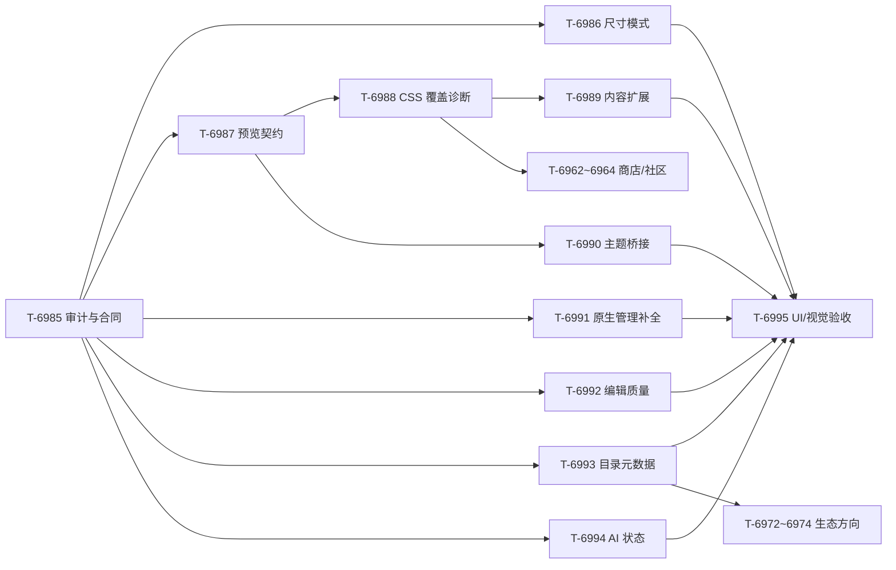

# 第三面板（片段实验室）完整盘点与开发计划

> 任务：T-6985 · 日期：2026-09-28 · 状态（2026-10-04 对账）：T-6986～T-6990 与 T-6995 可自动化部分已交付；T-6991 由原生管理首批与 T-7073 备份恢复完成，T-6992 轻量编辑器已交付（CodeMirror 暂缓），T-6993/T-6994 已由 T-7092/T-7093 补齐本地缺口并完成复验；T-6962/T-6963 本地商店由 T-7094 交付。T-6996 已关闭（JS 维持 blocked）。真实桌面观感、Android 和在线 AI 另记环境证据。
>
> 本文件回答五个问题：第三面板要解决什么、原型以哪一版为准、现在实际做到什么程度、预览到底能看什么、下一步按什么顺序开发。源码、测试和 ADR 是证据；历史计划里的“进行中”如果被后续账本覆盖，以后续账本为准。

## 1. 产品定位与边界

第三面板的正式名称是**片段实验室**。它负责在思源安全边界内管理、编辑和预览 CSS/JS 片段，让用户完成“修改草稿 → 看效果 → 人工审核 → 保存到思源原生片段”的闭环。它不替代思源原生搜索、文档编辑器、同步服务，也不把自己变成云端代码仓库或任意 JavaScript 运行器。

当前必须继续遵守的边界：

| 边界 | 当前决定 | 证据 |
| --- | --- | --- |
| 保存真源 | 思源原生片段列表是唯一保存来源；工作室内存草稿不能绕过原生接口落盘 | [ADR 0078](adr/0078-snippet-studio-boundary.md) |
| 并发 | 原生接口是整表替换、没有 CAS；保存前重读比较，保存后回读核对，但不宣称原子并发 | [ADR 0078](adr/0078-snippet-studio-boundary.md) |
| 预览 | 使用 opaque-origin sandbox iframe；CSS 可预览，预览不读取个人文档、不加载整套宿主 CSS、不访问网络 | `src/snippet-studio-preview.js` |
| JS | 当前只管理、编辑、启停和导出，执行预览永久 blocked，不能把按钮占位当成“已支持 JS 预览” | [ADR 0078](adr/0078-snippet-studio-boundary.md)、`src/snippet-studio-ui.js` |
| AI | 只生成待审核草稿；需要用户同意；结果经过本地 diff/lint 后手动接受，不能自动保存或启用 | [ADR 0083](adr/0083-snippet-ai-diff-review-layering.md) |
| 端侧 | 继续桌面可编辑；移动端只显示能力状态或入口不可用，不开放没有真实证据的移动编辑 | [ADR 0078](adr/0078-snippet-studio-boundary.md) |
| 包体 | 工作室保持动态 chunk，不把编辑器或预览依赖推回主入口 | [ADR 0078](adr/0078-snippet-studio-boundary.md) |

## 2. 原型沿革与现行原型

现有设计有两个阶段，容易造成“代码看起来和截图不一致”的误判：

1. **R1** 是常驻三栏概念：左侧目录 240px，中间编辑器，右侧 320px 的预览/AI/属性。它适合说明信息架构，但没有体现预览主区的高度需求。
2. **R2** 吸收了原始开发框架，是现在应遵循的施工基线：预览主区 `4fr`；主区下排为属性 `2fr` 与编辑器 `3fr`；AI 在右栏；目录通过浮层选择器打开；默认全屏。

现行原型证据：

- [统一平台 R2 规格](design-unified-platform-ui-round2-2026-09-26.md) 的第三面板行和默认全屏决策。
- [R2 原型页面](design/platform-ui-redesign-r2-2026-09-26.html) 的 `03R` 工作室屏幕。
- [R2 截图](design/redesign-2026-09-26-r2/r2-03-studio.png)。
- [异常状态原型](design/ui-states-2026-09-27.html) 的 L2 脏稿、L3 JS blocked、L6 保存冲突。

代码已经按 R2 落地了主要布局：`src/styles/_snippet-studio.scss` 的外层为主区 `4fr` + AI `1fr`，主区为预览与下排区域，属性/编辑器为 `2fr:3fr`。因此后续不再把 R1 的常驻目录当作“当前实现缺失”，而是把它列为未来可选的目录布局实验。

## 3. 实际实现情况

“已实现”表示本地源码、测试和生产接线已经存在；“部分实现”表示关键路径可用但产品能力或真实宿主证据不完整；“待实现”表示只有原型、占位或历史建议，没有生产功能。

| 能力域 | 实际已经做到 | 当前状态与证据 | 仍缺什么 |
| --- | --- | --- | --- |
| 入口与生命周期 | 桌面入口、平台导航、工作台/悬浮球/公开命令入口、动态 chunk、加载失败回切换器、单例保护、卸载清理 | **本地完成**；`src/index.ts:3407-3487`；T-6894 已完成 | 真实桌面 Dialog 层级、不同显示器和窄侧栏观感仍属 B-005 |
| 目录与选择 | 5 条内置 CSS 样例；原生片段目录；搜索、来源、类型、分类过滤；最近片段会话记忆；方向键/Home/End/Escape；分页 | **本地完成基础版**；`src/snippet-studio-model.js`、`src/snippet-studio-ui.js` | 标签、别名、置顶、排序、分组、批量操作、统一元数据；内置项与个人项的摘要字段不对称 |
| 原生管理 | 读取、保存、启用/停用、删除；严格字段投影；保存前重读比较；保存后回读；CSS 只在确认写入后注入 | **本地完成基础版**；`snippet-studio-model.js:194-243`、`snippet-studio-host.js` | `disabledInPublish` 编辑入口、总开关直达、顺序/级联说明、全量备份恢复、三方合并 |
| 草稿与离开 | 顶部/属性区未保存状态；常驻 footer 保存；保存/放弃/取消三选一；失败停留草稿；会话恢复 | **本地完成**；ADR 0086、T-6956 | 关闭后有界草稿恢复入口、另存为/克隆的清晰入口、恢复记录 |
| 编辑效率 | textarea；50 步/512 KiB 草稿撤销重做；字面查找、导航、两步确认替换；输入导入/导出；UserCSS 头和基础变量代入；有界行号、滚动同步、括号成对诊断和 Cmd/Ctrl+S | **已完成本地可做项**；T-6957/T-6959/T-6912/T-6923/T-6992 | CodeMirror 6、高亮、格式化和完整语法服务因包体/兼容性边界暂缓 |
| CSS 预览 | opaque-origin iframe；三场景；四宽度；明暗切换；保存基线对照；思源块语义镜像；按 CSS 特征追加探针 | **本地完成可审阅版**；`src/snippet-studio-preview.js`、T-6978 | 不是真实当前文档/主题渲染；无命中元素报告、CSS 解析错误行列、级联/变量诊断、更多复杂块和设备档位 |
| JS 预览 | 代码可读、编辑、保存、启停、导出；执行按钮明确 disabled | **按安全边界完成**；不能视为 JS 预览缺陷修复项 | 若未来开放，必须另立可终止 runner、权限白名单、超时/内存/日志协议；当前推荐继续 blocked |
| AI | generate/optimize/explain/iterate；SSE；90 秒超时；取消/代际隔离；history 限制；本地 diff/lint；逐 hunk 接受 | **本地完成审核链**；`src/snippet-studio-ai.js`、`src/snippet-diff.js`、`src/snippet-lint.js` | provider/权限/费用/重试状态不可见；候选复制/导出和更细的局部采用回执；真实宿主 SSE 证据后置 |
| 冲突与恢复 | 外部版本差异、继续编辑、重载、保留禁用副本、取消；差异超过上限会降级并明示 | **本地完成基础恢复**；T-6958、ADR 0078 | 无 CAS 的残余窗口仍存在；没有自动三方合并；外部删除与顺序变化的解释还不够细 |
| 样式系统 | `--studio-*` 已大部分映射平台 token；明暗、reduced-motion、900/560px 响应式、44px 触控样式 | **部分完成**；`src/styles/_snippet-studio.scss` | 仍保留独立 radial-gradient 和较多 studio 专属刻度；没有可拖拽三栏、尺寸记忆、预览缩放/边界说明 |
| 尺寸模式 | 片段实验室 fullscreen/adaptive/custom 三模式（T-6986，默认全屏、ADR 0080 口径不回退）+ 设置页「面板窗口」组（T-6999） | **三模式已交付**（2026-09-29）；`studioSizeMode` 白名单归一 | adaptive/custom 的真实缩窗观感与设置预览交互归 B-005 复验 |
| 测试与证据 | snippet 单测/契约共 104 项；入口和编辑状态两组 E2E；预览模型和 CSP 有专项测试 | **模型与接线较完整** | mount 级 DOM 测试、预览视觉矩阵、主题/复杂 CSS 兼容矩阵、AI 候选流程 E2E、真实桌面截图仍不足 |

## 4. 预览内容到底有多丰富

当前预览已经不是“固定一段标题和正文”。它是“固定语义样例 + CSS 命中探针”的可审阅预览，能回答“这条 CSS 大概会影响哪类思源元素”。它仍然不能回答“在我的真实笔记、当前主题和全部插件 DOM 中最终会长什么样”。

### 4.1 当前可见内容

| 层 | 当前内容 | 触发方式 |
| --- | --- | --- |
| 阅读场景 | h1、段落、引用、h2、行内代码、表格、代码块、静态按钮 | 选择“阅读文档” |
| 表格与代码场景 | 标题、表格、行内代码、代码块 | 选择“表格与代码” |
| 界面控件场景 | 按钮、禁用按钮、复选框、单选框、输入框、下拉框、标签、计数徽标、表格、引用 | 选择“界面控件” |
| CSS 命中探针 | h3~h6、链接、列表、任务（已完成/未完成）、data URI 图片、粗体/斜体/高亮/删除线/下划线/kbd、标签 | `analyzeCssCoverage()` 命中特征后追加；无命中不追加 |
| 对照与视口 | light/dark、saved baseline、auto/420/768/1024px；窄容器不够时回退 100% | 预览工具栏选择 |

### 4.2 当前预览的限制

- 场景 DOM 是静态 fixture，不读取个人文档、真实块 ID、当前主题 CSS 或插件自定义节点。
- `analyzeCssCoverage()` 当前是保守正则特征分析，能避免部分变量名误报，但还不能解释具体 selector 命中了哪个元素、哪个声明被覆盖，复杂 `@media`、`@supports`、属性选择器和嵌套选择器仍可能漏报或多报。
- CSS 错误目前不会像 JS 运行错误一样报告行列；CSS lint 只用于 AI 候选审查，不是编辑器诊断。
- 当前没有超级块/列、Callout、嵌套引用、块引用/嵌入、公式、文档树、数据库属性、PDF/媒体等安全静态占位。
- “暗色”是预览自己的 light/dark token，不等于当前思源皮肤的完整变量集合；字体、字号、用户自定义变量和高对比模式未桥接。

### 4.3 预览样式自适应原则

后续增强按三层推进：

1. **语义层**：保留 `protyle-wysiwyg b3-typography`、`data-node-id`、`data-type`、`data-subtype` 等思源常用结构，继续用静态 fixture 保证无个人数据。
2. **覆盖层**：把当前特征探针升级为有界 coverage analyzer，输出“命中特征 → 追加 fixture → 可能未命中/未知 selector”；只按片段实际 selector 追加内容，不无限堆固定样例。
3. **主题层**：建立严格白名单的只读 theme profile（light/dark，后续再评估高对比/皮肤），只注入 `--b3-*` 变量快照和字体/密度说明；不加载整套宿主 CSS，不允许外链和网络。

每次预览应显示一条能力回执：场景、宽度、主题、探针命中数、CSS/脚本/网络边界，以及“这是语义近似预览，不代表当前笔记”的说明。基线对照必须继续关闭探针，避免把新增探针误认为原片段效果。

## 5. 分阶段开发任务

任务按“先把合同和证据说清楚，再提升内容，再做生态”的顺序排列。T-6985 消化本轮用户新增优先级，原先“批次⑨ C/D 从 T-6985 起”的排期顺延到本专项之后。

| 任务 | 阶段 | 内容 | 依赖 | 完成证据 |
| --- | --- | --- | --- | --- |
| T-6985 | P0 | **第三面板完整审计与计划**：统一 R2 原型口径，建立实现/缺口/证据矩阵，明确预览能力与安全边界 | 无 | 本文件、[ADR 0096](adr/0096-snippet-studio-product-scope-and-preview.md)、ROADMAP、dev-plan、handoff 同步 |
| T-6986 | P0 | **尺寸模式合同**：为片段实验室增加 fullscreen/adaptive/custom；默认继续 fullscreen；沿用 `resolvePanelSize` 最小尺寸和 resize 语义；设置页、会话尺寸、窄窗回退一起设计 | T-6985、用户确认方案 | 纯模型、设置接线、负向验证、宽/窄/调整窗口 E2E；真实桌面另列 B-005 |
| T-6987 | P0 | **预览契约 v2 与能力回执**：声明 SceneId/ViewportId/ThemeProfile；固定可用组合；显示场景/宽度/主题/探针/脚本/网络状态 | T-6985 | 纯模型 + 生产 DOM + Chromium 截图；CSP/no network/no script/no HTML injection 负向验证 |
| T-6988 | P0 | **CSS 覆盖诊断**：从正则特征升级为有界 selector 分层分析，覆盖 `@media/@supports`、属性选择器、复杂选择器；输出命中/未知/可能未命中和错误位置 | T-6987 | CSS fixture 矩阵、变量误判负例、错误行列回执；不引入完整 stylelint |
| T-6989 | P1 | **预览内容扩展**：按真实 selector 采样增加任务/日记、富文本/标签、Callout/列/嵌套引用、公式/属性/数据库静态占位、媒体 blocked 状态；每场景保留静态、无网络、无脚本 | T-6988 | 场景覆盖矩阵、每项视觉截图和容量上限；不读取个人文档 |
| T-6990 | P1 | **主题 token bridge**：只读 light/dark profile，后续评估高对比/皮肤/字体/密度；预览说明实际使用的 token 集合 | T-6987 | theme profile 模型、明暗/高对比（若纳入）截图、外部 CSS 注入负向验证 |
| T-6991 | P1 | **原生管理补全**：`disabledInPublish` 控件、CSS/JS 总开关直达、顺序/级联解释、全量备份/恢复预览与一次撤销；不改变原生唯一真源 | T-6985 | 模型/宿主适配器/导入失败与部分成功回执；整表写入风险如实展示 |
| T-6992 | P1 | **编辑质量**：已落 ADR 0129；完成轻量行号/诊断/滚动同步和 Cmd/Ctrl+S，保留 textarea 事务与降级 | T-6985 | 纯模型、定向 UI/结构、包体门禁和真实思源 E2E 已通过；完整高亮/格式化后置 |
| T-6993 | P1 | **目录与草稿元数据**：标签、别名、置顶、最近、分组、排序、摘要预览；侧车数据版本化有界，与原生片段 ID 对账 | T-6985、T-6991 | 迁移/损坏清理/对账模型和选择器 DOM 测试；原生启用状态不复制成第二真源 |
| T-6994 | P1 | **AI 结果与状态诚实化**：provider/权限/费用/重试/取消/过期回执，候选复制/导出/局部采用回执；真实 SSE 单独留证 | T-6985 | AI 状态模型、失败/取消/重试、候选导出和 E2E；不增加能力预探测 |
| T-6995 | P1 | **第三面板 UI/视觉验收**：mount 级 DOM 测试、场景/宽度交互 E2E、明暗/窄窗/高对比截图矩阵；收敛 studio-only 渐变、圆角和 token 刻度 | T-6986~T-6994 分批产出 | Chromium/截图、可访问性、reduced-motion、包体复核；真实桌面另列 B-005 |
| T-6996 | P2 | **JS 方向复议**：默认继续 blocked；只有用户明确要受限模拟执行时，另立 runner ADR（可终止、权限白名单、时间/内存、事件日志） | T-6985、用户明确选择 | 选择前不写生产代码；选择后必须有安全负向测试和真实桌面证据 |
| T-6962~T-6964 | P2 | 片段商店→本地视图→社区目录/投稿，复用本专项的预览、草稿、冲突和安全合同 | T-6987~T-6993 | 依既有阶段 E 计划；商店是实验室内部视图，不新增平台表面 |
| T-6972~T-6974 | P2 | 分组、Gist、编辑器质量方向项；分组/Gist 已完成，CodeMirror 由 ADR 0129 暂缓，轻量 textarea 路线已收口 | T-6991~T-6993 | 后续仅保留完整高亮/格式化的重新评估，不绕过原生真源和包体门 |

### 任务依赖图

## 6. 每个任务的共同验收合同

所有生产任务按以下顺序验收：

1. 纯模型：输入、输出、有界、旧数据、取消、失败和不可用状态。
2. 生产接线：真实按钮、状态徽标、回执、生命周期和懒加载路径。
3. 普通 Chromium：宽屏/窄窗/明暗/主题变量/reduced-motion/焦点与滚动。
4. 预览安全：外链、`url()`、`@import`、脚本、HTML 注入和过大内容的负向验证；CSS 只在沙箱内观察。
5. 若新增或修改门禁/契约测试，必须按 `docs/gate-audit-checklist.md` 做违规注入，确认测试真的失败，再恢复字节。
6. 真实思源桌面、真实 AI SSE、窄侧栏和 Android 触控分别记录为 B-005/B-004 证据；浏览器夹具不能替代宿主结论。

## 7. 暂不开发的内容

- 任意 JavaScript 运行预览、Worker 冒充完整宿主 DOM、自动启用 AI 结果。
- 加载用户整套主题 CSS、个人文档或插件 DOM 作为预览输入。
- 云同步、自动上传、未经审核的社区代码直接启用、Gist Token 写入日志。
- 为了“看起来更丰富”无限堆固定样例；场景增量必须由 selector 覆盖证据驱动。
- 在用户确认尺寸模式、预览合同和 JS 方向前直接改生产行为。

## 8. 本轮结论

第三面板的工程骨架已经成立，真正欠缺的是三件事：**预览要从“静态示例”升级为“可解释的安全近似预览”，编辑与原生管理要补齐日常工作效率，设计账本要把 R2、源码和真实宿主证据分开记账**。后续开发先做尺寸与预览合同，再做内容扩展和管理效率，最后推进商店/社区；这样每一步都能独立验收，也不会把安全边界换成更多按钮。

## 2026-10-03 状态增补：T-6991 第一阶段已落地

`T-6991` 的原生管理已交付；此前第二阶段的全量备份/恢复预览和恢复前单次撤销已由 T-7073/ADR 0104 完成。2026-10-04 补齐目录标签/别名/置顶/摘要/本地排序（T-7092/ADR 0132）、AI 上下文选择/权限/候选复制导出/取消恢复（T-7093/ADR 0133）与只读本地商店（T-7094/ADR 0134）。本地证据见当期账本；真实端侧与在线提供方边界继续独立记录。
