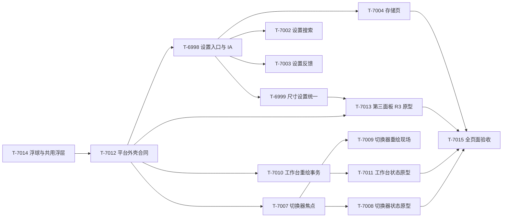

# 三大面板与设置页统一体验优化计划

日期：2026-09-28  
范围：第一面板（切换器）、第二面板（工作台）、第三面板（片段实验室）、设置页，以及悬浮球和共用对话框。  
依据：当前生产源码、现有自动化测试、R1/R2 原型、`docs/design-review-2026-09-27.md`、`docs/unified-platform-gap-matrix-2026-09-26.md`、ADR 0079/0080/0086/0096。

本计划解决的是页面层的可用性和原型一致性。功能已有不少实现，但页面之间仍存在入口不可达、状态表达不完整、重绘丢失现场、同一能力在不同页面有不同入口、原型写了不存在的字段等问题。后续每个生产任务都要把行为、UI、原型和测试一起收口。

## 1. 当前真实状态

| 页面 | 已经可用的能力 | 当前问题 | 实际结论 |
|---|---|---|---|
| 第一面板 / 切换器 | 已开页签本地过滤、收藏/最近/日记、全文与全库分层搜索、过滤、排序、分组、缩略图、右侧文档预览、预览失败回执、键盘打开和数字直达 | 页签卡主体不是清晰的 DOM 焦点目标；卡片附属动作主要靠 hover 或状态显示；过滤条的 tab 语义不完整；异步富化和尺寸变化会反复重建列表；工具栏入口过密；空、加载、内核断开、预览 blocked 等状态的原型覆盖不足 | 功能主链已实现，键盘可达性、状态设计和重绘现场保护为部分实现 |
| 第二面板 / 工作台 | 组件目录、组件商店、查看/编辑态、材质和尺寸档位、拖动排序、撤销重做、刷新、缓存回退、健康汇总、单组件重试、移动端单列 | `renderPanel()` 会清空并重建整个面板，长页面编辑或刷新时滚动和焦点可能丢失；编辑态每张卡放置多个操作且持续抖动；失败状态和重试过程缺少统一的行内 loading/success/error 结构；空工作台和窄自定义窗口的原型仍不完整 | 业务和布局能力已实现，交互事务与信息密度仍需优化 |
| 第三面板 / 片段实验室 | 原生片段读写、冲突处理、脏稿守卫、撤销重做、查找替换、CSS 安全沙箱、三场景四宽度预览、CSS 探针、AI 差异审核、导入导出和能力边界 | 仍只有全屏尺寸；预览是安全近似 fixture，不是真实文档/主题；复杂结构、CSS selector 命中诊断、主题桥接、编辑器能力、原生管理细节和 AI 状态仍不足；窄窗口应按容器而不是只看 viewport；脏稿、JS blocked、冲突、AI 待审核状态需要更完整的原型 | 以 `docs/third-panel-development-plan-2026-09-28.md` 的 T-6986～T-6996 为主线，本计划补页面间的统一合同 |
| 设置页 | 10 个可见标签、分组卡、分段控件、设置搜索基础版、收藏、快捷动作、悬浮球、文档集、日记、移动端、存储 | `buildSettingsHomePanel` 虽然存在，但 `panelKeys`、标签文案和激活逻辑没有注册，组件面板设置不可达；面板尺寸设置分散在“外观”和“面板”；`mobileThumbHeight` 有字段和消费端却没有设置入口；原型中的自动创建、面板状态等字段没有生产行为；搜索缺首焦点、完整 ARIA 和过滤；没有统一保存/清洗/失败回执；存储页缺分节进度和健康解释 | 设置页保留 10 个标签；把组件面板字段并入“面板”页的独立分组。当前不是“已完成”，而是基础可用、信息架构和反馈合同部分实现 |
| 悬浮球 / 对话框 | 三端动作目录、首层与更多、数字槽、手势、预设、导入导出、能力不可用投影、移动端 safe-area | 原型与生产的三手势、尺寸/边距控制和失败回执没有完全对齐；导入/恢复等副作用确认在部分原型中缺失；页面之间的关闭、返回焦点和上下文恢复规则还未统一 | 作为共用入口随平台合同一起优化，不另造一套页面语言 |

## 2. 统一交互合同

### 2.1 入口、返回与上下文

- 三大面板都使用同一个 `SurfaceNav`，当前面板、可用面板和关闭动作必须同时可见；桌面 Dialog 增加明确的关闭按钮，移动端使用系统返回或 sheet 关闭语义。
- 从设置页、悬浮球、搜索结果、组件卡和片段对象打开面板时记录 `returnTo`、对象 ID、查询词和焦点来源。关闭或返回后优先恢复来源控件，找不到时回到对应面板首个主控件。
- 设置页打开不丢失此前表面的上下文；从设置的某个标签关闭后恢复原面板，而不是固定回切换器。

### 2.2 焦点与重绘

- 每个真实对象只有一个主焦点目标；卡片上的收藏、关闭、更多等附属动作在获得焦点后可见且有名称。数字直达只属于已开页签网格，收藏/最近/全库行不再重复占用同一数字命名空间。
- 过滤 chips 要么是完整的 `tablist`（方向键、`aria-controls`、`aria-selected`、roving tabindex），要么降级为带 `aria-pressed` 的按钮组，不能维持半套 tab 语义。
- 任何异步重绘都走“捕获现场 → 更新 → 恢复现场”事务：保存滚动容器、焦点对象、预览选中对象、展开组和编辑状态；对象消失时按页面规则安全回退。
- `aria-live` 只播报状态变化和操作结果，不因整页重绘重复朗读静态标题；loading 必须有 `aria-busy`，重试必须保留原地错误原因。

### 2.3 信息层级与状态

- 每页只保留一个屏级主动作；列表行可以有一个行级主动作。AI“生成建议”、商店“添加”、目录“新建”等按这个例外规则标注层级。
- 统一使用 `ready / loading / stale / dirty / blocked / error` 六态。能力标签、来源标签和分类标签使用中性 badge，不借用 loading/stale 颜色。
- 对象相关失败留在对象卡、行或底部回执；全局 toast 只用于瞬时成功或无法归属对象的错误。
- 空态必须给出下一步；加载态只占用正在加载的区域；错误态保留可用的旧结果并提供重试或回退。

### 2.4 原型与生产

- R2 三表面原型继续作为布局基线，但必须同步补齐异常态、编辑态、窄窗口和移动态。新原型只使用生产已有字段或在同一任务中先落 ADR 再加字段。
- 原型统一使用真实生产类名和 `--sw-platform-*` / `--b3-*` token；不再使用只存在于原型的“自动创建”“组件面板状态”等按钮。
- 尺寸适配以面板容器为第一判断依据。第三面板和自定义窗口不能只依赖 viewport media query；需要容器断点或等价的布局观测合同。

## 3. 各页面的优化方向

### 3.1 第一面板：更快找到，也更容易用键盘操作

原型应保留已开页签的大卡主视野和右侧预览，但补充以下状态屏：空查询、无结果、全库加载骨架、内核断开降级、全库失败保留旧结果、非文档预览 blocked/error、100+ 页签分组折叠。搜索态显示过滤 chips；空查询不请求也不展示全库区块。

工具栏按宽度分层：搜索、收藏、最近、日记属于一级；排序、全屏、设置、实验室按宽度进入更多或溢出菜单。原型需要覆盖至少 700px、560px 和窄侧栏三档，并标出 Tab 顺序。

页签卡采用“一个主焦点 + 聚焦后动作条”的模型。卡片数字只表示打开页签；行级对象用修饰键或菜单动作，不再显示冲突数字。过滤 chips 采用完整 tab 或按钮组之一，并加入键盘和读屏状态。

异步富化、缩略图加载、窗口变化和查询切换不得让用户跳回列表顶部。预览选中对象仍存在时保持预览；对象被过滤或关闭时给出可解释的回退。

### 3.2 第二面板：编辑布局时保持现场，查看时降低噪声

工作台查看态以组件内容和健康状态为主。编辑态不再让每张卡长期显示四到五个文字按钮；优先显示拖动把手、尺寸角标和一个更多菜单，选中卡再显示移动、配置、删除等局部动作。保留键盘移动、撤销/重做和完成按钮。

`renderPanel()` 需要形成可验证的重绘事务：捕获当前组件 ID、滚动锚点、编辑按钮焦点、展开状态和拖动状态；重建后恢复这些现场。单组件刷新优先局部更新，整面板刷新也必须保持锚点。

失败卡同时显示状态、原因、缓存年龄、单项重试和复制诊断；单项重试期间显示原地 loading，完成后显示 ready/stale/error，不关闭详情。空工作台直接提供“打开组件商店”主动作和三项推荐，避免首次使用时只看到空白。

工作台原型补齐查看/编辑、空、加载、失败、窄自定义窗口和移动单列六类状态，并把组件尺寸档位、材质、健康回执放在同一信息层级。

### 3.3 第三面板：沿专项计划提升预览可信度

第三面板继续采用安全近似预览，不读取用户文档、不加载网络、不执行任意 JS。页面优化重点与 T-6986～T-6996 合并执行：尺寸模式、预览能力回执、CSS selector 覆盖诊断、结构化场景、主题 token bridge、原生管理、编辑器、目录元数据、AI 状态和视觉 E2E。

原型必须补齐：CSS/JS blocked、脏稿确认、冲突 diff、AI 待审核、保存成功/失败、窄窗容器布局、固定尺寸与自适应尺寸。名称只保留一个编辑源；属性区显示“草稿未保存 / 上次保存时间 / 启用中 / 发布时禁用”等互不矛盾的维度。预览底部回执应说明已覆盖的节点、未覆盖的能力和安全边界。

### 3.4 设置页：让设置可到达、可搜索、可恢复

建议保留 10 个标签，把“组件面板”作为“面板”页的一张独立分组卡。原因是设计规范、现有 i18n 和生产 `panelKeys` 都以 10 个标签为基线，`homePanel` 没有注册标签文案，属于遗留构建函数。必须把 `homePalette/homeSizeMode/homeWidth/homeHeight` 完整合并进“面板”，并把原型 14 改成“面板”页中的组件面板分组，不能继续保留不可达的独立入口。设置控件还要随尺寸模式即时显隐或标记生效范围，不能只在关闭重开后更新。

“面板”标签统一管理切换器、工作台、第三面板的尺寸模式、固定宽高、默认值和打开预览入口；设置页本身的尺寸单独说明。移动端缩略图高度补 slider、数值、重置和窄屏说明。设置搜索改为打开即聚焦，支持 `/` 或 `Ctrl+K`、清空、面板/分组路径、当前值和默认值、已修改/需要配置过滤，并补完整 ARIA。

设置变更继续即时写入，但必须有统一的保存成功、写入失败、旧数据清洗、迁移和回退回执。设置页不能只依赖打开时的 `s` 快照：外部入口、配置包导入或悬浮球面板修改设置后，要么局部刷新当前设置项，要么销毁并重建设置页，并保留当前标签、滚动和焦点。收藏组删除、配置包导入、文档集恢复等副作用动作显示影响摘要和撤销/取消路径。存储页补总量、分 key 进度条、schema/迁移健康状态、自动缓存管理说明和导入结果。

原型清洗项目包括：日记自动创建（目前没有对应字段）要么删掉要么单独立项；组件面板状态/默认视图/失败重试要么接入设置要么从原型删除；快捷键文案必须与真实绑定一致；移动端横屏双列、长标签换行、safe-area 和高对比状态必须有屏幕证据。悬浮球设置只展示实际支持的桌面/手机表面，旧侧栏配置要明确为兼容保留；存储 key 的名称、迁移状态和说明必须全部走双语 i18n，不能在英文界面显示硬编码中文或原始 key。

## 4. 统一原型重做范围

后续 R3 原型不追求再画一套装饰稿，而是补齐生产行为的可审查状态：

| 原型组 | 必须包含的画面 |
|---|---|
| 第一面板 | 桌面查看、键盘聚焦、空查询、无结果、加载、内核断开、失败保留旧结果、预览 blocked/error、100+ 页签折叠、移动列表 |
| 第二面板 | 查看、编辑抖动、选中卡局部操作、空工作台、组件加载、组件失败重试、健康详情、窄固定尺寸、移动单列 |
| 第三面板 | 全屏/自适应/固定、CSS 预览、JS blocked、脏稿守卫、冲突 diff、AI 待审核、保存回执、窄容器、主题桥接和覆盖诊断 |
| 设置页 | 10 标签 IA、组件面板分组、尺寸设置、搜索首焦点/结果、悬浮球三手势、移动缩略图、文档集恢复、配置导入、存储健康、暗色/高对比 |
| 共用浮层 | 关闭/返回焦点、更多菜单不可用、执行失败、确认/取消、移动 sheet 和 safe-area |

每张原型屏都要标注：入口、默认焦点、主动作、失败回退、`aria` 语义、响应式断点和真实生产字段。截图只作视觉证据，不能代替行为测试。

## 5. 任务队列

| 任务 | 优先级 | 内容 | 依赖 / 验收 |
|---|---:|---|---|
| T-6998 | P0 | 修复组件面板设置入口，把遗留 `homePanel` 内容并入现有“面板”标签，统一 10 标签 IA，接入 `lastSettingsTab`、搜索和移动横滚 | 路由/搜索/截图契约；负向注入确认组件面板字段未进入“面板”会失败 |
| T-6999 | P1 | 把三大面板尺寸模式统一到“面板”设置；补第三面板尺寸；显示当前模式、默认值和预览入口 | 依赖 T-6998、T-6986；模式模型、设置接线和窗口几何测试 |
| T-7000 | P1 | 补 `mobileThumbHeight` 设置、slider/数值/重置和旧 FAB 迁移说明 | 移动设置接线、窄屏溢出和键盘数值测试 |
| T-7001 | P1 | 原型-生产字段清洗：日记自动创建、homeStore 状态、行为项、快捷键文案和悬浮球表面说明逐项决策 | ADR；原型字段扫描、死设置字段审计和中英文文案契约 |
| T-7002 | P1 | 设置搜索首焦点、`/`/`Ctrl+K`、清空、过滤 chips、路径结果和完整 ARIA；统一设置控件的 `aria-labelledby` | `aria-controls/expanded/activedescendant` 契约；动态索引和读屏名称测试 |
| T-7003 | P1 | 设置统一保存/失败/清洗/迁移回执，增加最近变更撤销与分组恢复默认；外部设置变化触发局部刷新或带现场恢复的重建 | 存储原子写入、失败不误报成功、跨入口同步、回焦点和按标签滚动记忆测试 |
| T-7004 | P1 | 存储页进度条、schema/迁移健康、缓存管理说明、配置包/文档集导入确认；补齐全部 storage key 的中英文标签与分组 | 导入零写入负向验证、用量渲染、英文 locale 和回执测试 |
| T-7005 | P2 | 设置页逐标签视觉矩阵：桌面、窄桌面、移动、暗色、高对比、长文案 | Chromium 截图 + B-004/B-005 人工验收清单 |
| T-7006 | P2 | 设置 slider、长标签 rail、触控命中区、焦点环和 reduced-motion 抛光 | 视觉契约、对比度和移动布局测试 |
| T-7007 | P0 | 第一面板页签卡焦点模型、附属动作可发现性、数字命名空间、过滤语义收口 | 键盘/读屏契约；负向注入确认无焦点目标会失败 |
| T-7008 | P1 | 第一面板工具栏分层和异常态原型/实现：空、加载、断开、失败、预览 blocked/error、移动态 | R3 状态屏 + 分辨率矩阵 + 交互测试 |
| T-7009 | P1 | 第一面板异步重绘保持滚动、焦点、预览、分组和缩略图现场 | E2E 查询/窗口变化/富化竞态；旧请求不得覆盖新现场 |
| T-7010 | P0 | 第二面板重绘事务：捕获/恢复组件焦点、滚动锚点、编辑状态和展开状态 | 长画布编辑与刷新 E2E；局部刷新不跳顶 |
| T-7011 | P1 | 第二面板编辑态减噪、空态、失败卡、单项重试状态和健康详情原型 | DOM/ARIA/截图；失败重试全过程有 busy 和结果 |
| T-7012 | P1 | 平台外壳统一关闭、返回焦点、kbd、回执和尺寸入口；设置与三面板上下文互返 | SurfaceNav/ContextBar/返回链契约；桌面、侧栏、移动分支 |
| T-7013 | P1 | 第三面板 R3 原型整合，消费 T-6986～T-6995 的尺寸、预览、CSS、AI 和状态合同 | 不新增重复实现；原型字段与生产状态逐项对照 |
| T-7014 | P1 | 悬浮球和共用浮层：尺寸/边距拆行、三手势展示、不可用/失败回执、导入/恢复确认、移动 sheet | 浮球/对话框契约；副作用操作必须可取消并可解释 |
| T-7015 | P2 | 全页面视觉与真实宿主验收矩阵 | 自动截图只作结构证据；B-004 真机、B-005 真内核单列结论 |

## 6. 依赖与完成定义

任务完成必须同时满足：生产行为、原型画面、双语文案、键盘/触控/ARIA、明暗/高对比/reduced-motion、错误回退和测试证据一致。新增或修改契约测试按 `docs/gate-audit-checklist.md` 做负向验证；真实桌面/Android/内核证据继续单独标记，不用浏览器截图代替。

## 7. 暂不加入本批施工

- 不把设置页做成第二个复杂控制中心；低频项继续分组或进入更多。
- 不把第一面板改成纯命令面板；预览和收藏/最近仍保留。
- 不让第三面板读取用户全文档或加载网络资源；JS 默认继续 blocked。
- 不以全量截图数量代替交互证据；没有可复现状态和回退路径的原型不算完成。

